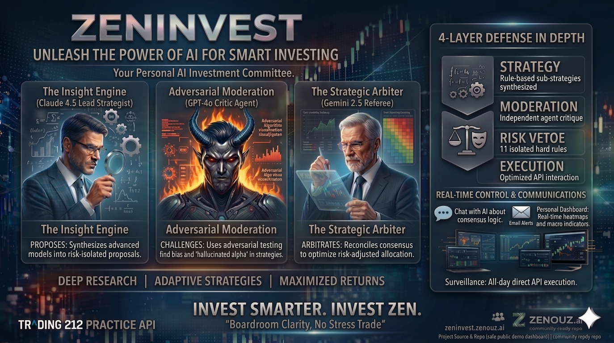

# ZenInvest

[](https://github.com/zenouz-ai/zeninvest/actions/workflows/ci.yml)
[](#quick-start)
[](LICENSE)

<p align="center">
  
</p>

**Autonomous multi-LLM investment committee that researches, debates, and trades with deterministic safety guardrails.**

**Problem.** Markets move faster than any solo operator can reliably track. Signal is buried under filings, headlines, sector rotation, macro shocks, and the emotional bias that comes with discretionary decision-making.

**Solution.** ZenInvest is a proof-of-concept autonomous investment research and execution system: Claude leads strategy, GPT-style moderation challenges assumptions, Gemini-style risk scoring adds an independent lens, and deterministic Python guardrails retain final veto power over capital at risk.

**Why This Repo Exists.** This public repository is a curated mirror of the canonical development repo. It keeps the application code, tests, public-safe workflows, and sanitized documentation needed to understand and run the system locally, while intentionally omitting operator runbooks, deployment specifics, and private infrastructure details.

<p align="center">
  
</p>

**Status:** Proof of Concept (`v1.0`) with a large pytest suite, Docker-based local/runtime workflows, and an operator-facing dashboard plus conversational trading interface.

## Important Notes

- This project is a research / engineering proof of concept, not an investment product.
- Nothing in this repository is financial advice.
- Live trading requires your own credentials, infrastructure choices, and operator judgment.
- Public releases are synchronized from the canonical repo rather than developed directly in this mirror.

## How It Works

```text
Orchestrator (configurable intraday and standard schedules)
  ├── Market Data Agent    → yfinance + Finnhub + Alpha Vantage + macro intelligence
  ├── Universe Screener    → sector-balanced, cap-tiered candidate discovery
  ├── Strategy Agent       → momentum + mean reversion + factor + LLM synthesis
  ├── Moderation Panel     → adversarial review and risk challenge
  ├── Risk Agent           → deterministic Python guardrails with veto power
  ├── Opportunity Agent    → queueing, prioritisation, and BUY selection
  ├── Execution Agent      → broker market/limit/stop order workflows
  ├── Refresh Lane         → broker sync, stop maintenance, freshness updates
  ├── Notification Agent   → Slack + email alerts with fail-open delivery
  └── Journal & Reporting  → runs, trade journals, costs, outcomes, reports
```

Each cycle starts with market and macro context, screens a fresh candidate set, synthesizes a thesis, debates it across multiple models, applies deterministic risk rules, ranks opportunities, executes through the broker integration, and records the full chain for later review.

The refresh lane keeps the system grounded in broker truth between full strategy cycles by syncing orders, warming held-name data, and maintaining protective stops without screening new instruments.

**State Machine:** `ACTIVE -> CAUTIOUS -> HALTED`

### Key Differentiators

- Multi-LLM adversarial committee, not a single-model autopilot
- Agentic research with multiple tools and per-member budgets across the committee
- Deterministic risk rules that no LLM can override
- Cost-aware graceful degradation when model or search budgets tighten
- Proactive macro intelligence with live market regime context
- Real-time operator dashboard, live activity feed, and conversational trading flows
- Walk-forward backtesting and promotion-oriented validation tooling

## Tech Stack

- **Language & runtime:** Python `3.11`, Poetry, `asyncio` + `httpx`
- **Backend & orchestration:** FastAPI, APScheduler, SQLAlchemy + SQLite, Alembic
- **Committee LLMs:** Anthropic Claude (strategy), OpenAI GPT (skeptic), Google Gemini (risk)
- **Market data & research:** yfinance, Finnhub, Alpha Vantage, Brave, Tavily, SEC EDGAR
- **Learning & memory (research-only):** LightGBM, scikit-learn, SHAP, PyArrow, vector index, Neo4j + Graphiti, d3rlpy + gymnasium
- **Frontend:** React 18 + TypeScript, Vite, Tailwind, Recharts/D3, Mermaid
- **Infra & ops:** Docker Compose, nginx, Slack + SMTP, Rich logging

## Innovation & Research

ZenInvest is built to learn from its own track record without ever letting unproven models touch live capital. Three research tracks are maturing behind hard gates — each forward-looking, each with a kill switch and a documented fallback.

- **Embedded learning loop (shadow → gated).** A dual-track pipeline turns every decision and outcome into training data: tabular ML (conviction calibration, win/loss/stall scoring) plus a champion-vs-challenger evaluation harness. It runs strictly read-only; any influence on live conviction or sizing is gated on a large body of closed trades plus operator sign-off.
- **Knowledge graphs & memory.** Journal embeddings, a decision graph, and temporal episodes let the committee ask *"what did we think last time this setup appeared?"* — evidence-only retrieval that surfaces prior theses and their outcomes, never an auto-executed signal.
- **Parallel processing.** The committee is being re-architected to run moderation models concurrently, gated on per-phase timing instrumentation, to cut cycle latency without weakening adversarial review.

Architecture details: [Architecture](docs/ARCHITECTURE.md). Delivery status: [Sophistication Roadmap](docs/SOPHISTICATION_ROADMAP.md).

## API Ecosystem

| API | Role | Why It Matters |
|-----|------|----------------|
| **Trading 212** | Order execution on Practice/Demo | Safe autonomous trading with market, limit, stop-loss, and cancel workflows |
| **Anthropic Claude** | Strategy synthesis | Primary decision-maker for conviction, thesis construction, and tool-using research |
| **OpenAI GPT** | Skeptical moderation | Challenges assumptions and reduces confirmation bias before execution |
| **Google Gemini** | Risk assessment | Adds an independent third view on risk, fragility, and downside scenarios |
| **yfinance** | OHLCV, indicators, fundamentals | Baseline market data for screening, signals, and company context |
| **Finnhub** | Analyst recs, insider sentiment, macro headlines | Adds qualitative and headline-driven context that raw prices miss |
| **Alpha Vantage** | News sentiment, sector performance | Brings ticker-level sentiment extraction and sector rotation signals |
| **Brave Search** | Primary web research provider | Powers real-time agentic research when the committee needs live context |
| **Tavily** | Fallback web research provider | Adds redundancy and structured extraction when Brave is unavailable |
| **SEC EDGAR** | Filing search | Gives the strategy and moderators direct access to primary-source filings |

## Agentic Research

ZenInvest gives all three committee members independent tool-use loops. Strategy, Skeptic, and Risk can each call `web_search`, `news_search`, `sector_search`, `sec_search`, and `macro_search` before finalising a verdict.

Research is budgeted, not unbounded. Provider routing, caching, and audit logs make it possible to inspect exactly how research influenced a decision from the dashboard or API.

Deep dive: [Agentic Research](docs/AGENTIC_RESEARCH.md)

## Proactive Macro Intelligence

Macro intelligence runs on its own schedule, derives a live market regime such as `RISK_ON`, `RISK_OFF`, or `NEUTRAL`, and injects that state into strategy and moderation prompts before trades are sized or approved.

The result is visible operationally in the dashboard through regime history, macro headlines, sector snapshots, and action-plan context that are persisted rather than treated as ephemeral prompt text.

Architecture details: [Architecture](docs/ARCHITECTURE.md)

## Dashboard & Operator Interface

ZenInvest ships with a broad dashboard surface spanning portfolio, runs, universe, opportunity queue, insights, order management, costs, chat, world-news context, roadmap visibility, and evolution planning. The React frontend and FastAPI backend expose portfolio state, orders, decisions, opportunity ranking, costs, and real-time activity from the running system.

Operator routes are authenticated; public routes are intentionally sanitized. Slack extends the same control surface into conversational trading with multi-turn review, confirm, reject, cancel, and planner-backed trade flows.

Interface docs: [Dashboard](docs/DASHBOARD.md) and [Conversational Trading Workflow](docs/CONVERSATIONAL_TRADING_WORKFLOW.md)

## Repository Layout

The public mirror keeps stable entrypoints at the root while separating source, documentation, branding, tests, and generated local output:

- `src/` — agent runtime, orchestrator, scheduler, data models, backtesting, and research-only learning code
- `dashboard/` — FastAPI operator API and React/Vite frontend
- `docs/` — public-safe architecture, setup, dashboard, research, roadmap, and workflow documentation
- `config/` — default settings and `.env` example for local runs
- `branding/` — public ZenInvest visual identity used by the README and dashboard
- `tests/` — pytest coverage using in-memory SQLite by default
- `backtests/` — backtest configs and scenarios; generated results belong under `backtests/results/`
- `data/`, `logs/`, `journals/`, and `backtests/results/` — generated local/runtime outputs; do not commit them

## Quick Start

### Prerequisites

- Python `3.11+`
- [Poetry](https://python-poetry.org/docs/#installation)
- Core API keys in a project-root `.env` copied from `config/.env.example`

### Install

```bash
git clone https://github.com/zenouz-ai/zeninvest.git
cd zeninvest
poetry install
cp config/.env.example .env
poetry run alembic upgrade head
```

### Run a Dry Cycle

```bash
poetry run python -m src.orchestrator.main --dry-run
```

### Run the Scheduler

```bash
poetry run python -m src.scheduler.scheduler
```

Full setup, env vars, frontend tooling, and troubleshooting: [Local Setup](docs/LOCAL_SETUP.md)

## Backtesting

```bash
poetry run python -m src.backtesting.main --config backtests/default.yaml
poetry run python -m src.backtesting.main --config backtests/default.yaml --walk-forward
poetry run python -m src.backtesting.main --synthetic --output-dir backtests/results/run1
```

Backtesting guide: [Backtesting](docs/BACKTESTING.md)

## Schedule

| Job | When | Notes |
|-----|------|-------|
| Analysis cycles | Mon-Fri | Configurable intraday and standard schedules |
| Refresh lane | Mon-Fri around analysis cycles + weekend refresh | Broker truth sync, data freshness, stop maintenance, pending-order cleanup |
| Daily snapshot | Daily | Portfolio snapshot plus daily report |
| Weekly report | Weekly | End-of-week summary |
| Instrument refresh | Periodic | Tradable universe refresh from broker metadata |
| Strategy episode scan | Daily | Publishes strategy-attribution episodes from git-backed history |

Scheduling architecture and config semantics: [Architecture](docs/ARCHITECTURE.md)

## Docker

```bash
docker compose up -d --build
docker compose logs -f investment-agent
docker compose logs -f dashboard
docker compose logs -f slack-listener
docker compose logs -f nginx
```

This public repo keeps local/runtime Docker workflows. Production deployment runbooks and infrastructure specifics are intentionally omitted from the public mirror.

## Safety Guardrails

These rules are deterministic Python and remain final even when every LLM agrees. Current defaults come from `config/settings.yaml` and are configurable:

- No single stock above `20%` of portfolio
- No single sector above `40%`
- Portfolio average pairwise correlation below `0.7`
- Drawdown-based transitions into `CAUTIOUS` and `HALTED`
- Volatility-aware sizing caps when `VIX` rises
- Daily loss halts that block new buys
- Cash floor protection
- Minimum position-count discipline once invested
- `CAUTIOUS` mode restrictions on new `BUY` actions

## Cost Management

ZenInvest tracks LLM and research spend per call and enforces daily plus monthly budgets. When budgets tighten, the system degrades gracefully instead of failing unpredictably.

## Public Repo Scope

The public repo keeps:

- source code
- tests
- public CI and security workflows
- local setup and architecture docs
- sanitized dashboard, research, and workflow docs

The public repo does **not** include:

- private deployment runbooks
- organization-specific infrastructure details
- mirror token workflows
- internal launch planning or operator-only operations docs

See [Public Repo Scope](docs/PUBLIC_REPO_SCOPE.md).

## Project Evolution

ZenInvest remains a proof-of-concept system focused on evidence-backed iteration rather than premature complexity. The public roadmap is available in [Sophistication Roadmap](docs/SOPHISTICATION_ROADMAP.md).

## Documentation Index

- [Architecture](docs/ARCHITECTURE.md) — pipeline, data flow, scheduling, dashboard/API topology
- [Agentic Research](docs/AGENTIC_RESEARCH.md) — tool-use architecture, provider routing, budgets, audit model
- [Dashboard](docs/DASHBOARD.md) — frontend/backend architecture, page map, UX, public/private split
- [Conversational Trading Workflow](docs/CONVERSATIONAL_TRADING_WORKFLOW.md) — Slack and dashboard multi-turn trading flows
- [Backtesting](docs/BACKTESTING.md) — engine, walk-forward validation, promotion report
- [Local Setup](docs/LOCAL_SETUP.md) — install, env vars, tests, frontend runtime, troubleshooting
- [Sophistication Roadmap](docs/SOPHISTICATION_ROADMAP.md) — public backlog and delivery status
- [Public Repo Scope](docs/PUBLIC_REPO_SCOPE.md) — what stays public and what intentionally does not
- [Brand Guide](branding/BRAND.md) — ZenInvest visual system

## Contributing

Contributions are welcome. Read [CONTRIBUTING.md](CONTRIBUTING.md) for setup, conventions, and PR expectations.

## Security

Report vulnerabilities through [SECURITY.md](SECURITY.md). Do not open public issues for security disclosures.

## License

MIT. See [LICENSE](LICENSE).
