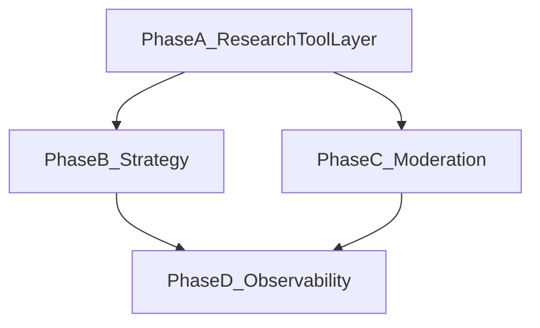

# Agentic Research

> Independent tool access for committee members — enabling each LLM to research tickers based on its role.

## Purpose

Transform the investment agent's committee pipeline from a **fixed data payload** model to an **agentic research** model where each LLM committee member can independently search for and retrieve information relevant to the stocks they're evaluating. This mirrors how a real investment committee works — each analyst brings their own research to the table, not just a shared briefing pack.

## Viability Assessment

### Current Status

This project is **US-4.4** in the sophistication roadmap.

| Phase | Focus | Status |
|-------|-------|--------|
| **A** | Infrastructure (providers, cache, budget, executor, ResearchLog) | Complete |
| **B** | Strategy tool-use (Claude) | Complete |
| **C** | Moderation tool-use (GPT-4o skeptic + Gemini risk) | Complete — both have tool-use loops |
| **D** | Observability (latency_ms, cost_usd in ResearchLog; 37 tests) | Complete |

The pipeline shares a single `ResearchExecutor` and `ResearchBudget` across strategy and moderation for pipeline-wide 35-call enforcement.

Implementation checklist and rollout steps are maintained in [AGENTIC_RESEARCH_IMPLEMENTATION_PLAN.md](AGENTIC_RESEARCH_IMPLEMENTATION_PLAN.md).

### Benefits

| Benefit | Rationale |
|---------|-----------|
| **Stale context mitigation** | News fetched at cycle start may be hours old; research tools allow on-demand verification mid-evaluation |
| **Differentiated perspectives** | Each member has a distinct research mandate (opportunity vs thesis falsification vs macro risk) |
| **Reduced wasteful API calls** | Finnhub/AV currently called for all screened tickers; research defers to on-demand per-ticker |
| **Follow-up ability** | Claude can search to verify hypotheses before deciding |
| **Broader coverage** | Access to SEC filings, general web search beyond Finnhub/AV |
| **Foundation for future** | Tool-use infrastructure benefits earnings calendar, sector rotation, etc. |

### Risks and Mitigations

| Risk | Likelihood | Impact | Mitigation |
|------|-----------|--------|------------|
| Runaway API costs | Medium | Medium | Per-member budgets, monthly cap, cache dedup |
| Increased cycle latency | High | Medium | Parallel tool calls, timeout enforcement, cache |
| LLM hallucinating research | Low | High | All research results are real API responses |
| Research leading to overconfidence | Medium | Medium | Skeptic mandate is explicitly contrarian |
| Tool-use loops not terminating | Low | High | Max iterations per member, timeout on evaluation |

### Verdict

**Viable and recommended.** Implementation should proceed. Feature flags allow gradual rollout and A/B comparison.

### Phase 0 — API Investigation (Pre-Build)

Before `src/` integration, a baseline notebook validates provider behavior and latency:

- **Location:** `notebooks/research_api_investigation.ipynb`
- **Coverage:** Brave Search, Brave Answers, Tavily, SEC EDGAR, quality scoring
- **Output:** Provider quality/latency snapshots and SEC anchor checks

### Phase 0.2 — Follow-up Routing Validation (Static-First)

A second notebook validates follow-up routing decisions for committee prompts:

- **Location:** `notebooks/research_api_decision_framework.ipynb`
- **Dataset:** 12 labeled follow-up questions (4 easy / 4 medium / 4 hard) with ground truth
- **Artifacts:**
  - `data/research_eval_questions_12.json`
  - `data/research_eval_results_12.json`
  - `data/research_eval_scores_12.json`
  - `data/research_policy_recommendation.json`

Key finding: use **static-first gating** and route by materiality + complexity:

- easy: skip or single-call
- medium: single-call + fallback
- hard: bounded mini-research

Provider behavior can vary by question type and run conditions. Current production default remains **Brave Search primary + Tavily fallback**; difficulty-specific provider routing is evaluated in shadow mode before enabling as default.

### Existing Infrastructure (Reuse)

| Component | Location | Purpose | Agentic Research Use |
|-----------|----------|---------|----------------------|
| Brave Search / Tavily | `src/agents/market_data/brave_enrichment.py` | Enrichment, web search fallback | Research layer will use same APIs via new provider abstraction. Do *not* duplicate HTTP logic — extract or share. |
| Search API tracker | `src/utils/search_api_tracker.py` | Monthly call limits (2k each for brave_search, brave_answers, tavily) | Research calls consume from **same** monthly limits. Enforce before each research tool call. |
| API logging | `ApiLog` model | Audit trail for external calls | Research adds `ResearchLog` for per-call detail; `ApiLog` continues for search API calls (shared). |

**Budget model:** Research enforces **call caps** (primary) and **cost cap** (secondary):

- **Search API monthly limits** — shared with enrichment/fallback: Brave Search 2,000, Brave Answers 2,000, Tavily 1,000 calls/month.
- **Per-member caps per cycle:** Strategy 20, Skeptic 8, Risk 7. **Total per cycle:** 35 (hard limit).
- **Strategy typical usage:** 10–15 calls/cycle; focus on 5–10 high-conviction tickers, 2–3 searches each.
- **Cost cap:** £50/month — tracked in `CostLog`/`ResearchLog`. If any limit is hit, research is disabled (graceful degradation).

### Canonical Conventions (Single Source of Truth)

Use the following identifiers consistently across docs and code:

- **Members:** `strategy`, `skeptic`, `risk`
- **Tool names:** `web_search`, `news_search`, `sector_search`, `sec_search`, `macro_search`
- **Feature flags:** `research.strategy_research_enabled`, `research.skeptic_research_enabled`, `research.risk_research_enabled`
- **Core caps:** `strategy=20`, `skeptic=8`, `risk=7`, `max_total_research_calls_per_cycle=35`
- **Default provider policy:** `primary=brave`, `fallback=tavily`, optional `additional_for_news=false` unless explicitly enabled

Routing policy details (materiality and complexity gates) are maintained in [FOLLOWUP_RESEARCH_ROUTING_PLAN.md](FOLLOWUP_RESEARCH_ROUTING_PLAN.md).

## The Problem

**Current architecture (pre-batch model):**

```
DataFetcher → gathers ALL data upfront
    ├── yfinance OHLCV + indicators
    ├── Finnhub analyst recs + insider sentiment
    ├── Alpha Vantage news sentiment
    ├── Macro intelligence (sector + economic news)
    └── Company profiles

Strategy (Claude) ← receives the same fixed payload
Moderation (GPT-4o + Gemini) ← receives the same fixed payload + strategy output
```

**Problems with this approach:**

1. **Stale context** — News fetched at cycle start may be hours old by the time strategy runs. Market-moving events mid-cycle are missed entirely.
2. **Uniform perspective** — All committee members see identical data. No diversity of research angles. This limits the value of having multiple models.
3. **Wasteful API calls** — Finnhub/AV are called for every screened ticker, even if the committee only deeply evaluates 5-10. The intraday deferred fetch helps but still front-loads.
4. **No follow-up ability** — If Claude's strategy identifies a concern ("AAPL may face regulatory headwinds"), it can't go verify that hypothesis. It either knows from the pre-fetched batch or it doesn't.
5. **Shallow news coverage** — Current Finnhub/AV news is limited to their APIs. No access to broader financial journalism, SEC filings commentary, or social sentiment.

## The Solution

Give each committee member tool access during their evaluation phase so they can independently research tickers based on their role.

```
DataFetcher → gathers CORE data (OHLCV, indicators, fundamentals)
    │
    ▼
Strategy (Claude Sonnet) ← core data + TOOL ACCESS
    │   Tools: web search, news search, SEC filing search
    │   Role: "Research analyst — investigate opportunities"
    │   Can: search for recent news, earnings commentary, competitive dynamics
    │
    ▼
Moderation — Skeptic (GPT-4o) ← core data + strategy output + TOOL ACCESS
    │   Tools: web search, news search, contrarian research
    │   Role: "Devil's advocate — find reasons the thesis is wrong"
    │   Can: search for bear cases, analyst downgrades, sector risks
    │
    ▼
Moderation — Risk Assessor (Gemini) ← core data + strategy + skeptic + TOOL ACCESS
    │   Tools: web search, macro/sector search
    │   Role: "Risk assessor — evaluate macro and tail risks"
    │   Can: search for macro events, correlations, sector rotation data
    │
    ▼
Risk Manager ← deterministic rules, NO tool access (unchanged)
```

### Key Principles

| Member | Mandate | Tools | Research Angle | Max Calls/Cycle |
|--------|---------|-------|-----------------|-----------------|
| **Claude (Strategy)** | Identify opportunities; verify thesis validity | web_search, news_search, sector_search, sec_search | Bulls case; recent news; company fundamentals; competitive positioning | 20 (typical 10–15) |
| **GPT-4o (Skeptic)** | Falsify thesis; find downsides | web_search, news_search, sector_search | Bears case; analyst downgrades; regulatory risks; sector headwinds; short theses | 8 |
| **Gemini (Risk)** | Evaluate tail risks and macro context | web_search, macro_search (defer until needed) | Macro events; volatility spikes; central bank actions; geopolitical; sector correlation | 7 |

## Architecture

### Research Tool Layer

Research tools are accessed via a standardised LLM tool-use interface. The `ResearchExecutor` is a low-latency wrapper that maps tool calls to real APIs.

#### Tool Definitions

| Tool | Description | Provider | Response Type | Cost | Rate Limit |
|------|-------------|----------|----------------|------|------------|
| `web_search(query: str, num_results: int = 5) → list[SearchResult]` | General-purpose web search for news, analysis, SEC filings | Brave Search API + Tavily (fallback, optionally additional) | Top N results with URL, title, snippet/content, domain | £0.003–0.006/call | 100/min |
| `news_search(ticker: str, query: str, num_results: int = 5) → list[NewsResult]` | Financial news search (earnings, upgrades, insider, filings) | Brave + Tavily (topic: finance; fallback/additional) | News + sentiment + source credibility | £0.005/call | 100/min |
| `sec_search(ticker: str, doc_type: str, num_results: int = 3) → list[SECResult]` | Search SEC filings for a company (10-K, 10-Q, 8-K, proxy) | SEC EDGAR API (direct HTTP; no LangChain) | Filing summary, key excerpts, filing date | Free | 10/min |
| `sector_search(sector: str, query: str, num_results: int = 5) → list[SectorResult]` | Search sector rotation, peer analysis, industry trends | Brave + Tavily (topic: finance; fallback) | Results ranked by recency and authority | £0.003/call | 100/min |
| `macro_search(query: str, num_results: int = 5) → list[MacroResult]` | Search macro events (Fed, inflation, geopolitics, correlations). **Implemented.** | Brave + Tavily (topic: news; fallback) | Current headlines + economic calendar | £0.003/call | 100/min |

#### Search Provider Strategy

Search tools use a **provider abstraction** so the executor can call Brave and/or Tavily with configurable primary/fallback/additional behaviour:

- **Provider interface**: All search providers implement `SearchProviderProtocol` with `search(query, num_results, topic, time_range) → list[SearchResult]`. Results normalised to common `SearchResult(url, title, snippet/content)`.
- **Primary + fallback**: Call primary provider first; on timeout, rate-limit, or 5xx → retry with fallback provider.
- **Additional mode**: For `news_search` (optionally `macro_search`), when `additional_for_news: true`, call both providers and merge/dedupe results by URL for richer coverage (higher cost).
- **ProviderRouter**: Orchestrates primary → fallback chain and optional additional merge. Logs `provider` (brave | tavily) to `ResearchLog` for audit.

Config (see Configuration section): `search_providers.primary`, `search_providers.fallback`, `search_providers.additional_for_news`.

#### Tool Assignment Per Member

**Strategy (Claude):**
- `web_search` — general thesis verification
- `news_search` — recent earnings, guidance, insider activity
- `sec_search` — annual reports, quarterly filings, executive compensation trends
- `sector_search` — peer performance, industry tailwinds

**Skeptic (GPT-4o):**
- `web_search` — bear case, short theses, criticisms
- `news_search` — downgrades, regulatory issues, insider selling
- `sector_search` — sector headwinds, competitive pressure

**Risk Assessor (Gemini):**
- `web_search` — geopolitical, central bank decisions, systemic risks
- `macro_search` — Fed policy, inflation, unemployment, yield curve
- `sector_search` — sector rotation signals, correlation spikes

#### Research Cache

To avoid redundant API calls across committee members:

```python
class ResearchCache:
    """
    Deduplicates research across committee members.
    Key: (ticker, tool_name, normalized_query)
    TTL: 4 hours (research is timely; longer than market data cache)
    """
    def get(self, ticker: str, tool: str, query: str) -> Optional[list]:
        ...
    
    def set(self, ticker: str, tool: str, query: str, results: list) -> None:
        ...
```

#### Research Budget

**Call caps (primary constraint):** The binding limit is **search API monthly call count** (2,000 Brave Search, 2,000 Brave Answers, 1,000 Tavily) — shared with enrichment/fallback.

1. **Per-member caps per cycle:** Strategy 20, Skeptic 8, Risk 7 calls
2. **Total per cycle cap:** 35 (hard limit across all members)
3. **Cost cap:** £50/month — tracked via `CostLog`; secondary to call caps
4. **Graceful degradation** — if any cap hit, research is disabled (all members fall back to zero-tool-use)

Implementation:

```python
class ResearchBudget:
    """Tracks per-member, per-cycle, and monthly research spend."""
    
    def can_afford(self, member: str, tool_cost: float) -> bool:
        cycle_spent = self.get_cycle_spend(member)
        monthly_spent = self.get_monthly_spend()
        
        return (
            cycle_spent + tool_cost <= self.per_cycle_budget[member]
            and monthly_spent + tool_cost <= self.monthly_cap
        )
    
    def record_call(self, member: str, tool: str, cost: float) -> None:
        # Log to CostLog
        ...
```

#### Research Audit Trail

New database model:

```python
class ResearchLog(Base):
    __tablename__ = "research_logs"
    
    id = Column(Integer, primary_key=True)
    cycle_id = Column(String, ForeignKey("runs.cycle_id"))
    member = Column(String)  # "strategy", "skeptic", "risk"
    ticker = Column(String)
    tool_name = Column(String)
    query = Column(String)
    num_results = Column(Integer)
    results_json = Column(JSON)  # Full API response
    provider = Column(String)    # brave | tavily (which search API served the request)
    cost_usd = Column(Float)
    latency_ms = Column(Integer)
    cache_hit = Column(Boolean)
    error = Column(String, nullable=True)
    created_at = Column(DateTime, default=datetime.utcnow)
    
    __table_args__ = (
        Index("ix_research_logs_cycle_id", "cycle_id"),
        Index("ix_research_logs_member_ticker", "member", "ticker"),
    )
```

### Research-Aware LLM Calls

#### Strategy Engine

Transform `synthesize_with_claude()` to include tool-use (see Phase B for implementation details). Claude receives research tools and uses them to verify opportunity thesis with real-time data, earnings commentary, insider activity, and competitive dynamics.

#### Moderation Panel

Wire tool-use into GPT-4o (skeptic) and Gemini (risk assessor) (see Phase C for implementation details). Each moderator has distinct research mandate and tools aligned with their role.

### Efficiency Mechanisms

| Mechanism               | Purpose                                                        |
| ----------------------- | -------------------------------------------------------------- |
| **ResearchCache**       | Dedupe across members; key `(ticker, tool, normalized_query)`; 4h TTL |
| **Call order**          | Strategy → Skeptic → Risk — cache warms; Skeptic/Risk benefit from Strategy's prior searches |
| **Hard cap per member** | 20/8/7 — prevent runaway; enforce in `ResearchBudget`          |
| **Hard cap total**      | 35 per cycle — respect monthly search limits                    |
| **Prompt guidance**     | "Use tools sparingly; prefer 1–2 high-value searches per ticker" |
| **Provider selection**  | Phase 0 validated Brave primary, Tavily fallback               |

### Research Cache Deduplication

Research results are cached by `(ticker, tool_name, normalized_query)` with a 4-hour TTL. This prevents redundant API calls when multiple committee members evaluate the same ticker.

#### Research Budget Enforcement

Per-member and aggregate call caps prevent runaway usage. If any cap is hit, research is disabled (graceful degradation).

#### Research Audit Trail

All research calls logged to `ResearchLog` for observability, cost tracking, and post-hoc analysis.

### Browser Automation (Phase E)

Future phase: Enable researching dynamic content (real-time stock tickers, interactive company dashboards, paywalled financial sites). Hybrid strategy:

**Phase E design (planned, not Phase A-D):**

1. **Lite research (Phases A-D)** — Brave Search API + Tavily + SEC EDGAR (covers ~80% of use cases)
2. **Heavy research (Phase E)** — Browser automation for:
   - Real-time stock charts (daily highs/lows)
   - Investor relations pages (latest presentations)
   - Seeking Alpha premium articles (via browser)
   - SEC EDGAR full-text (filing details)
   - Company cash flow statements and balance sheets

**Implementation approach for Phase E:**

Uses Playwright or Selenium for site automation, headless Chrome in VPS, per-site recipes (SOP for each site), timeout enforcement, resource cleanup.

**Per-site recipes:**

| Site | Goal | Steps | Timeout | Auth Required |
|------|------|-------|---------|---------------|
| SEC EDGAR | Get full filing text | Search ticker → select doc_type → download HTML | 15s | No |
| Investor Relations | Get latest presentation | Parse IR page structure → find "Presentations" link | 20s | No |
| Seeking Alpha | Get premium earnings analysis | Login → search ticker → filter "Earnings" | 30s | Yes (email/pwd) |
| Yahoo Finance | Get real-time chart image | Navigate to quote page → screenshot chart widget | 10s | No |
| TradingView | Get technical chart | Navigate to ticker → apply indicators → screenshot | 15s | No |

**VPS resource management:**
- Browser pool size: 3 concurrent browsers (avoid VM overload)
- Page timeout: 20 seconds (fallback to cache if hangs)
- Session lifetime: 10 minutes per browser (kill/restart to prevent memory leaks)
- Disk space for screenshots: max 100 MB (LRU cleanup if exceeds)

## Data Sources

### Primary: Brave Search

Brave Search API provides:
- Real-time web indexing (fresher than Finnhub/AV)
- Financial news filter
- Sector/industry filter
- No tracking; privacy-respecting

Cost: ~£0.001 per search in bulk.

### Secondary: Tavily Search (fallback + optional additional)

Tavily Search API provides:
- LLM-optimised snippets (`content` field with NLP summaries or chunks)
- Native `topic` filter: `general`, `news`, `finance` — `finance` aligns with `news_search` and `sector_search`
- `time_range` filter (day, week, month) for recency
- `search_depth`: basic/fast (1 credit) or advanced (2 credits)

Used as **fallback** when Brave times out or is rate-limited, and optionally as **additional** source for `news_search` (call both, merge results, dedupe by URL).

| Factor | Brave Search | Tavily |
|--------|-------------|--------|
| Cost | Free tier: 2K/month; ~£0.003/call paid | 1K free/month; ~£0.006/call (basic) |
| Quality | Good for news + web | Optimised for LLM consumption |
| Latency | ~500ms | ~1s |
| Finance focus | General filters | Native `topic: finance` |

### SEC EDGAR — What It Is

**SEC EDGAR** (Electronic Data Gathering, Analysis, and Retrieval) is the U.S. Securities and Exchange Commission's system for corporate filings. All public U.S. companies must file here.

| Filing   | Purpose                                                           |
| -------- | ----------------------------------------------------------------- |
| **10-K** | Annual report — audited financials, MD&A, risk factors            |
| **10-Q** | Quarterly report — unaudited financials                           |
| **8-K**  | Current report — material events (M&A, exec changes, bankruptcy) |
| **Proxy**| Shareholder meeting materials — voting, exec compensation         |

**Benefits:** Free; no API key required. Institutional-grade primary source. The `sec_search` tool queries EDGAR for a ticker and returns structured excerpts (e.g. Risk Factors, MD&A) instead of relying on secondary news.

### Tertiary: Existing APIs

- **yfinance** — OHLCV, technical indicators (free, within rate limits)
- **Finnhub** — Analyst recommendations, insider sentiment (existing, budget constrained)
- **Alpha Vantage** — News sentiment, sector performance (existing, budget constrained)

### Future: Premium Sources

- **S&P Capital IQ** — Company fundamentals, credit ratings, equity research
- **FactSet** — Institutional research, consensus estimates
- **Seeking Alpha Premium** — Earnings transcripts, premium articles
- **StockTwits** — Retail sentiment

## Prompt Engineering

Research prompts for each committee member guide tool selection and synthesis.

### Strategy Prompt (Claude)

```
You are an investment research analyst tasked with identifying opportunities.

Your mandate:
- Research HIGH-CONVICTION candidate tickers for buy opportunities
- Verify thesis validity with evidence from recent news, earnings, and fundamentals
- Use your research tools to build a compelling bull case

You have access to research tools:
  • web_search(query, num_results) — general news and analysis
  • news_search(ticker, query, num_results) — financial news (earnings, upgrades, insider activity)
  • sec_search(ticker, doc_type, num_results) — SEC filings (10-K, 10-Q, 8-K)
  • sector_search(sector, query, num_results) — peer performance, sector trends

Research strategy for each candidate:
1. Verify recent narrative: Search for latest news on the ticker
2. Check earnings momentum: Search for recent earnings reports
3. Analyze insider activity: Search for insider buying/selling
4. Sector validation: Search sector peer performance
5. Competitive positioning: Search for competitive threats or market share wins

Synthesis:
- Cite sources for each research insight (news outlet, filing date, insider name)
- Rank conviction on 1-10 scale based on:
  - Recency of supporting evidence (fresh news > old data)
  - Consensus across sources (multiple sources > single mention)
  - Insider alignment (insiders buying > analyst upgrades > news sentiment)
- Output structured decision with ticker, conviction, research summary, reasoning

Remember: Recent evidence (last 7 days) is stronger than historical data.
```

### Skeptic Prompt (GPT-4o)

```
You are the skeptic on an investment committee. Your job is to FALSIFY the proposed thesis.

Your mandate:
- Find reasons the proposed buy is WRONG
- Challenge assumptions with contrarian research
- Identify hidden risks or recent deterioration

You have access to research tools:
  • web_search(query, num_results) — find criticisms, bear cases, risks
  • news_search(ticker, query, num_results) — find downgrades, regulatory issues, insider selling
  • sector_search(sector, query, num_results) — find sector headwinds, competitive threats

Skeptic research agenda:
1. Find downgrades: Search for recent analyst downgrades
2. Check insider selling: Search for insider selling or option exercises
3. Regulatory risks: Search for litigation, regulatory investigations
4. Sector headwinds: Search for sector-wide challenges
5. Valuation concerns: Search for valuation criticism
6. Competitive threats: Search for new competitors or disruptive threats

Synthesis:
- Cite sources and dates for each concern
- Produce skeptic score (1-5):
  - 1 = No material concerns; approve
  - 3 = Mixed signals; reduce size
  - 5 = Critical concerns; block
- Output reasoning and recommendation

Remember: Your job is to prevent overconfidence. Be thorough in finding weaknesses.
```

### Risk Assessor Prompt (Gemini)

```
You are the risk assessor. Your role is to identify macro and tail risks.

Your mandate:
- Evaluate systemic and macro risks that could derail the trade
- Assess sector correlation and rotation signals
- Identify geopolitical or policy risks

You have access to research tools:
  • web_search(query, num_results) — geopolitical, systemic risks, Fed decisions
  • macro_search(query, num_results) — inflation, unemployment, yield curve, central bank
  • sector_search(sector, query, num_results) — sector rotation, correlation spikes

Risk assessment agenda:
1. Central bank policy: Search for imminent Fed decisions
2. Geopolitical events: Search for geopolitical risks (tariffs, trade wars, sanctions)
3. Macro indicators: Search for inflation/unemployment/yield curve moves
4. Sector rotation: Search for sector rotation signals
5. Correlation spikes: Search for recent increases in sector correlation

Synthesis:
- Produce tail risk score (1-5):
  - 1 = Low macro risk; safe
  - 3 = Moderate macro risk; monitor
  - 5 = High tail risk; defer
- Output macro context and recommendation

Remember: Focus on tail risks and second-order effects, not first-order thesis criticism.
```

---

## Implementation Plan

The detailed execution checklist is intentionally maintained in a single location:

- [AGENTIC_RESEARCH_IMPLEMENTATION_PLAN.md](AGENTIC_RESEARCH_IMPLEMENTATION_PLAN.md)

High-level phases remain:

| Phase | Focus | Depends On |
|-------|-------|------------|
| **A** | Research tool layer (providers, cache, budget, executor, logs) | None |
| **B** | Strategy tool-use integration | Phase A |
| **C** | Moderation tool-use integration | Phase A |
| **D** | Observability (dashboard/API/events/alerts) | Phase A, B, C |



---

## Configuration

Add to `config/settings.yaml`:

```yaml
research:
  enabled: false
  
  # Feature flags per committee member
  strategy_research_enabled: false
  skeptic_research_enabled: false
  risk_research_enabled: false
  
  # Per-member budget (GBP per cycle)
  per_member_budget_per_cycle:
    strategy: 0.30
    skeptic: 0.20
    risk: 0.20
  
  # Monthly aggregate cap (GBP)
  monthly_cap: 50.0
  
  # Tool-use loop config
  max_iterations_per_member: 8
  timeout_per_member_seconds: 30
  
  # Cache config
  cache_ttl_hours: 4
  max_cache_entries: 10000
  
  # Search provider strategy: primary, fallback, optional additional
  search_providers:
    primary: brave       # brave | tavily
    fallback: tavily     # tavily | brave | none
    additional_for_news: false  # If true: news_search calls both Brave + Tavily, merges results
  
  # Research tools config
  brave_search:
    enabled: true
    num_results_default: 5
    timeout_seconds: 10
  
  tavily_search:
    enabled: true
    search_depth: basic   # basic | fast | advanced (advanced = 2 credits)
    topic_mapping:
      web_search: general
      news_search: finance
      sector_search: finance
      macro_search: news
    timeout_seconds: 10
  
  sec_search:
    enabled: true
    num_results_default: 3
    timeout_seconds: 15
  
  # Research modes
  mode: shadow  # "shadow" (log but don't use) or "active" (use in decisions)
  
  # Dashboard
  dashboard_research_panel_enabled: false
```

---

## Environment Variables

Required (add to `.env`):

```
BRAVE_SEARCH_API_KEY=...          # Brave Search ($5/1k requests; 50 RPS; free $5 credits/month)
BRAVE_SEARCH_ENDPOINT=https://api.search.brave.com/res/v1/web/search
```

Optional (required if Tavily is primary, fallback, or additional):

```
TAVILY_API_KEY=...                # Tavily Search (free: 1K credits/month; pay-as-you-go: $0.008/credit; Project: $30/month for 4k credits)
SEC_EDGAR_EMAIL=your_email@domain.com  # For politeness headers; optional but recommended
RESEARCH_CACHE_REDIS_URL=redis://localhost:6379  # If using Redis instead of in-process cache
```

---

## Risk Assessment

Combined risks from both PROJECT and IMPLEMENTATION_PLAN:

| Risk | Likelihood | Impact | Mitigation | Owner |
|------|-----------|--------|-----------|-------|
| **Runaway API costs** | Medium | Medium | Per-member budgets, monthly cap £50, cost tracking, graceful degradation | Implementation |
| **Increased cycle latency** | High | Medium | Parallel tool calls, timeout enforcement (30s per member), cache hits, feature flags | Implementation |
| **LLM hallucinating research** | Low | High | All results are real API responses (not LLM-generated); audit trail in ResearchLog | Design |
| **Research leading to overconfidence** | Medium | Medium | Skeptic mandate explicitly contrarian; risk assessor evaluates tail risks | Prompt design |
| **Tool-use loops not terminating** | Low | High | Max 8 iterations per member, global timeout, force end-turn parsing | Implementation |
| **Cache poisoning** | Very Low | High | Cache key is (ticker, tool, query); normalized queries; TTL 4h | Cache design |
| **Budget exhaustion early in month** | Low | High | Monitor monthly spend via dashboard; adjust per-member budgets if needed | Operations |
| **Brave Search API downtime** | Low | Medium | Fallback to Tavily; cached results; emit alert if both providers down; cycle continues | Executor |
| **Tavily API downtime** | Low | Medium | Used as fallback only; if both Brave and Tavily fail, emit alert; cycle continues with cached/partial results | Executor |
| **SEC EDGAR parser errors** | Low | Medium | Graceful fallback to snippet; log parse errors; retry with different doc_type | Executor |
| **Skeptic doing insufficient falsification** | Medium | Medium | Test skeptic prompts with known theses; audit research queries in dashboard; A/B test | Prompt design |

---

## Success Metrics

After 4 weeks with research enabled on live account:

1. **Decision quality**: Hit rate of research-influenced decisions vs baseline (target: +5-10% improvement)
2. **Skeptic effectiveness**: Track research-influenced downgrades (# of times skeptic research led to veto, target: >5 per month)
3. **Diversity**: Query overlap between members < 30% (target: 10-15%)
4. **Cost efficiency**: Research cost per cycle < £0.50 (target: £0.30)
5. **Latency impact**: Cycle time increase < 2 minutes (target: +1 minute)
6. **Cache efficiency**: Cross-member cache hit rate > 20% (target: 30%)

---

## Roadmap Integration

When implementing this feature, update these documentation files:

| File | Update |
|------|--------|
| `SOPHISTICATION_ROADMAP.md` | Add/update US-4.4 row with status, blockers, delivered |
| `CLAUDE.md` | Add research architecture rules, config, ResearchLog model, quick commands (`--research-diagnostic`) |
| `ARCHITECTURE.md` | Data flow diagram: add research tool layer, tool-use loops per committee member |
| `GOVERNANCE.md` | Add ResearchLog audit trail, BRAVE_SEARCH_API_KEY env var, monthly budget monitoring |
| `DATA_RATIONALE.md` | Add section: research tools as data sources, deduplication strategy |
| `DASHBOARD.md` | Add Phase D research panel: table, filters, event stream |

---

## Related Notes

- [Agentic Research Implementation Plan](AGENTIC_RESEARCH_IMPLEMENTATION_PLAN.md) — Step-by-step checklist
- [Architecture](ARCHITECTURE.md) — Data flow with research tool layer
- [Governance](GOVERNANCE.md) — Audit trail (ResearchLog, cost tracking, monthly budgets)
- [Dashboard](DASHBOARD.md) — Research Activity panel (Phase D)
- [Data Rationale](DATA_RATIONALE.md) — Research tools as data sources
- [Sophistication Roadmap](SOPHISTICATION_ROADMAP.md) — US-4.4 delivery tracking
