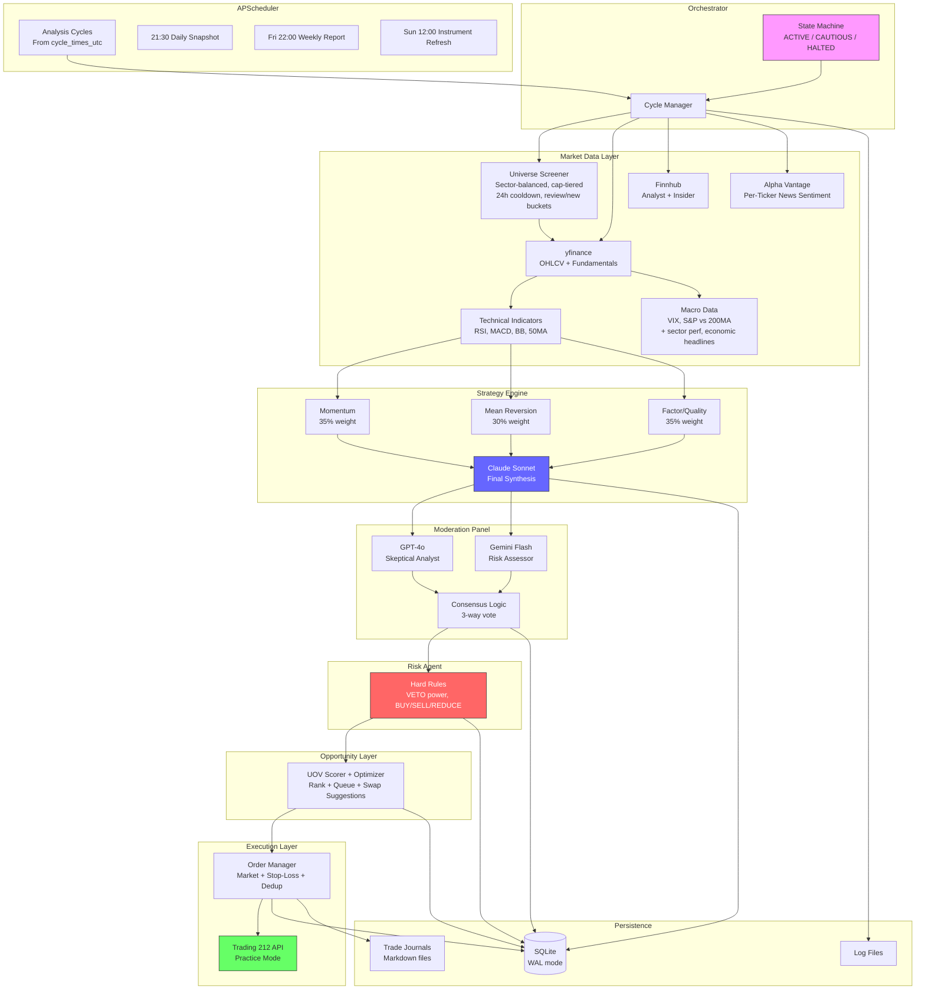
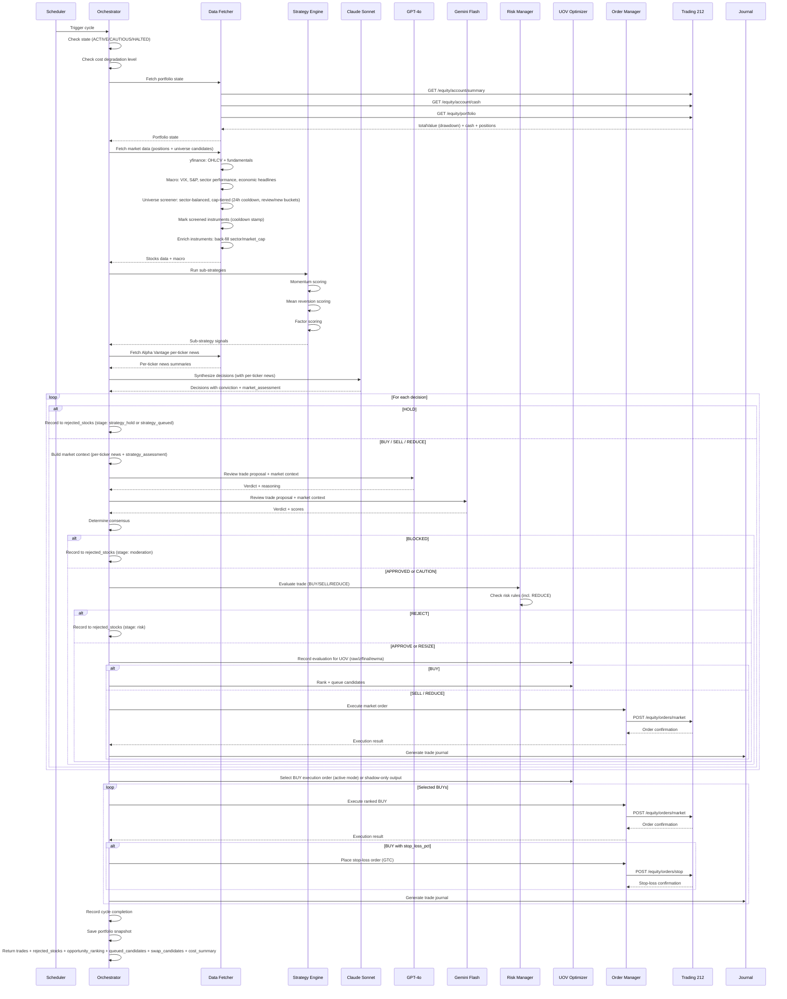
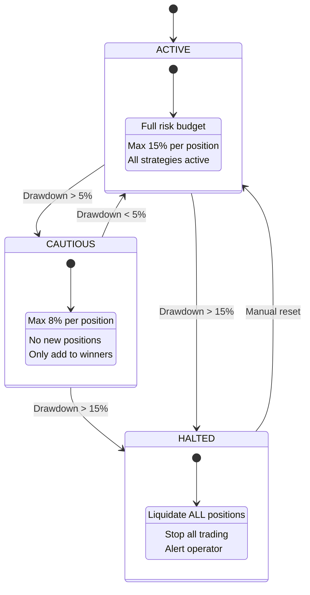
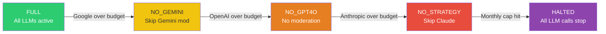
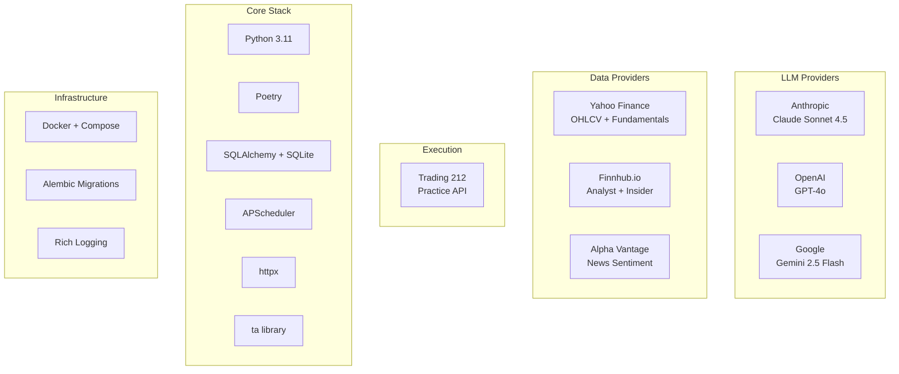

# Solution Architecture

> Complete system architecture: pipeline flow, state machine, database schema, and Mermaid diagrams.

## Purpose

This document is the single source of truth for the investment agent's technical architecture. It covers the data flow from external APIs through the multi-LLM pipeline to execution, the state machine and cost degradation chain, the database schema, the dashboard backend, and the moderation consensus logic. All diagrams (ASCII and Mermaid) live here.

## System Overview (ASCII)

```
+===========================================================================+
|                        INVESTMENT AGENT SYSTEM                             |
+===========================================================================+
|                                                                            |
|  +-----------------+     +------------------------------------------+     |
|  | APScheduler     |     |           ORCHESTRATOR                    |     |
|  |                 |---->|  State Machine: ACTIVE/CAUTIOUS/HALTED    |     |
|  | 08/12/16 or 07/19 UTC cycles |     |  Cycle ID tracking                       |     |
|  | 21:30 snapshot  |     |  Error handling & recovery                |     |
|  | Fri 22:00 weekly|     +----+-----------+-----------+----------+---+     |
|  | Sun 12:00 instr |          v           v           v          v        |
|  +-----------------+     +--------+  +--------+  +-------+  +--------+   |
|                          | STEP 1 |  | STEP 2 |  | STEP 3|  | STEP 4 |   |
|                          | DATA   |  |STRATEGY|  | MOD   |  | RISK   |   |
|                          +---+----+  +---+----+  +---+---+  +---+----+   |
|                              |           |           |           |        |
|                              v           v           v           v        |
|                          +--------+  +--------+  +-------+  +--------+   |
|                          | STEP 5 |  | STEP 6 |  | STEP 7 |              |
|                          |  UOV   |  |EXECUTE |  |JOURNAL |              |
|                          +--------+  +--------+  +--------+              |
|                                                                            |
+===========================================================================+
```

## Data Flow (ASCII)

```
EXTERNAL APIs                    AGENTS                         STORAGE
=============                    ======                         =======

Yahoo Finance  ----+
  (OHLCV, info)    |
                   v
Finnhub --------> DATA FETCHER ----+---> SQLite (market_data_cache, news_sentiment_cache)
  (analyst recs,   |               |     [Deferred when intraday: only for active-review tickers]
   insider sent.)  |               v
                   |        +-- INDICATORS (RSI, MACD, BB, 50MA)
Alpha Vantage --->-+        |     (8 fields — see docs/DATA_RATIONALE.md)
  (news sentiment) |        +-- FUNDAMENTALS (P/E, P/B, ROE, margins, D/E)
                   |        |     (9 fields — see docs/DATA_RATIONALE.md)
                   |        +-- MACRO (VIX, S&P vs 200MA, market regime)
                   |        +-- MACRO INTELLIGENCE (sector performance, economic headlines)
                   |        |
                   |        +-- PER-TICKER NEWS (extract_per_ticker_news)
                   |        |     [Parsed from AV ticker_sentiments array,
                   |        |      per-stock sentiment scores + headlines]
                   |        |
                   |        +-- UNIVERSE SCREENER (get_screened_universe)
                   |              [Sector-balanced, cap-tiered sampling:
                   |               70% large, 20% mid, 10% small cap]
                   |              [Cooldown (24h) prevents re-screening within window]
                   |              [When pool exhausted: order by last_screened_at ASC to rotate]
                   |              [Review (24-48h ago) vs new (never or >48h) buckets, 50% each via uninvestigated_target_pct]
                   |              [Batch enrichment job (daily 06:00): cascade yfinance → Finnhub → AV OVERVIEW → BRAVE_ANSWERS for sector/market_cap]
                   |
                   |        +-- WEB SEARCH FALLBACK (get_news_sentiment_fallback)
                   |              [When Finnhub analyst or AV ticker sentiment fails:
                   |               Brave/Tavily supplies analyst/news snippets for strategy prompt]
                   |
                   v
          +-- STRATEGY ENGINE -----+
          |   Momentum (35%)       |
          |   Mean Rev. (30%)      |---> SQLite (strategy_decisions)
          |   Factor (35%)         |
          +--------+---------------+
                   |
                   v
Anthropic  -------> CLAUDE SONNET SYNTHESIS
  (strategy LLM)    [Sub-strategy signals + company_profiles + news_sentiment
                     (per-ticker, aggregate, broad, sector, economic) + analyst data
                     + portfolio state] → decisions with conviction
                     → market_assessment thesis
                            |
                            v
                   MARKET CONTEXT (context.py)
                   [indicators, fundamentals,
                    macro (VIX, regime, sector_headwind, sector_summary, economic_highlights),
                    sub-strategy signals, analyst data, news_sentiment,
                    strategy_assessment (challenge this)]
                            |
                            v
OpenAI ----------> GPT-4o MODERATOR ---+
  (skeptic)        (full data access)  |
                                       +--> MODERATION PANEL --> SQLite
Gemini ----------> GEMINI MODERATOR ---+    (consensus logic)   (moderation_logs)
  (risk assessor)  (full data access)  |
                            +----------+
                            |
                            v
                   RISK MANAGER (hard rules) --> SQLite (risk_decisions)
                   [Max stock %, sector %,
                    drawdown, VIX, cash floor,
                    correlation, REDUCE check]
                            |
                            v
Trading 212 <----- ORDER MANAGER -----------> SQLite (orders, opportunity_queue,
  (Practice API)   [Market orders (BUY/SELL/REDUCE),                stop_loss_adjustments)
                    stop-loss orders (GTC),
                    limit orders (dip-buy),
                    dedup + rate limit]
                            |
                            v
                   STOP-LOSS MANAGER ----------> SQLite (stop_loss_adjustments)
                   [ATR-based stop reassessment,
                    trailing stops (cancel+replace),
                    limit dip-buy orders]
                            ^
                            |
                   UOV SCORER + OPTIMIZER --> SQLite (opportunity_score_snapshots)
                   [Cross-cycle UOV EWMA, BUY ranking, queueing]
                   [Queue state persisted in opportunity_queue]
                            |
                            v
                   TRADE JOURNAL -----------> journals/*.md
                   [Full markdown report
                    per trade executed]
```

## State Machine

```
                    +--------+
                    | ACTIVE |  Normal operation
                    |  Full  |  Full risk budget
                    | budget |  Max 15% per position
                    +---+----+
                        |
                        | Drawdown > 5%
                        v
                   +----------+
                   | CAUTIOUS |  Reduced risk
                   | Max 8%   |  No new positions
                   | per pos. |  Only add to winners
                   +----+-----+
                        |
                        | Drawdown > 15%
                        v
                    +--------+
                    | HALTED |  Emergency stop
                    | Liquid.|  Liquidate ALL positions
                    |  ALL   |  Alert operator
                    +--------+

  Recovery: Manual intervention required to move from HALTED back to ACTIVE.
  CAUTIOUS -> ACTIVE: Automatic when drawdown recovers below 5%.
```

## Cost Degradation Chain

```
  +-----------+    Google over    +------------+    OpenAI over   +-----------+
  |   FULL    | ----------------> | NO_GEMINI  | ---------------> | NO_GPT4O  |
  | All LLMs  |                   | Skip Gemini|                  | No mods   |
  | available |                   | moderator  |                  | available |
  +-----------+                   +------------+                  +-----------+
                                                                       |
                                         Anthropic over budget         |
       +--------+                   +---------------+                  |
       | HALTED | <---------------- | NO_STRATEGY   | <----------------+
       | All    |   Monthly cap     | Skip Claude   |   Anthropic over
       | halted |   exceeded        | synthesis     |
       +--------+                   +---------------+
```

## Dashboard (Phase 1 + Phase 1.5 Analytics Lite)

```
Agent pipeline (scheduler, screener, strategy, moderation, risk, execution, notifications)
    |
    v
log_event() --> events_log (non-blocking, fail-open)
    |
    v
FastAPI dashboard backend (reads agent SQLite only; no duplicate tables)
    |
    +-- GET /api/runs, /api/runs/diff, /api/status (state, paused)
    +-- GET /api/universe, /api/universe/{ticker}
    +-- GET /api/portfolio, /api/orders
    +-- GET /api/events, /api/events/stream (SSE)
    +-- POST /api/runs/trigger (dry-run), POST /api/runs/trigger-live (live cycle)
    +-- GET /api/decisions, /api/decisions/waterfall, /api/decisions/{cycle_id}, /api/decisions/ticker/{ticker}
    +-- GET /api/moderation/{cycle_id}, /api/moderation/ticker/{ticker}; GET /api/risk/{cycle_id}
    +-- GET /api/opportunity/scores, /api/opportunity/queue, /api/opportunity/history/{ticker}
    +-- GET /api/outcomes, /api/outcomes/stats
    +-- GET /api/stop-loss/current, /api/stop-loss/adjustments
    +-- GET /api/performance/metrics, /api/performance/history
    +-- GET /api/costs/daily, /api/costs/monthly, /api/costs/degradation
    +-- GET /api/api-usage/daily
    +-- GET /api/system/state, POST /api/system/trigger-cycle, pause, resume
    |
    v
React frontend (SPA, served by FastAPI when dist/ exists)
    |
    +-- 7 pages: Dashboard Home (system state badge, Dry Run/Live Run buttons, next run, P&L, activity feed), Universe, Run History, Portfolio, Opportunity Pipeline, Order Management, Costs
    +-- Universe: expandable rows with committee reasoning
    +-- Run History: timeline, run diff (new/closed/position changes)
    +-- Portfolio: positions, P&L chart, sector allocation
```

**Data flow:** Agent writes to `events_log` and `runs`; dashboard reads from existing agent tables (orders, portfolio_snapshots, instruments, strategy_decisions, moderation_logs, risk_decisions, opportunity_score_snapshots, opportunity_queue, trade_outcomes, stop_loss_adjustments, performance_metrics, cost_logs, api_logs, system_state). Shared SQLite DB via `./data` volume in Docker. **Run History** displays `runs` table (one row per cycle; created by scheduler and orchestrator when dashboard enabled). **Activity feed (SSE)** uses relative URL — works when accessing at `http://VPS_IP:8000`.

## Moderation Consensus Logic

```
  Strategy (always AGREE)  +  GPT-4o Verdict  +  Gemini Verdict
  ========================    ==============      ==============

  3/3 AGREE                    --> APPROVED (proceed normally)
  2/3 AGREE, 1 DISAGREE       --> CAUTION  (proceed with flag)
  2/3 DISAGREE                 --> BLOCKED  (do not trade)
  HIGH_RISK + any DISAGREE     --> BLOCKED  (do not trade)

  Fallback (1 moderator):
    AGREE + conviction >= 75   --> APPROVED
    DISAGREE                   --> BLOCKED
    else                       --> CAUTION

  Fallback (0 moderators):
    conviction >= 85           --> APPROVED
    else                       --> BLOCKED
```

## Database Schema (Key Tables)

```
+-------------------+     +-------------------+     +------------------+
| strategy_decisions|     | moderation_logs   |     | risk_decisions   |
|-------------------|     |-------------------|     |------------------|
| cycle_id          |     | cycle_id          |     | cycle_id         |
| ticker            |     | ticker            |     | ticker           |
| action            |     | moderator         |     | proposed_action  |
| conviction        |     | verdict           |     | verdict          |
| target_alloc_pct  |     | reasoning         |     | adjusted_alloc   |
| reasoning         |     | growth_score      |     | triggered_rules  |
| catalysts_json    |     | risk_score        |     | reasoning        |
| growth_potential  |     | confidence_score  |     | portfolio_state  |
| risk_level        |     | consensus         |     |                  |
| market_assessment |     |                   |     |                  |
| raw_response_json |     |                   |     |                  |
+-------------------+     +-------------------+     +------------------+
         |                         |                        |
         v                         v                        v
+-------------------+     +-------------------+     +------------------+
| orders            |     | cost_logs         |     | api_logs         |
|-------------------|     |-------------------|     |------------------|
| ticker            |     | provider          |     | service          |
| action            |     | model             |     | method           |
| quantity          |     | input_tokens      |     | endpoint         |
| price             |     | output_tokens     |     | status_code      |
| status            |     | cost_gbp          |     | duration_ms      |
| t212_order_id     |     | purpose           |     | error            |
| strategy          |     |                   |     |                  |
| conviction        |     |                   |     |                  |
+-------------------+     +-------------------+     +------------------+

+-------------------+     +-------------------+     +------------------+
| portfolio_snaps   |     | system_state      |     | instruments      |
|-------------------|     |-------------------|     |------------------|
| total_value_gbp   |     | state (ACTIVE/    |     | ticker           |
| cash_gbp          |     |   CAUTIOUS/HALTED)|     | name             |
| invested_gbp      |     | peak_portfolio    |     | sector           |
| num_positions     |     | current_drawdown  |     | industry         |
| positions_json    |     | paused            |     | market_cap       |
| state             |     | last_cycle_at     |     | business_summary |
+-------------------+     +-------------------+     | data_available   |
                                                    | last_screened_at |
                                                    +------------------+

+-------------------------+     +----------------------+
| opportunity_score_snaps |     | opportunity_queue    |
|-------------------------|     |----------------------|
| cycle_id                |     | ticker               |
| ticker                  |     | queued_cycles        |
| stage                   |     | last_uov_ewma        |
| uov_raw / z / final     |     | last_seen_cycle_id   |
| uov_ewma                |     | metadata_json        |
| moderation_consensus    |     |                      |
| risk_verdict            |     |                      |
+-------------------------+     +----------------------+
```

---

## Mermaid Diagrams

### System Architecture



### Pipeline Sequence



### Cycle Output Structure

Each `run_cycle()` call returns a JSON result with:

```json
{
  "cycle_id": "cycle_20260303_0700_a1b2c3",
  "trades": [
    {
      "ticker": "AAPL_US_EQ",
      "action": "BUY",
      "allocation_pct": 8.5,
      "reasoning": "Strong momentum above 200-day MA with ...",
      "industry": "Consumer Electronics",
      "market_cap": 3200000000000,
      "description": "Apple Inc. designs, manufactures, and markets ...",
      "execution": { "status": "filled", "quantity": 12.5, "value_gbp": 850.0 },
      "moderation": "APPROVED",
      "risk": "APPROVE",
      "stop_loss": { "status": "filled", "stop_price": 168.0 }
    }
  ],
  "rejected_stocks": [
    {
      "ticker": "TSLA_US_EQ",
      "action": "BUY",
      "stage": "moderation",
      "reason": "BLOCKED by moderation consensus",
      "conviction": 72,
      "moderation_consensus": "BLOCKED",
      "industry": "Auto Manufacturers",
      "market_cap": 850000000000,
      "description": "Tesla, Inc. designs, develops, manufactures ..."
    }
  ],
  "rejected_by_action": { "BUY": 1, "HOLD": 15, "QUEUED": 9 },
  "opportunity_ranking": [
    {
      "ticker": "AAPL_US_EQ",
      "uov_raw": 0.42,
      "uov_z": 1.31,
      "uov_final": 1.31,
      "uov_ewma": 0.88,
      "is_tradable": true
    }
  ],
  "queued_candidates": [
    { "ticker": "GOOG_US_EQ", "queued_cycles": 2, "uov_ewma": 0.56 }
  ],
  "swap_candidates": [
    { "candidate_ticker": "NVDA_US_EQ", "weakest_held_ticker": "PFE_US_EQ", "delta": 1.12 }
  ],
  "num_trades": 3,
  "num_rejected": 2,
  "rejected_by_action": { "BUY": 1, "HOLD": 15, "QUEUED": 9 },
  "cost_summary": { ... },
  "status": "completed"
}
```

Rejected stocks are tagged by the pipeline stage that blocked them:

| Stage | Meaning | Extra fields |
|-------|---------|--------------|
| `strategy_hold` | Claude returned HOLD | reasoning, conviction; moderation_consensus/risk_verdict "not invoked" |
| `strategy_queued` | Claude returned QUEUED | reasoning, conviction; moderation_consensus/risk_verdict "not invoked" |
| `moderation` | GPT-4o + Gemini consensus BLOCKED | moderation verdict |
| `risk` | Hard rules REJECTED | triggered_rules list |
| `opportunity_queue` | Approved BUY deferred by UOV queueing/capacity | structured reason (awaiting_promotion, capacity_gated, below_immediate) + uov_ewma, uov_z |
| `opportunity_filtered` | Below queue threshold or dropped from queue | structured reason (below_queue, queue_expired, no_longer_eligible) + uov_ewma, uov_z |

All rejection details are also persisted in the `strategy_decisions`, `moderation_logs`, `risk_decisions`, and `opportunity_score_snapshots` tables for long-term analysis.

### State Machine



### Cost Degradation



### Technology Stack




## Near-Term Extensions

For the full prioritised backlog and detailed user story specifications, see [Sophistication Roadmap](SOPHISTICATION_ROADMAP.md). Key delivered extensions that interact with the architecture above:

- **Chat & Notifications (US-1.5)** — Slack webhook + SMTP email alerts with fail-open behaviour and `notification_logs` audit trail. See [Chat & Commands](CHAT_AND_COMMANDS.md).
- **Backtesting Engine (US-5.1)** — daily replay engine, paper broker, walk-forward validation, promotion report. See [Backtesting](BACKTESTING.md).
- **Dashboard (US-1.7/1.8)** — FastAPI REST API + SSE stream, React frontend (7 pages). See [Dashboard](DASHBOARD.md) and [Dashboard Deployment](DASHBOARD_DEPLOYMENT.md).
- **Agentic Research (US-4.4)** — *Planned.* Independent tool access (web search, news, SEC) for Strategy + Moderation. Provider abstraction: Brave (primary) + Tavily (fallback, optionally additional for news). See [Agentic Research](AGENTIC_RESEARCH.md).

---

## Related Notes

- [Data Rationale](DATA_RATIONALE.md) — why each data point exists and how it influences decisions
- [Governance](GOVERNANCE.md) — risk rules, cost controls, audit trail
- [Deployment](DEPLOYMENT.md) — VPS setup, Docker, monitoring
- [Dashboard](DASHBOARD.md) — web dashboard design and implementation
- [Chat & Commands](CHAT_AND_COMMANDS.md) — notifications and planned inbound commands
- [Backtesting](BACKTESTING.md) — engine, walk-forward validation, promotion report
- [Agentic Research](AGENTIC_RESEARCH.md) — planned tool access for committee (Brave + Tavily)
