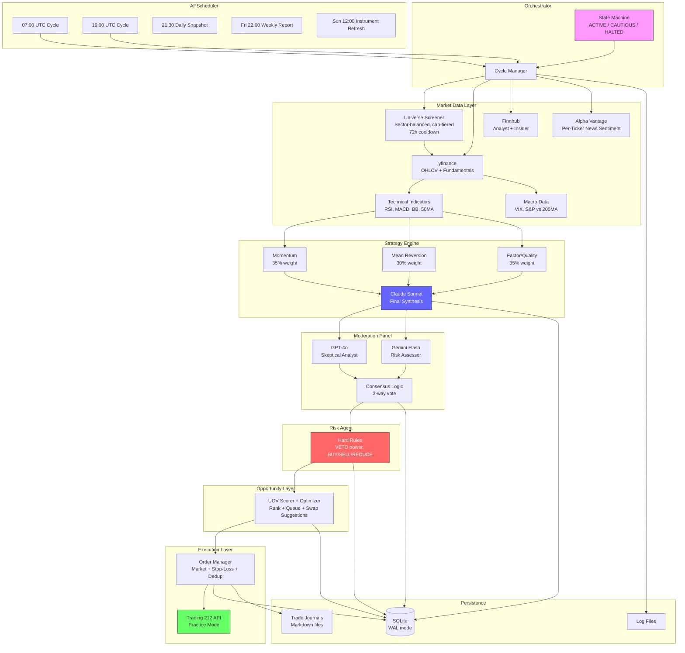
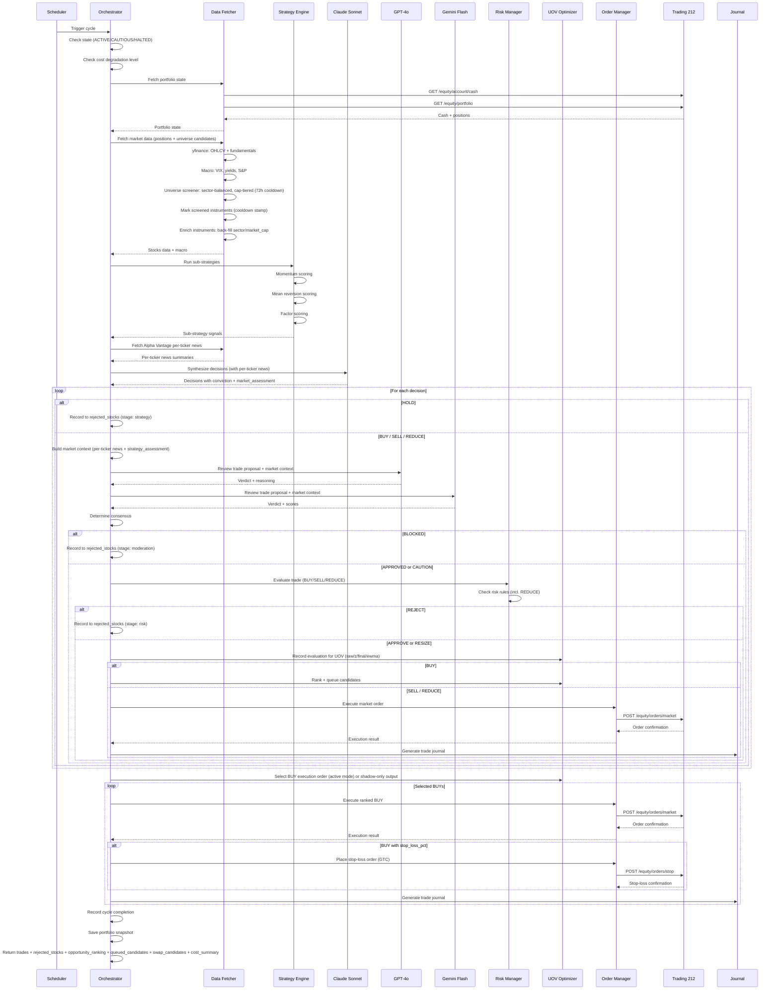
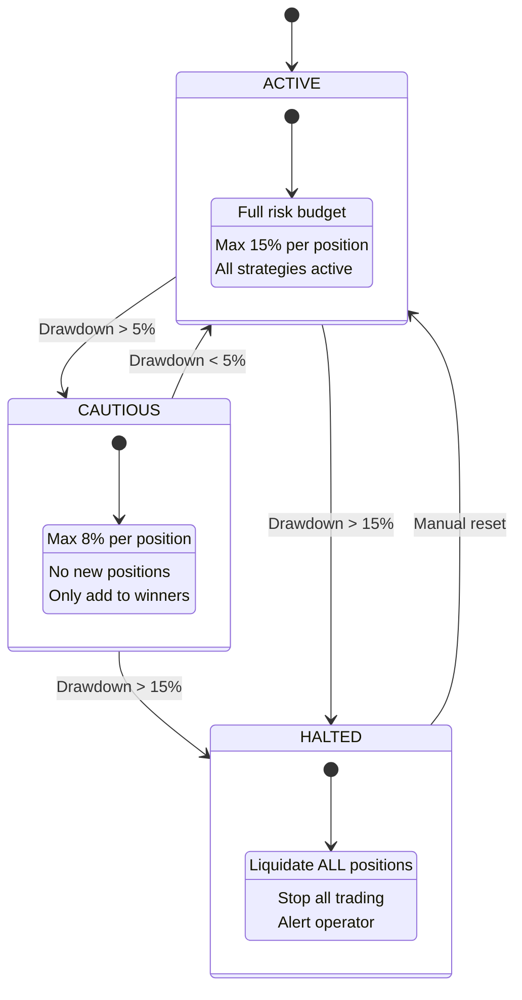
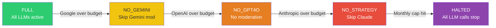
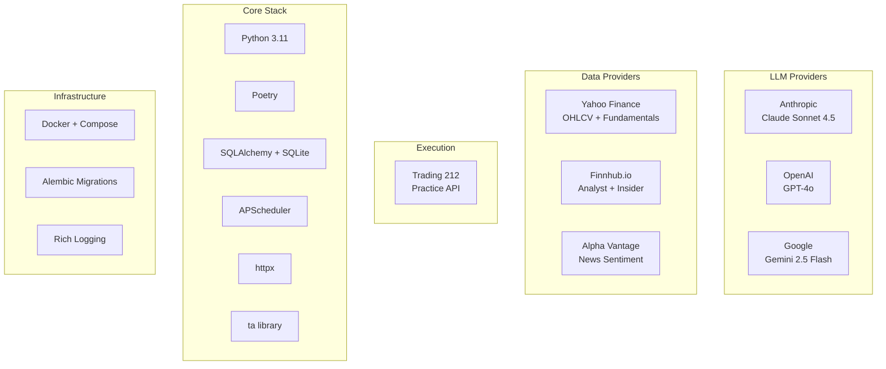

# Solution Architecture

## System Overview (ASCII)

```
+===========================================================================+
|                        INVESTMENT AGENT SYSTEM                             |
+===========================================================================+
|                                                                            |
|  +-----------------+     +------------------------------------------+     |
|  | APScheduler     |     |           ORCHESTRATOR                    |     |
|  |                 |---->|  State Machine: ACTIVE/CAUTIOUS/HALTED    |     |
|  | 07:00 UTC cycle |     |  Cycle ID tracking                       |     |
|  | 19:00 UTC cycle |     |  Error handling & recovery                |     |
|  | 21:30 snapshot  |     +----+-----------+-----------+----------+---+     |
|  | Fri 22:00 weekly|          |           |           |          |        |
|  | Sun 12:00 instr |          v           v           v          v        |
|  +-----------------+     +--------+  +--------+  +-------+  +--------+   |
|                          | STEP 1 |  | STEP 2 |  | STEP 3|  | STEP 4 |   |
|                          | DATA   |  |STRATEGY|  | MOD   |  | RISK   |   |
|                          +---+----+  +---+----+  +---+---+  +---+----+   |
|                              |           |           |           |        |
|                              v           v           v           v        |
|                          +--------+  +--------+  +-------+  +--------+   |
|                          | STEP 5 |  | STEP 6 |  | STEP 7 |              |
|                          |  UOV   |  |EXECUTE |  |JOURNAL |              |
|                          +--------+  +--------+  +--------+              |
|                                                                            |
+===========================================================================+
```

## Data Flow (ASCII)

```
EXTERNAL APIs                    AGENTS                         STORAGE
=============                    ======                         =======

Yahoo Finance  ----+
  (OHLCV, info)    |
                   v
Finnhub --------> DATA FETCHER ----+---> SQLite (market_data_cache)
  (analyst recs,   |               |
   insider sent.)  |               v
                   |        +-- INDICATORS (RSI, MACD, BB, 50MA)
Alpha Vantage --->-+        |     (8 fields — see docs/DATA_RATIONALE.md)
  (news sentiment) |        +-- FUNDAMENTALS (P/E, P/B, ROE, margins, D/E)
                   |        |     (9 fields — see docs/DATA_RATIONALE.md)
                   |        +-- MACRO (VIX, S&P vs 200MA, market regime)
                   |        |
                   |        +-- PER-TICKER NEWS (extract_per_ticker_news)
                   |        |     [Parsed from AV ticker_sentiments array,
                   |        |      per-stock sentiment scores + headlines]
                   |        |
                   |        +-- UNIVERSE SCREENER (get_screened_universe)
                   |              [Sector-balanced, cap-tiered sampling:
                   |               70% large, 20% mid, 10% small cap]
                   |              [72h screening cooldown prevents re-screening]
                   |              [Back-fills sector/market_cap to instruments]
                   |
                   v
          +-- STRATEGY ENGINE -----+
          |   Momentum (35%)       |
          |   Mean Rev. (30%)      |---> SQLite (strategy_decisions)
          |   Factor (35%)         |
          +--------+---------------+
                   |
                   v
Anthropic  -------> CLAUDE SONNET SYNTHESIS
  (strategy LLM)    [Sub-strategy signals + per-ticker news
                     + analyst data + portfolio state]
                     → decisions with conviction
                     → market_assessment thesis
                            |
                            v
                   MARKET CONTEXT (context.py)
                   [indicators, fundamentals,
                    macro, sub-strategy signals,
                    analyst data, per-ticker news,
                    strategy_assessment (challenge this)]
                            |
                            v
OpenAI ----------> GPT-4o MODERATOR ---+
  (skeptic)        (full data access)  |
                                       +--> MODERATION PANEL --> SQLite
Gemini ----------> GEMINI MODERATOR ---+    (consensus logic)   (moderation_logs)
  (risk assessor)  (full data access)  |
                            +----------+
                            |
                            v
                   RISK MANAGER (hard rules) --> SQLite (risk_decisions)
                   [Max stock %, sector %,
                    drawdown, VIX, cash floor,
                    correlation, REDUCE check]
                            |
                            v
Trading 212 <----- ORDER MANAGER -----------> SQLite (orders, opportunity_queue)
  (Practice API)   [Market orders (BUY/SELL/REDUCE),
                    stop-loss orders (GTC),
                    dedup + rate limit]
                            ^
                            |
                   UOV SCORER + OPTIMIZER --> SQLite (opportunity_score_snapshots)
                   [Cross-cycle UOV EWMA, BUY ranking, queueing]
                   [Queue state persisted in opportunity_queue]
                            |
                            v
                   TRADE JOURNAL -----------> journals/*.md
                   [Full markdown report
                    per trade executed]
```

## State Machine

```
                    +--------+
                    | ACTIVE |  Normal operation
                    |  Full  |  Full risk budget
                    | budget |  Max 15% per position
                    +---+----+
                        |
                        | Drawdown > 5%
                        v
                   +----------+
                   | CAUTIOUS |  Reduced risk
                   | Max 8%   |  No new positions
                   | per pos. |  Only add to winners
                   +----+-----+
                        |
                        | Drawdown > 15%
                        v
                    +--------+
                    | HALTED |  Emergency stop
                    | Liquid.|  Liquidate ALL positions
                    |  ALL   |  Alert operator
                    +--------+

  Recovery: Manual intervention required to move from HALTED back to ACTIVE.
  CAUTIOUS -> ACTIVE: Automatic when drawdown recovers below 5%.
```

## Cost Degradation Chain

```
  +-----------+    Google over    +------------+    OpenAI over   +-----------+
  |   FULL    | ----------------> | NO_GEMINI  | ---------------> | NO_GPT4O  |
  | All LLMs  |                   | Skip Gemini|                  | No mods   |
  | available |                   | moderator  |                  | available |
  +-----------+                   +------------+                  +-----------+
                                                                       |
                                         Anthropic over budget         |
       +--------+                   +---------------+                  |
       | HALTED | <---------------- | NO_STRATEGY   | <----------------+
       | All    |   Monthly cap     | Skip Claude   |   Anthropic over
       | halted |   exceeded        | synthesis     |
       +--------+                   +---------------+
```

## Moderation Consensus Logic

```
  Strategy (always AGREE)  +  GPT-4o Verdict  +  Gemini Verdict
  ========================    ==============      ==============

  3/3 AGREE                    --> APPROVED (proceed normally)
  2/3 AGREE, 1 DISAGREE       --> CAUTION  (proceed with flag)
  2/3 DISAGREE                 --> BLOCKED  (do not trade)
  HIGH_RISK + any DISAGREE     --> BLOCKED  (do not trade)

  Fallback (1 moderator):
    AGREE + conviction >= 75   --> APPROVED
    DISAGREE                   --> BLOCKED
    else                       --> CAUTION

  Fallback (0 moderators):
    conviction >= 85           --> APPROVED
    else                       --> BLOCKED
```

## Database Schema (Key Tables)

```
+-------------------+     +-------------------+     +------------------+
| strategy_decisions|     | moderation_logs   |     | risk_decisions   |
|-------------------|     |-------------------|     |------------------|
| cycle_id          |     | cycle_id          |     | cycle_id         |
| ticker            |     | ticker            |     | ticker           |
| action            |     | moderator         |     | proposed_action  |
| conviction        |     | verdict           |     | verdict          |
| target_alloc_pct  |     | reasoning         |     | adjusted_alloc   |
| reasoning         |     | growth_score      |     | triggered_rules  |
| catalysts_json    |     | risk_score        |     | reasoning        |
| growth_potential  |     | confidence_score  |     | portfolio_state  |
| risk_level        |     | consensus         |     |                  |
| market_assessment |     |                   |     |                  |
| raw_response_json |     |                   |     |                  |
+-------------------+     +-------------------+     +------------------+
         |                         |                        |
         v                         v                        v
+-------------------+     +-------------------+     +------------------+
| orders            |     | cost_logs         |     | api_logs         |
|-------------------|     |-------------------|     |------------------|
| ticker            |     | provider          |     | service          |
| action            |     | model             |     | method           |
| quantity          |     | input_tokens      |     | endpoint         |
| price             |     | output_tokens     |     | status_code      |
| status            |     | cost_gbp          |     | duration_ms      |
| t212_order_id     |     | purpose           |     | error            |
| strategy          |     |                   |     |                  |
| conviction        |     |                   |     |                  |
+-------------------+     +-------------------+     +------------------+

+-------------------+     +-------------------+     +------------------+
| portfolio_snaps   |     | system_state      |     | instruments      |
|-------------------|     |-------------------|     |------------------|
| total_value_gbp   |     | state (ACTIVE/    |     | ticker           |
| cash_gbp          |     |   CAUTIOUS/HALTED)|     | name             |
| invested_gbp      |     | peak_portfolio    |     | sector           |
| num_positions     |     | current_drawdown  |     | industry         |
| positions_json    |     | paused            |     | market_cap       |
| state             |     | last_cycle_at     |     | business_summary |
+-------------------+     +-------------------+     | data_available   |
                                                    | last_screened_at |
                                                    +------------------+

+-------------------------+     +----------------------+
| opportunity_score_snaps |     | opportunity_queue    |
|-------------------------|     |----------------------|
| cycle_id                |     | ticker               |
| ticker                  |     | queued_cycles        |
| stage                   |     | last_uov_ewma        |
| uov_raw / z / final     |     | last_seen_cycle_id   |
| uov_ewma                |     | metadata_json        |
| moderation_consensus    |     |                      |
| risk_verdict            |     |                      |
+-------------------------+     +----------------------+
```

---

## Mermaid Diagrams

### System Architecture



### Pipeline Sequence



### Cycle Output Structure

Each `run_cycle()` call returns a JSON result with:

```json
{
  "cycle_id": "cycle_20260303_0700_a1b2c3",
  "trades": [
    {
      "ticker": "AAPL_US_EQ",
      "action": "BUY",
      "allocation_pct": 8.5,
      "reasoning": "Strong momentum above 200-day MA with ...",
      "industry": "Consumer Electronics",
      "market_cap": 3200000000000,
      "description": "Apple Inc. designs, manufactures, and markets ...",
      "execution": { "status": "filled", "quantity": 12.5, "value_gbp": 850.0 },
      "moderation": "APPROVED",
      "risk": "APPROVE",
      "stop_loss": { "status": "filled", "stop_price": 168.0 }
    }
  ],
  "rejected_stocks": [
    {
      "ticker": "TSLA_US_EQ",
      "action": "BUY",
      "stage": "moderation",
      "reason": "BLOCKED by moderation consensus",
      "conviction": 72,
      "industry": "Auto Manufacturers",
      "market_cap": 850000000000,
      "description": "Tesla, Inc. designs, develops, manufactures ..."
    }
  ],
  "opportunity_ranking": [
    {
      "ticker": "AAPL_US_EQ",
      "uov_raw": 0.42,
      "uov_z": 1.31,
      "uov_final": 1.31,
      "uov_ewma": 0.88,
      "is_tradable": true
    }
  ],
  "queued_candidates": [
    { "ticker": "GOOG_US_EQ", "queued_cycles": 2, "uov_ewma": 0.56 }
  ],
  "swap_candidates": [
    { "candidate_ticker": "NVDA_US_EQ", "weakest_held_ticker": "PFE_US_EQ", "delta": 1.12 }
  ],
  "num_trades": 3,
  "num_rejected": 2,
  "cost_summary": { ... },
  "status": "completed"
}
```

Rejected stocks are tagged by the pipeline stage that blocked them:

| Stage | Meaning | Extra fields |
|-------|---------|--------------|
| `strategy` | Claude returned HOLD | reasoning, conviction |
| `moderation` | GPT-4o + Gemini consensus BLOCKED | moderation verdict |
| `risk` | Hard rules REJECTED | triggered_rules list |
| `opportunity_queue` | Approved BUY deferred by UOV queueing/capacity | queued reason + metadata |

All rejection details are also persisted in the `strategy_decisions`, `moderation_logs`, `risk_decisions`, and `opportunity_score_snapshots` tables for long-term analysis.

### State Machine



### Cost Degradation



### Technology Stack




## Planned Near-Term Extensions

These are approved near-term projects that are intentionally documented before implementation.

### 1) Chat Interface & Real-Time Alerts (US-1.5)
- **Implemented in v1:** outbound notifications for trade instruction approvals, trade execution results, cycle run summaries, state transitions, and critical failures.
- **Implemented channels:** Slack webhook + email (SMTP), with retries/timeouts/dedup and fail-open behavior.
- **Implemented persistence:** `notification_logs` table for send-attempt audit trail.
- **Operational profile (current default):**
  - `trade_instruction_approved` -> Slack only
  - `trade_execution_result` -> Slack + Email
  - `cycle_run_summary` -> Slack only
  - `state_transition` -> Slack + Email
  - `critical_cycle_failure` -> Slack + Email
  - `include_dry_run_alerts: false`
- **Hookup path used in production rollout:**
  - Slack: Incoming Webhook URL in `.env` via `SLACK_WEBHOOK_URL`
  - Email: SendGrid SMTP via `smtp.sendgrid.net:587`, `SMTP_USER=apikey`, `SMTP_USE_TLS=true`
  - Verification: inspect `notification_logs` via in-container Python query + SendGrid Email Logs for final delivery status
- **Future:** inbound command interface (`/status`, `/pause`, `/resume`, `/force-sell`) with auth and audit logs.
- Detailed plan: `docs/CHAT_INTERFACE_PROJECT.md`.

### 2) Backtesting Engine (US-5.1)
- Implemented: `src/backtesting/` — engine, paper broker, io, metrics, deterministic policy, walk-forward runner, promotion report.
- Deterministic historical replay with next-open fill and slippage; LLM-free policy proxy.
- Walk-forward validation and benchmark comparison; scenario configs (bull/bear/sideways); promotion report (safe to deploy vs hold).
- CLI: `python -m src.backtesting.main --config backtests/default.yaml`, `--synthetic`, `--walk-forward`, `--scenario bull|bear|sideways`.
- Detailed plan: `docs/BACKTESTING_PROJECT_PLAN.md`.
