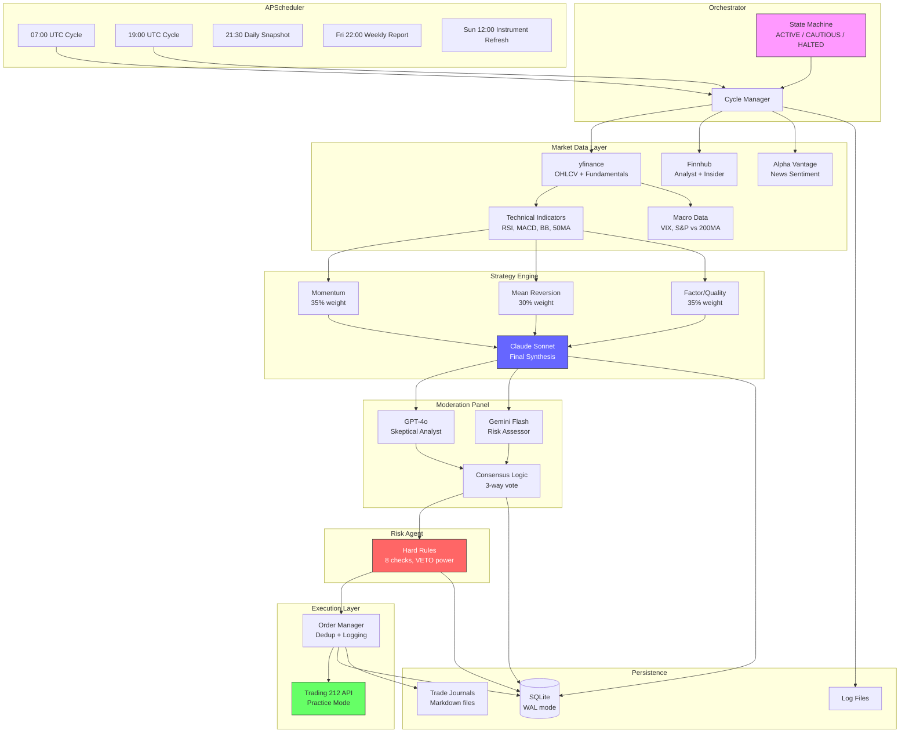
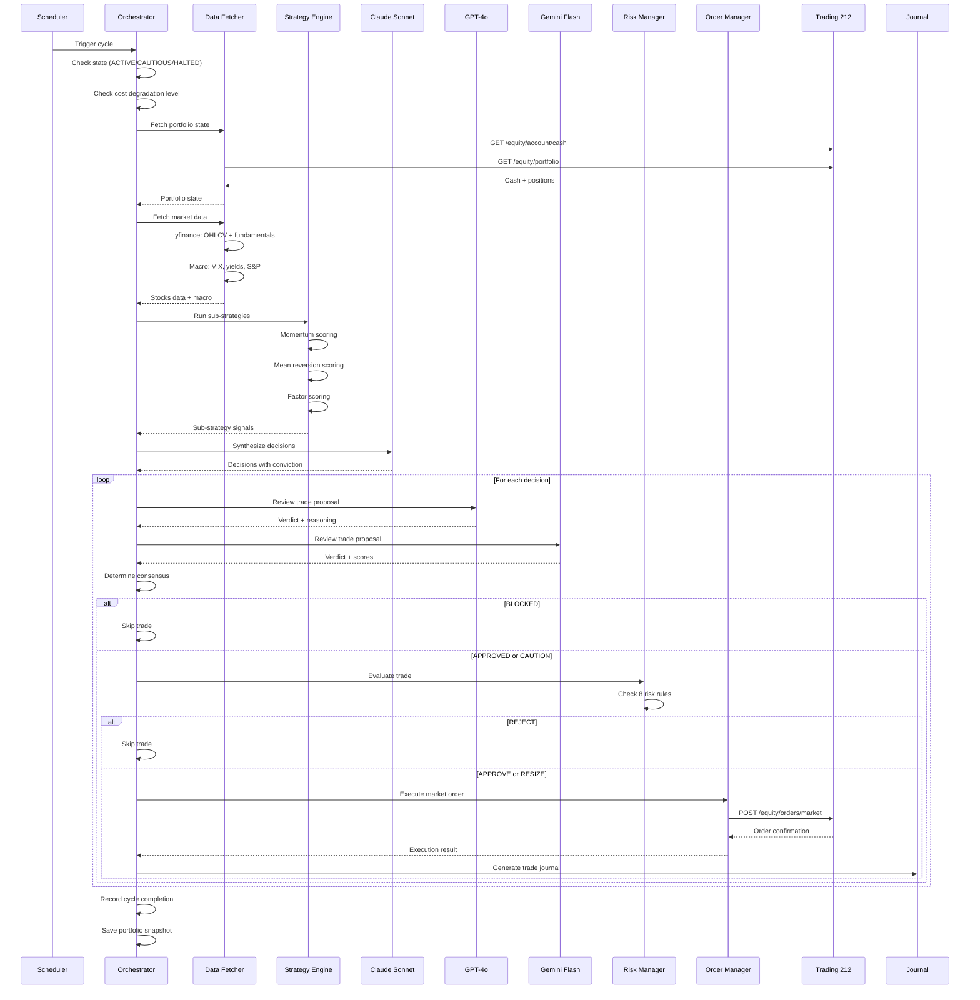
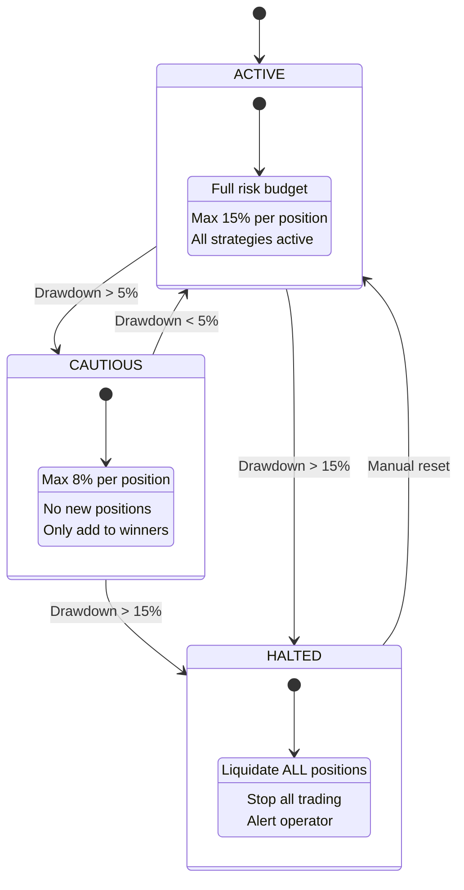
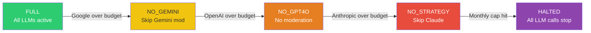
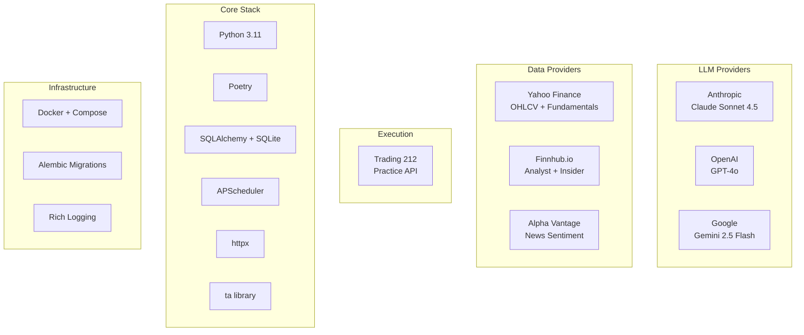

# Solution Architecture

## System Overview (ASCII)

```
+===========================================================================+
|                        INVESTMENT AGENT SYSTEM                             |
+===========================================================================+
|                                                                            |
|  +-----------------+     +------------------------------------------+     |
|  | APScheduler     |     |           ORCHESTRATOR                    |     |
|  |                 |---->|  State Machine: ACTIVE/CAUTIOUS/HALTED    |     |
|  | 07:00 UTC cycle |     |  Cycle ID tracking                       |     |
|  | 19:00 UTC cycle |     |  Error handling & recovery                |     |
|  | 21:30 snapshot  |     +----+-----------+-----------+----------+---+     |
|  | Fri 22:00 weekly|          |           |           |          |        |
|  | Sun 12:00 instr |          v           v           v          v        |
|  +-----------------+     +--------+  +--------+  +-------+  +--------+   |
|                          | STEP 1 |  | STEP 2 |  | STEP 3|  | STEP 4 |   |
|                          | DATA   |  |STRATEGY|  | MOD   |  | RISK   |   |
|                          +---+----+  +---+----+  +---+---+  +---+----+   |
|                              |           |           |           |        |
|                              v           v           v           v        |
|                          +--------+  +--------+  +-------+  +--------+   |
|                          | STEP 5 |  | STEP 6 |                          |
|                          |EXECUTE |  |JOURNAL |                          |
|                          +--------+  +--------+                          |
|                                                                            |
+===========================================================================+
```

## Data Flow (ASCII)

```
EXTERNAL APIs                    AGENTS                         STORAGE
=============                    ======                         =======

Yahoo Finance  ----+
  (OHLCV, info)    |
                   v
Finnhub --------> DATA FETCHER ----+---> SQLite (market_data_cache)
  (analyst recs,   |               |
   insider sent.)  |               v
                   |        +-- INDICATORS (RSI, MACD, BB, 50MA)
Alpha Vantage --->-+        |     (8 fields — see docs/DATA_RATIONALE.md)
  (news sentiment)          +-- FUNDAMENTALS (P/E, P/B, ROE, margins, D/E)
                            |     (9 fields — see docs/DATA_RATIONALE.md)
                            +-- MACRO (VIX, S&P vs 200MA, market regime)
                            |
                            v
                   +-- STRATEGY ENGINE --+
                   |   Momentum (35%)    |
                   |   Mean Rev. (30%)   |---> SQLite (strategy_decisions)
                   |   Factor (35%)      |
                   +--------+------------+
                            |
                            v
Anthropic  -------> CLAUDE SONNET SYNTHESIS
  (strategy LLM)    (Final decisions with conviction)
                            |
                            v
OpenAI ----------> GPT-4o MODERATOR ---+
  (skeptic)                            |
                                       +--> MODERATION PANEL --> SQLite
Gemini ----------> GEMINI MODERATOR ---+    (consensus logic)   (moderation_logs)
  (risk assessor)                      |
                            +----------+
                            |
                            v
                   RISK MANAGER (hard rules) --> SQLite (risk_decisions)
                   [Max stock %, sector %,
                    drawdown, VIX, cash
                    floor, correlation]
                            |
                            v
Trading 212 <----- ORDER MANAGER -----------> SQLite (orders)
  (Practice API)   [Dedup, rate limit,
                    market orders]
                            |
                            v
                   TRADE JOURNAL -----------> journals/*.md
                   [Full markdown report
                    per trade executed]
```

## State Machine

```
                    +--------+
                    | ACTIVE |  Normal operation
                    |  Full  |  Full risk budget
                    | budget |  Max 15% per position
                    +---+----+
                        |
                        | Drawdown > 5%
                        v
                   +----------+
                   | CAUTIOUS |  Reduced risk
                   | Max 8%   |  No new positions
                   | per pos. |  Only add to winners
                   +----+-----+
                        |
                        | Drawdown > 15%
                        v
                    +--------+
                    | HALTED |  Emergency stop
                    | Liquid.|  Liquidate ALL positions
                    |  ALL   |  Alert operator
                    +--------+

  Recovery: Manual intervention required to move from HALTED back to ACTIVE.
  CAUTIOUS -> ACTIVE: Automatic when drawdown recovers below 5%.
```

## Cost Degradation Chain

```
  +-----------+    Google over    +------------+    OpenAI over   +-----------+
  |   FULL    | ----------------> | NO_GEMINI  | ---------------> | NO_GPT4O  |
  | All LLMs  |                   | Skip Gemini|                  | No mods   |
  | available |                   | moderator  |                  | available |
  +-----------+                   +------------+                  +-----------+
                                                                       |
                                         Anthropic over budget         |
       +--------+                   +---------------+                  |
       | HALTED | <---------------- | NO_STRATEGY   | <----------------+
       | All    |   Monthly cap     | Skip Claude   |   Anthropic over
       | halted |   exceeded        | synthesis     |
       +--------+                   +---------------+
```

## Moderation Consensus Logic

```
  Strategy (always AGREE)  +  GPT-4o Verdict  +  Gemini Verdict
  ========================    ==============      ==============

  3/3 AGREE                    --> APPROVED (proceed normally)
  2/3 AGREE, 1 DISAGREE       --> CAUTION  (proceed with flag)
  2/3 DISAGREE                 --> BLOCKED  (do not trade)
  HIGH_RISK + any DISAGREE     --> BLOCKED  (do not trade)

  Fallback (1 moderator):
    AGREE + conviction >= 75   --> APPROVED
    DISAGREE                   --> BLOCKED
    else                       --> CAUTION

  Fallback (0 moderators):
    conviction >= 85           --> APPROVED
    else                       --> BLOCKED
```

## Database Schema (Key Tables)

```
+-------------------+     +-------------------+     +------------------+
| strategy_decisions|     | moderation_logs   |     | risk_decisions   |
|-------------------|     |-------------------|     |------------------|
| cycle_id          |     | cycle_id          |     | cycle_id         |
| ticker            |     | ticker            |     | ticker           |
| action            |     | moderator         |     | proposed_action  |
| conviction        |     | verdict           |     | verdict          |
| target_alloc_pct  |     | reasoning         |     | adjusted_alloc   |
| reasoning         |     | growth_score      |     | triggered_rules  |
| catalysts_json    |     | risk_score        |     | reasoning        |
+-------------------+     +-------------------+     +------------------+
         |                         |                        |
         v                         v                        v
+-------------------+     +-------------------+     +------------------+
| orders            |     | cost_logs         |     | api_logs         |
|-------------------|     |-------------------|     |------------------|
| ticker            |     | provider          |     | service          |
| action            |     | model             |     | method           |
| quantity          |     | input_tokens      |     | endpoint         |
| price             |     | output_tokens     |     | status_code      |
| status            |     | cost_gbp          |     | duration_ms      |
| t212_order_id     |     | purpose           |     | error            |
+-------------------+     +-------------------+     +------------------+

+-------------------+     +-------------------+
| portfolio_snaps   |     | system_state      |
|-------------------|     |-------------------|
| total_value_gbp   |     | state (ACTIVE/    |
| cash_gbp          |     |   CAUTIOUS/HALTED)|
| invested_gbp      |     | peak_portfolio    |
| num_positions     |     | current_drawdown  |
| positions_json    |     | paused            |
| state             |     | last_cycle_at     |
+-------------------+     +-------------------+
```

---

## Mermaid Diagrams

### System Architecture



### Pipeline Sequence



### State Machine



### Cost Degradation



### Technology Stack


