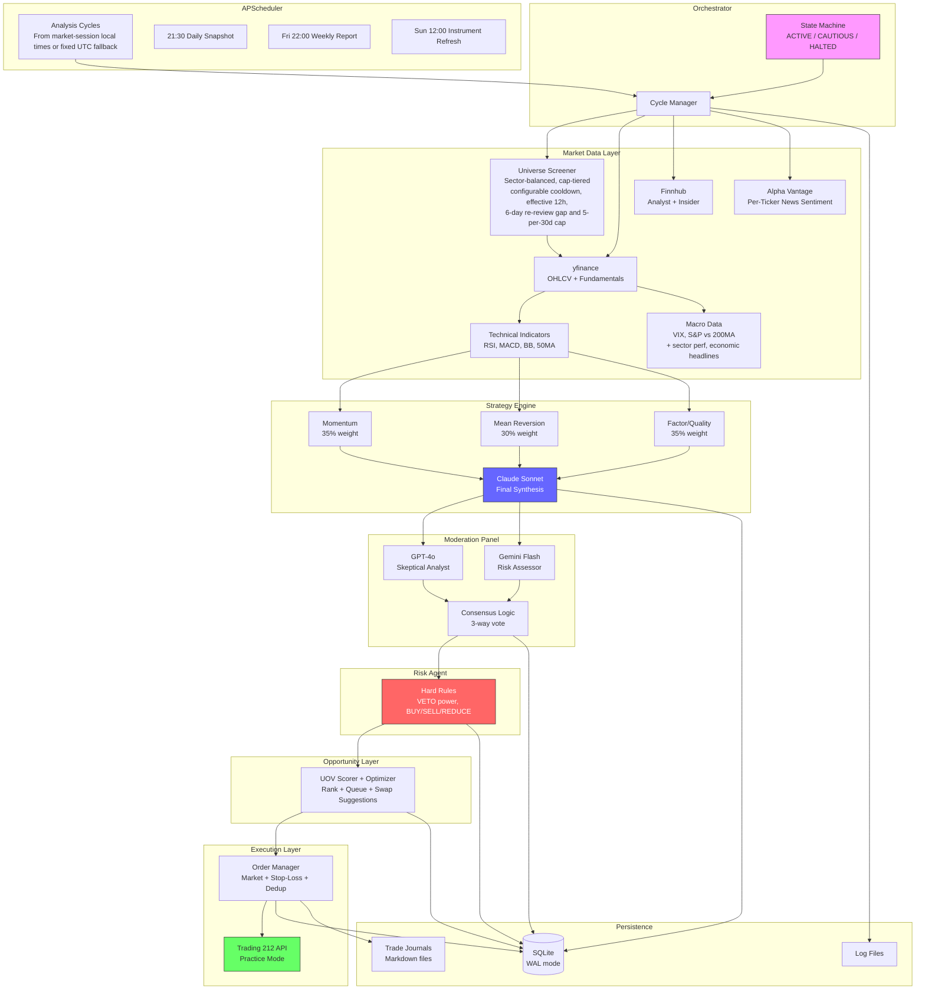
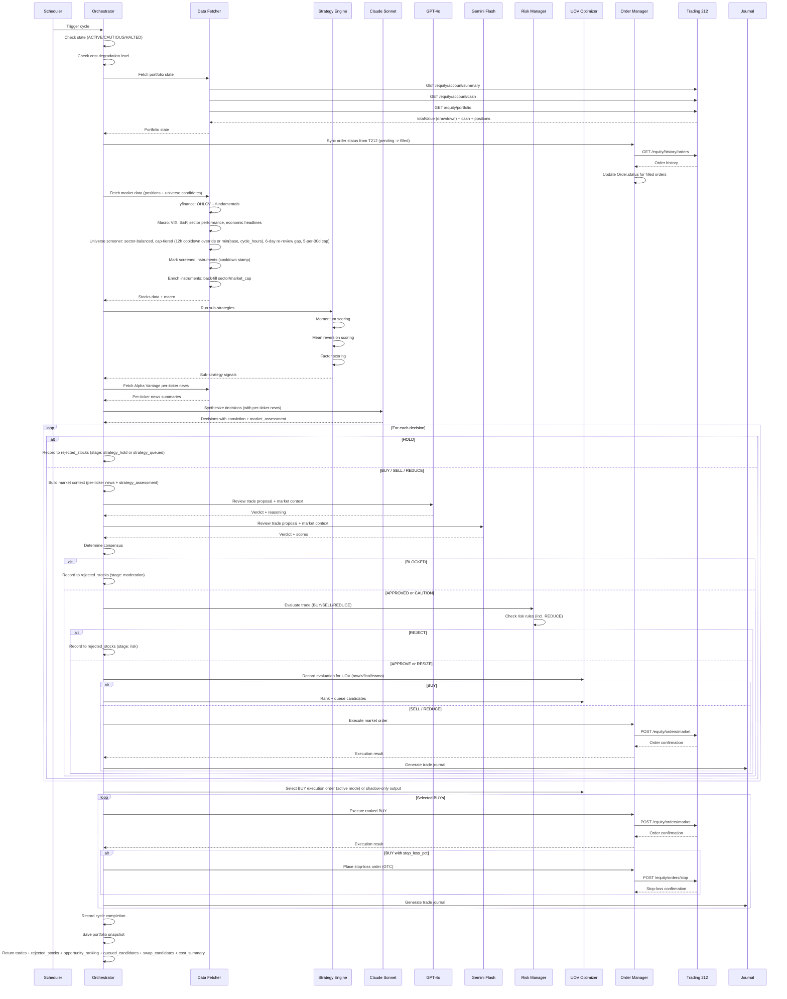
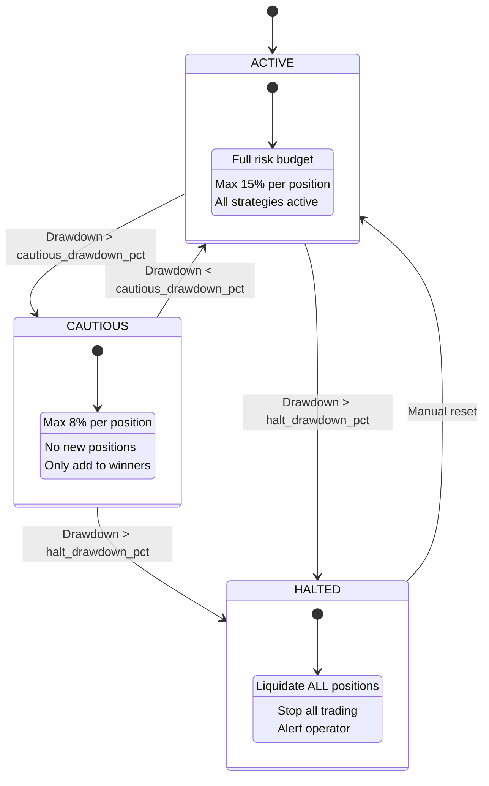
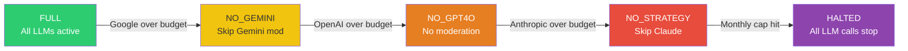
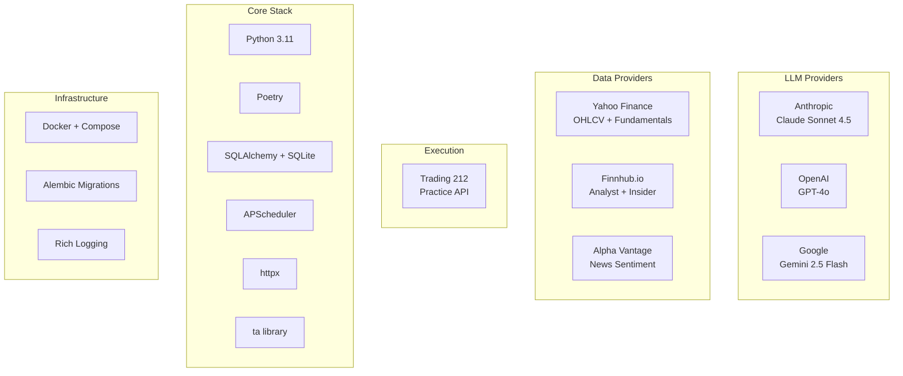

# Solution Architecture

> Complete system architecture: pipeline flow, state machine, database schema, and Mermaid diagrams.

## Purpose

This document is the single source of truth for the investment agent's technical architecture. It covers the data flow from external APIs through the multi-LLM pipeline to execution, the state machine and cost degradation chain, the database schema, the dashboard backend, and the moderation consensus logic. All diagrams (ASCII and Mermaid) live here.

## System Overview (ASCII)

```
+===========================================================================+
|                        INVESTMENT AGENT SYSTEM                             |
+===========================================================================+
|                                                                            |
|  +-----------------+     +------------------------------------------+     |
|  | APScheduler     |     |           ORCHESTRATOR                    |     |
|  |                 |---->|  State Machine: ACTIVE/CAUTIOUS/HALTED    |     |
|  | 10:00/12:30/15:15 America/New_York or 07/19 UTC cycles |     |  Cycle ID tracking                       |     |
|  | Mon-Fri, skip NYSE holidays  |     |  Error handling & recovery                |     |
|  | 21:30 snapshot  |     |                                           |     |
|  | Fri 22:00 weekly|     +----+-----------+-----------+----------+---+     |
|  | Sun 12:00 instr |          v           v           v          v        |
|  +-----------------+     +--------+  +--------+  +-------+  +--------+   |
|                          | STEP 1 |  | STEP 2 |  | STEP 3|  | STEP 4 |   |
|                          | DATA   |  |STRATEGY|  | MOD   |  | RISK   |   |
|                          +---+----+  +---+----+  +---+---+  +---+----+   |
|                              |           |           |           |        |
|                              v           v           v           v        |
|                          +--------+  +--------+  +-------+  +--------+   |
|                          | STEP 5 |  | STEP 6 |  | STEP 7 |              |
|                          |  UOV   |  |EXECUTE |  |JOURNAL |              |
|                          +--------+  +--------+  +--------+              |
|                                                                            |
+===========================================================================+
```

## Data Flow (ASCII)

```
EXTERNAL APIs                    AGENTS                         STORAGE
=============                    ======                         =======

Yahoo Finance  ----+
  (OHLCV, info)    |
                   v
Finnhub --------> DATA FETCHER ----+---> SQLite (market_data_cache, news_sentiment_cache)
  (analyst recs,   |               |     [Deferred when intraday: only for active-review tickers]
   insider sent.)  |               v
                   |        +-- INDICATORS (RSI, MACD, BB, 50MA)
Alpha Vantage --->-+        |     (8 fields — see docs/DATA_RATIONALE.md)
  (news sentiment) |        +-- FUNDAMENTALS (P/E, P/B, ROE, margins, D/E)
                   |        |     (9 fields — see docs/DATA_RATIONALE.md)
                   |        +-- MACRO (VIX, S&P vs 200MA, market regime)
                   |        +-- MACRO INTELLIGENCE (sector performance, economic headlines)
                   |        |
                   |        +-- PER-TICKER NEWS (extract_per_ticker_news)
                   |        |     [Parsed from AV ticker_sentiments array,
                   |        |      per-stock sentiment scores + headlines]
                   |        |
                   |        +-- UNIVERSE SCREENER (get_screened_universe)
                   |              [Runs every cycle regardless of state; Risk blocks new BUYs in CAUTIOUS]
                   |              [Sector-balanced, cap-tiered sampling:
                   |               70% large, 20% mid, 10% small cap]
                   |              [Cooldown: effective_screening_cooldown_override if set (active-swing default 4h); else intraday=min(base, cycle_hours), standard=base; prevents re-screening within window]
                   |              [When pool exhausted: order by last_screened_at ASC to rotate; proactive seed when pool < 2×max_candidates]
                   |              [Autonomous re-reviews gated by 2-day cooldown and 10-per-30d cap; fresh-share targeted via uninvestigated_target_pct]
                   |              [Batch enrichment job (daily 06:00): cascade yfinance → Finnhub → AV OVERVIEW → BRAVE_ANSWERS for sector/market_cap/industry/business_summary; ticker conversion via ticker_utils.t212_to_yf]
                   |
                   |        +-- WEB SEARCH FALLBACK (get_news_sentiment_fallback)
                   |              [When Finnhub analyst or AV ticker sentiment fails:
                   |               Brave/Tavily supplies analyst/news snippets for strategy prompt]
                   |
                   v
          +-- STRATEGY ENGINE -----+
          |   Momentum (35%)       |
          |   Mean Rev. (30%)      |---> SQLite (strategy_decisions)
          |   Factor (35%)         |
          +--------+---------------+
                   |
                   v
Anthropic  -------> CLAUDE SONNET SYNTHESIS
  (strategy LLM)    [Sub-strategy signals + company_profiles + news_sentiment
                     (per-ticker, aggregate, broad, sector, economic) + analyst data
                     + portfolio state] → decisions with conviction
                     → market_assessment thesis
                     [When research.enabled: tool-use loop (web_search, news_search, sector_search, sec_search, macro_search) — caps 20/8/7 per member, 35 total/cycle]
                            |
                            v
                   MARKET CONTEXT (context.py)
                   [indicators, fundamentals,
                    macro (VIX, regime, sector_headwind, sector_summary, economic_highlights),
                    sub-strategy signals, analyst data, news_sentiment,
                    strategy_assessment (challenge this)]
                            |
                            v
OpenAI ----------> GPT-4o MODERATOR ---+
  (skeptic)        (full data access; when skeptic_research_enabled: tool-use)  |
                                       +--> MODERATION PANEL --> SQLite
Gemini ----------> GEMINI MODERATOR ---+    (consensus logic)   (moderation_logs)
  (risk assessor)  (full data access; when risk_research_enabled: tool-use loop)  |
                            +----------+
                            |
                            v
                   RISK MANAGER (hard rules) --> SQLite (risk_decisions)
                   [Max stock %, sector %,
                    drawdown, VIX, cash floor,
                    correlation (OHLCV returns),
                    daily loss halt (snapshot P&L),
                    REDUCE check]
                            |
                            v
Trading 212 <----- ORDER MANAGER -----------> SQLite (orders, opportunity_queue,
  (Practice API)   [Market orders (BUY/SELL/REDUCE),                stop_loss_adjustments)
                    stop-loss orders (GTC),
                    limit orders (dip-buy),
                    dedup + rate limit]
                            |
                            v
                   STOP-LOSS MANAGER ----------> SQLite (stop_loss_adjustments)
                   [ATR-based stop reassessment,
                    trailing stops (cancel+replace),
                    limit dip-buy orders]
                            ^
                            |
                   UOV SCORER + OPTIMIZER --> SQLite (opportunity_score_snapshots)
                   [Cross-cycle UOV EWMA, BUY ranking, queueing]
                   [Queue state persisted in opportunity_queue]
                            |
                            v
                   TRADE JOURNAL -----------> journals/*.md
                   [Full markdown report
                    per trade executed]
```

## State Machine

```
                    +--------+
                    | ACTIVE |  Normal operation
                    |  Full  |  Full risk budget
                    | budget |  Max 15% per position
                    +---+----+
                        |
                        | Drawdown > cautious_drawdown_pct (30%)
                        v
                   +----------+
                   | CAUTIOUS |  Reduced risk
                   | Max 8%   |  No new positions
                   | per pos. |  Only add to winners
                   +----+-----+
                        |
                        | Drawdown > halt_drawdown_pct (40%)
                        v
                    +--------+
                    | HALTED |  Emergency stop
                    | Liquid.|  Liquidate ALL positions
                    |  ALL   |  Alert operator
                    +--------+

  Recovery: Manual intervention required to move from HALTED back to ACTIVE.
  CAUTIOUS -> ACTIVE: Automatic when drawdown recovers below cautious_drawdown_pct; or `--reset-peak` / Dashboard "Reset Peak" when peak was set incorrectly.

  Practice mode: When `trading.account_type: practice`, the state machine is relaxed — drawdown is logged
  but the system always stays ACTIVE. Use `account_type: live` for real money.
```

## Cost Degradation Chain

```
  +-----------+  One moderator   +------------+  Both moderators  +-----------+
  |   FULL    | ----------------> | NO_GEMINI  | ----------------> | NO_GPT4O  |
  | All LLMs  |  over budget     | One mod     |  over budget     | No mods   |
  | available |  (Google OR      | still runs  |                  | available |
  +-----------+   OpenAI)        +------------+                   +-----------+
                                                                       |
                                         Anthropic over budget         |
       +--------+                   +---------------+                  |
       | HALTED | <---------------- | NO_STRATEGY   | <----------------+
       | All    |   Monthly cap     | Skip Claude   |   Anthropic over
       | halted |   exceeded        | synthesis     |
       +--------+                   +---------------+

  Note: Individual moderators self-check their own budgets before each call.
  NO_GEMINI is returned when Google is over budget (GPT-4o still available).
  NO_GPT4O is returned when OpenAI is over budget (Gemini still available) and
  also when both moderator budgets are exceeded.
```

## Dashboard (Phase 1 + Phase 1.5 Analytics Lite)

```
Agent pipeline (scheduler, screener, strategy, moderation, risk, execution, notifications)
    |
    v
log_event() --> events_log (non-blocking, fail-open)
    |
    v
FastAPI dashboard backend (reads agent SQLite monitoring tables and hosts separate evolution planner workflow tables in the same DB)
    |
    +-- GET /api/runs, /api/runs/diff, /api/status (state, paused)
    +-- GET /api/universe, /api/universe/{ticker}
    +-- GET /api/portfolio, /api/orders
    +-- GET /api/public/docs/*, /api/public/performance/metrics, /api/public/portfolio*, /api/public/macro/*
    +-- GET /api/events, /api/events/stream (SSE, 5s poll cadence)
    +-- POST /api/runs/trigger (dry-run), POST /api/runs/trigger-live (live cycle; 409 when another cycle is active)
    +-- GET /api/decisions, /api/decisions/waterfall, /api/decisions/{cycle_id}, /api/decisions/ticker/{ticker}
    +-- GET /api/moderation/{cycle_id}, /api/moderation/ticker/{ticker}; GET /api/risk/{cycle_id}
    +-- GET /api/opportunity/config, /api/opportunity/scores, /api/opportunity/queue, /api/opportunity/history/{ticker}
    +-- GET /api/outcomes, /api/outcomes/stats
    +-- GET /api/research/logs, /api/research/ticker/{ticker}, /api/research/summary
    +-- GET /api/stop-loss/current, /api/stop-loss/adjustments
    +-- GET /api/performance/metrics, /api/performance/history
    +-- GET /api/costs/daily, /api/costs/monthly, /api/costs/degradation
    +-- GET /api/api-usage/daily
    +-- GET /api/system/state, POST /api/system/trigger-cycle, pause, resume
    +-- GET/POST /api/evolution/requests, plan/messages/runs/artifacts, blocked build/deploy approvals
    |
    v
React frontend (SPA, served by FastAPI when dist/ exists)
    |
    +-- 11 pages: Dashboard Home (skeleton loading, alert banner, metric cards, positions with sparklines, activity feed, hardening warnings), Universe (deep-linkable /universe/:ticker), Run History, Portfolio (sparklines, public read-only mode + operator-only Force Sell), Opportunity Pipeline, Order Management (including off-hours warning notes), Commands (chat-first conversational operator console with shared Slack/dashboard sessions, planner-led agentic beta routing, live agent-activity rail, evidence panels, degraded-turn warning cards, pending proposal rail, research trace, session spend, and a secondary legacy Slack command-history tab), World News (public read-only macro archive), Costs, Roadmap & Architecture, Evolution Planner
    +-- Public nav: Overview, Portfolio, World News, Roadmap; operator nav adds Dashboard, Universe, Runs, and More
    +-- Universe: sortable columns, expandable rows with pipeline waterfall + committee reasoning, responsive column hiding
    +-- Run History: timeline, run diff (new/closed/position changes)
    +-- Portfolio: positions with inline sparklines, P&L chart, sector allocation, mobile card layout
    +-- Evolution Planner: authenticated operator-only change intake, clarification loop, repo context, validation matrix, and audit trail with planner-only gates
    +-- Components: AlertBanner, Skeleton, Sparkline, PipelineWaterfall, PnlDisplay, FreshnessIndicator, useFocusTrap
```

**CORS:** Dashboard API uses configurable CORS origins via `dashboard.cors_origins` in `config/settings.yaml`. Defaults to the canonical HTTPS domain `https://zeninvest.zenouz.ai` plus localhost dev origins when absent. Production should allow the canonical HTTPS domain rather than a raw VPS IP. Individual moderators self-check budgets, so the degradation level is primarily for reporting.

**Authentication (US-7.1 + US-7.7):** The dashboard uses a public/private split. Anonymous read-only routes live under `/api/public/*`, and the anonymous page surface is intentionally limited to Overview, Portfolio, World News, and Roadmap. All other `/api/*` routes require operator login and a signed `HttpOnly` session cookie. Operator actions such as cycle triggers, pause/resume, order management, and Force Sell remain private even when their corresponding read-only data pages are public. Operator auth is configured with `DASHBOARD_OPERATOR_USERNAME`, `DASHBOARD_OPERATOR_PASSWORD_HASH`, `DASHBOARD_SESSION_SECRET`, and optional localhost-only `DASHBOARD_INSECURE_DEV_MODE=true`. Operator login is blocked over plain HTTP outside localhost dev mode. Production ingress is HTTPS behind Cloudflare + Nginx on `zeninvest.zenouz.ai`, with Nginx enforcing canonical host/scheme access and forwarding `X-Forwarded-Proto: https` to the internal-only dashboard app. The frontend no longer injects shared secrets at build time or stores dashboard credentials in `localStorage`. Axios and SSE treat `401/403` from protected APIs as a signed-out state. SSE uses `fetch()` + stream parsing with credentials included.

**Data flow:** Agent writes to `events_log` and `runs`; dashboard reads from existing agent tables (orders, portfolio_snapshots, instruments, strategy_decisions, moderation_logs, risk_decisions, opportunity_score_snapshots, opportunity_queue, trade_outcomes, stop_loss_adjustments, performance_metrics, cost_logs, api_logs, system_state, `slack_command_log`, `chat_sessions`, `chat_turns`, `chat_actions`, `chat_research_logs`, `chat_workflow_steps`, and `research_logs`). Dashboard-owned persistence now also includes `run_dataset_audits`, keyed to `runs.id`, so refreshes and full cycles record per-dataset status, timing, row deltas, metadata, and failures without overloading `runs.summary_json`. `orders.warning_note` now carries off-hours execution annotations, and `system_state` also exposes `halted_recovery_streak` plus `peak_inflation_warning_note` for the hardening surfaces. Conversational workflow spend is attributable at session/turn granularity via nullable `chat_session_id` / `chat_turn_id` tags on `cost_logs` and `research_logs`, while `chat_workflow_steps` stores the safe operator-visible trace of what the planner/orchestrator is doing: planning, resolving tickers, fetching market data, running grounded research, asking specialists, comparing options, composing an answer, drafting a trade preview, waiting for confirmation, and emitting explicit warning metadata when the planner/composer degrades or subject resolution is incomplete. The planner/composer default now uses OpenAI `gpt-4o` via the Responses API for reliability, with deterministic help/clarification and trade execution paths preserved as the bounded fallback. Zen Evolution Engine uses a **separate dashboard workflow domain** (`evolution_requests`, `evolution_messages`, `evolution_plans`, `evolution_runs`, `evolution_artifacts`, `evolution_approvals`, `evolution_deployments`) so software-change planning does not overload the trading chat/session model. Shared SQLite DB via `./data` volume in Docker. The orchestrator **normalises T212 positions** before saving to `portfolio_snapshots.positions_json` — converting `instrument.ticker` and `walletImpact` (currentValue, unrealizedProfitLoss, totalCost) into flat fields (ticker, value_gbp, pnl_gbp, pnl_pct) for dashboard display. **Run History** displays `runs` table (one row per cycle; scheduler creates Run for scheduled cycles, passes `scheduled_cycle_id` to orchestrator which updates it—no duplicates) and can now drill into the persisted dataset-audit rows for refresh/cycle health. **Activity feed (SSE)** uses relative URL when the SPA is same-origin and now polls every 5 seconds to keep idle VPS overhead low. Operator SSE connections use `fetch()` with session cookies; public pages do not receive private event data.

## Runtime Topology (US-7.6)

The runtime hardening work is deployment-model agnostic. On the current VPS, the active production control plane remains Docker Compose, with three long-lived containers plus shared runtime locks:

```
docker compose
  |
  +-- investment-dashboard-nginx
  |     -> nginx:alpine
  |     -> public ingress on 80/443
  |     -> proxies to dashboard:8000
  |
  +-- investment-agent
  |     -> python -m src.scheduler.scheduler
  |     -> scheduler.lock
  |
  +-- investment-dashboard
  |     -> python -m dashboard.backend.server
  |     -> api.lock
  |     -> internal-only on compose network port 8000
  |
  +-- investment-slack-listener
        -> python -m src.agents.notifications.slack_trade_listener
        -> slack-listener.lock

orchestrator run_cycle()
  -> orchestrator-cycle.lock
  -> shared across scheduled + dashboard-triggered execution
```

An alternative non-Docker small-VPS layout is also committed via `systemd`:

```
systemd
  |
  +-- investment-agent-api.service
  |     -> python -m dashboard.backend
  |     -> api.lock
  |
  +-- investment-agent-scheduler.service
  |     -> python -m src.scheduler.scheduler
  |     -> scheduler.lock
  |
  +-- investment-agent-slack-listener.service
  |     -> python -m src.agents.notifications.slack_trade_listener
  |     -> slack-listener.lock
  |
  +-- investment-agent-migrate.service (oneshot)
        -> scripts/run_migrations.sh
        -> migrations.lock
```

**Operational guarantees:**

- duplicate service starts fail fast instead of silently competing
- only one cycle can run at a time across manual and scheduled entrypoints
- Slack command handling is bounded by a worker pool rather than one thread per message
- the API runs as a single `uvicorn` process (`reload=False`, `workers=1`)

See [VPS Runtime Stability Plan](VPS_RUNTIME_STABILITY_PLAN.md) and [VPS Systemd Runbook](VPS_SYSTEMD_RUNBOOK.md).

## Risk-Parity Position Sizing (US-3.1)

When `risk.risk_parity_enabled: true`, BUY allocations are computed using 60-day inverse-volatility weighting instead of relying solely on Claude's target allocation. The pipeline:

1. **Volatility estimation** — `RiskParitySizer.compute_annualized_volatility()` computes realized vol from close prices over `risk_parity_lookback_days` (default 60), floored at `risk_parity_vol_floor` (default 0.05).
2. **Inverse-vol weighting** — Each ticker's ideal allocation is proportional to `1/vol`, giving lower-volatility stocks larger positions.
3. **Three-tier scaling** — The ideal allocation is scaled down by: (a) deployable cash budget, (b) target portfolio vol budget (`risk_parity_target_vol`, default 0.15), and (c) `max_single_stock_pct` cap.
4. **Delta-to-target execution** — BUY size is the increment from current allocation to the risk-parity target, not the full target. This avoids over-buying existing positions.
5. **Fallback** — When a ticker has insufficient price history, Claude's original target (capped at `max_single_stock_pct`) is used with `applied=False`.

Config validation: `lookback_days >= 2`, `vol_floor >= 0`, `target_vol > vol_floor` (clamped with warning if violated). Strategy/risk waterfall exposes `claude_target_pct` vs `risk_parity_target_pct` for audit.

## Volume Signals (US-4.1)

When `data_providers.volume_signals_enabled: true`, two volume indicators are computed in `indicators.py` alongside price-based signals:

1. **OBV (On-Balance Volume)** — Cumulative volume flow: adds volume on up-days, subtracts on down-days. Included in indicator output as `obv`.
2. **20-day volume ratio** — Current volume divided by 20-day average volume. Included as `volume_ratio_20d`.

**Sub-strategy integration:**
- **Momentum** (`momentum.py`): +10 score for breakout confirmation (price above SMA-20 + volume ratio > 1.5); -10 for price weakness on high volume (price below SMA-20 + volume ratio > 1.5).
- **Mean-reversion** (`mean_reversion.py`): +10 for oversold + volume confirmation (RSI < 35 + volume ratio > 1.3); -10 for overbought + high volume (RSI > 70 + volume ratio > 1.5).

Moderator context receives volume signal summaries for qualitative reasoning. Feature flag ensures zero impact when disabled.

## Moderation Consensus Logic

```
  Strategy (always AGREE)  +  GPT-4o Verdict  +  Gemini Verdict
  ========================    ==============      ==============

  3/3 AGREE (MODIFY = conditional AGREE) --> APPROVED (proceed normally)
  2/3 AGREE, 1 DISAGREE                 --> CAUTION  (proceed with 25% allocation reduction)
  2/3 DISAGREE                           --> BLOCKED  (do not trade)
  HIGH_RISK + any DISAGREE               --> BLOCKED  (do not trade)

  MODIFY verdicts: count as AGREE in consensus vote; their modifications.target_allocation_pct
  is applied as an allocation cap on the final trade (most conservative suggestion wins).

  Fallback (1 moderator):
    AGREE + conviction >= 75   --> APPROVED
    DISAGREE                   --> BLOCKED
    else                       --> CAUTION

  Fallback (0 moderators):
    conviction >= 85           --> APPROVED
    else                       --> BLOCKED
```

## Database Schema (Key Tables)

```
+-------------------+     +-------------------+     +------------------+
| strategy_decisions|     | moderation_logs   |     | risk_decisions   |
|-------------------|     |-------------------|     |------------------|
| cycle_id          |     | cycle_id          |     | cycle_id         |
| ticker            |     | ticker            |     | ticker           |
| action            |     | moderator         |     | proposed_action  |
| conviction        |     | verdict           |     | verdict          |
| target_alloc_pct  |     | reasoning         |     | adjusted_alloc   |
| reasoning         |     | growth_score      |     | triggered_rules  |
| catalysts_json    |     | risk_score        |     | reasoning        |
| growth_potential  |     | confidence_score  |     | portfolio_state  |
| risk_level        |     | consensus         |     |                  |
| market_assessment |     |                   |     |                  |
| raw_response_json |     |                   |     |                  |
+-------------------+     +-------------------+     +------------------+
         |                         |                        |
         v                         v                        v
+-------------------+     +-------------------+     +------------------+
| orders            |     | cost_logs         |     | api_logs         |
|-------------------|     |-------------------|     |------------------|
| ticker            |     | provider          |     | service          |
| action            |     | model             |     | method           |
| quantity          |     | input_tokens      |     | endpoint         |
| price             |     | output_tokens     |     | status_code      |
| status            |     | cost_gbp          |     | duration_ms      |
| t212_order_id     |     | purpose           |     | error            |
| strategy          |     |                   |     |                  |
| conviction        |     |                   |     |                  |
+-------------------+     +-------------------+     +------------------+

+-------------------+     +-------------------+     +------------------+
| portfolio_snaps   |     | system_state      |     | instruments      |
|-------------------|     |-------------------|     |------------------|
| total_value_gbp   |     | state (ACTIVE/    |     | ticker           |
| cash_gbp          |     |   CAUTIOUS/HALTED)|     | name             |
| invested_gbp      |     | peak_portfolio    |     | sector           |
| num_positions     |     | current_drawdown  |     | industry         |
| positions_json    |     | paused            |     | market_cap       |
| state             |     | last_cycle_at     |     | business_summary |
+-------------------+     +-------------------+     | data_available   |
                                                    | last_screened_at |
                                                    +------------------+

+-------------------------+     +----------------------+
| opportunity_score_snaps |     | opportunity_queue    |
|-------------------------|     |----------------------|
| cycle_id                |     | ticker               |
| ticker                  |     | queued_cycles        |
| stage                   |     | last_uov_ewma        |
| uov_raw / z / final     |     | last_seen_cycle_id   |
| uov_ewma                |     | metadata_json        |
| moderation_consensus    |     |                      |
| risk_verdict            |     |                      |
+-------------------------+     +----------------------+
```

---

## Mermaid Diagrams

### System Architecture



### Pipeline Sequence



Execution floor guardrails:
- `min_order_value_gbp` is enforced as a minimum BUY ticket size for MARKET BUY and limit BUY paths: requests below the floor are upgraded to the floor when enough cash is available after the cash-floor guard.
- If there is not enough spendable cash to place the minimum BUY ticket, the BUY is skipped with a cash-floor reason.
- SELL, REDUCE, and protective stop-loss SELL orders are exempt from the floor so small positions can still be exited or protected.
- If a REDUCE would leave a residual position below `small_position_cleanup_value_gbp`, the orchestrator converts it to full SELL before execution.
- Ordinary autonomous SELLs are profit-gated: they require `exit_trigger_type="gain_realization"` plus unrealized profit at or above `sell_min_profit_pct` (default `15%`), unless the exit is a `hard_exit`.
- Once a position crosses `sell_min_profit_pct`, HOLD is only allowed if a live broker stop protects the full remaining quantity at or above the profit-lock line; otherwise the orchestrator deterministically exits the position.
- REDUCE is a rare profit-trim action only: the orchestrator only allows 50% trims once the configured unrealized gain threshold is met.
- Small-position cleanup liquidates holdings below `small_position_cleanup_value_gbp` (default `£200`) immediately, before position-analysis/strategy for those tickers. These deterministic cleanup SELLs use the broker-reported live quantity and bypass moderation/risk so there is a single cleanup liquidation path with no LLM involvement for the cleanup ticker.
- **FX-aware BUY quantity:** For `_US_EQ` instruments the orchestrator derives a GBP-equivalent price (`current_price × account-level GBP/USD scale`) before calling `calculate_quantity()`. The scale comes from `_compute_position_value_scale(positions, invested_gbp)` which divides T212's GBP `invested` value by the sum of native-currency positions. This prevents ~21% under-allocation caused by dividing a GBP target by a USD price. Controlled by `trading.fx_aware_quantity: true`; falls back to scale=1.0 when portfolio is empty. Stop prices sent to T212 always remain in native currency.
- **Market orders:** `OrderManager` calls T212 `POST /equity/orders/market` once per decision (no retry wrapper). Mutating POSTs are never auto-retried; only safe GETs use tenacity retries in `T212Client`.
- **SELL/REDUCE:** After cancelling conflicting stop orders, execution clamps share quantity to `GET /equity/portfolio/{ticker}` so a value/price-derived size cannot exceed the broker-reported position (reduces spurious 400 responses). Stop cancel failures with HTTP 404/400/409 “already gone” style bodies are treated as idempotent success.
- **Non-tradable BUY quarantine:** If T212 rejects a BUY with a 400 `instrument-invisible` / `Instrument can not be traded` response, `OrderManager` marks the instrument `data_available=False` so future screen/execution passes skip it.
- **Later HOLD/QUEUED beats earlier pending SELL:** On live cycles, if a newer strategy decision for a ticker is `HOLD` or `QUEUED`, the orchestrator cancels any still-live pending market SELL already sitting at T212 for that ticker so stale pre-open exits do not survive the latest decision.

### Cycle Output Structure

Each `run_cycle()` call returns a JSON result with:

```json
{
  "cycle_id": "cycle_20260303_0700_a1b2c3",
  "trades": [
    {
      "ticker": "AAPL_US_EQ",
      "action": "BUY",
      "allocation_pct": 8.5,
      "reasoning": "Strong momentum above 200-day MA with ...",
      "industry": "Consumer Electronics",
      "market_cap": 3200000000000,
      "description": "Apple Inc. designs, manufactures, and markets ...",
      "execution": { "status": "filled", "quantity": 12.5, "value_gbp": 850.0 },
      "moderation": "APPROVED",
      "risk": "APPROVE",
      "stop_loss": { "status": "filled", "stop_price": 168.0 }
    }
  ],
  "rejected_stocks": [
    {
      "ticker": "TSLA_US_EQ",
      "action": "BUY",
      "stage": "moderation",
      "reason": "BLOCKED by moderation consensus",
      "conviction": 72,
      "moderation_consensus": "BLOCKED",
      "industry": "Auto Manufacturers",
      "market_cap": 850000000000,
      "description": "Tesla, Inc. designs, develops, manufactures ..."
    }
  ],
  "rejected_by_action": { "BUY": 1, "HOLD": 15, "QUEUED": 9 },
  "opportunity_ranking": [
    {
      "ticker": "AAPL_US_EQ",
      "uov_raw": 0.42,
      "uov_z": 1.31,
      "uov_final": 1.31,
      "uov_ewma": 0.88,
      "is_tradable": true
    }
  ],
  "queued_candidates": [
    { "ticker": "GOOG_US_EQ", "queued_cycles": 2, "uov_ewma": 0.56 }
  ],
  "swap_candidates": [
    { "candidate_ticker": "NVDA_US_EQ", "weakest_held_ticker": "PFE_US_EQ", "delta": 1.12 }
  ],
  "num_trades": 3,
  "num_rejected": 2,
  "rejected_by_action": { "BUY": 1, "HOLD": 15, "QUEUED": 9 },
  "cost_summary": { ... },
  "status": "completed"
}
```

Rejected stocks are tagged by the pipeline stage that blocked them:

| Stage | Meaning | Extra fields |
|-------|---------|--------------|
| `strategy_hold` | Claude returned HOLD | reasoning, conviction; moderation_consensus/risk_verdict "not invoked" |
| `strategy_queued` | Claude returned QUEUED | reasoning, conviction; moderation_consensus/risk_verdict "not invoked" |
| `moderation` | GPT-4o + Gemini consensus BLOCKED | moderation verdict |
| `risk` | Hard rules REJECTED | triggered_rules list |
| `opportunity_queue` | Approved BUY deferred by UOV queueing/capacity | structured reason (awaiting_promotion, capacity_gated, below_immediate) + uov_ewma, uov_z |
| `opportunity_filtered` | Below queue threshold or dropped from queue | structured reason (below_queue, queue_expired, no_longer_eligible) + uov_ewma, uov_z |

All rejection details are also persisted in the `strategy_decisions`, `moderation_logs`, `risk_decisions`, and `opportunity_score_snapshots` tables for long-term analysis.

### State Machine



### Cost Degradation



### Technology Stack




## Near-Term Extensions

For the full prioritised backlog and detailed user story specifications, see [Sophistication Roadmap](SOPHISTICATION_ROADMAP.md). Key delivered extensions that interact with the architecture above:

- **Chat & Notifications (US-1.5/1.6)** — Slack webhook + SMTP email alerts with fail-open behaviour and `notification_logs` audit trail. Events: `trade_instruction_approved`, `trade_execution_result`, `cycle_run_summary`, `state_transition`, `critical_cycle_failure`, `order_adjustment`, `trade_without_stop`. **Inbound Slack trade commands (US-1.6):** Socket Mode listener → `CommandGateway` → one of 3 execution paths: `SingleTickerRunner` for `REVIEW` and strategy-triggered trades, `DirectTradeRunner` for plain BUY/SELL commands, or `CancelCommandRunner` for `cancel buy|sell|stop sell ...`. Bot self-message filtering via `auth.test` user_id. REVIEW replies include full per-moderator verdicts (GPT-4o Skeptic + Gemini Risk with scores and reasoning), while direct trades and cancel commands keep a lighter execution/audit path. See [Chat & Commands](CHAT_AND_COMMANDS.md).
- **Backtesting Engine (US-5.1)** — daily replay engine, paper broker, walk-forward validation, promotion report. See [Backtesting](BACKTESTING.md).
- **Dashboard (US-1.7/1.8 + US-1.10 extension)** — FastAPI REST API + SSE stream, React frontend (11 current pages including the authenticated Evolution Planner workspace). The Roadmap tab displays this architecture with roadmap-to-component mapping. See [Dashboard](DASHBOARD.md), [Dashboard Deployment](DASHBOARD_DEPLOYMENT.md), and [Zen Evolution Engine](ZEN_EVOLUTION_ENGINE.md).
- **Zen Evolution Engine (US-1.10)** — Separate change-management workflow domain for operator-requested natural-language system changes. Phase 1 is planner-only: scoped plan, risk class, validation matrix, repo context, clarification loop, and auditable blocked build/deploy approvals. See [Zen Evolution Engine](ZEN_EVOLUTION_ENGINE.md).
- **Agentic Research (US-4.4)** — *Delivered.* All three members (Strategy, GPT-4o Skeptic, Gemini Risk) have tool-use loops with 5 tools (web_search, news_search, sector_search, sec_search, macro_search). Pipeline shares a single ResearchExecutor/ResearchBudget for pipeline-wide cap enforcement. Dashboard displays per-ticker research trail: which member used which tool, queries, results, cache hits, latency, and cost. `GET /api/research/ticker/{ticker}` provides historical research per ticker. Universe table includes a `Research` column. See [Agentic Research](AGENTIC_RESEARCH.md).
- **Nemotron Integration Investigation (US-2.4)** — *Investigation only.* Candidate risk/moderation model evaluated via smoke testing and shadow-mode comparison before any promotion to live committee roles. See [Nemotron Investigation](Nemotron_3_Super_Integration_Investigation.md).
- **Formal Verification (US-7.0 Phase 2)** — Crash safety fixes: OpportunityQueue `queue_status` lifecycle (QUEUED→EXECUTING→EXECUTED) with orphan reconciliation; `trade_without_stop` alert; portfolio re-query before BUY after SELL/REDUCE; decision chain integrity check. See [Formal Verification Audit](FORMAL_VERIFICATION_AUDIT.md).

---

## Related Notes

- [Data Rationale](DATA_RATIONALE.md) — why each data point exists and how it influences decisions
- [Governance](GOVERNANCE.md) — risk rules, cost controls, audit trail
- [Deployment](DEPLOYMENT.md) — VPS setup, Docker, monitoring
- [Dashboard](DASHBOARD.md) — web dashboard design and implementation
- [Chat & Commands](CHAT_AND_COMMANDS.md) — notifications and planned inbound commands
- [Backtesting](BACKTESTING.md) — engine, walk-forward validation, promotion report
- [Agentic Research](AGENTIC_RESEARCH.md) — canonical architecture, conventions, and implementation state
- [Follow-up Routing Plan](FOLLOWUP_RESEARCH_ROUTING_PLAN.md) — routing policy (materiality + complexity gates)
- [Nemotron Investigation](Nemotron_3_Super_Integration_Investigation.md) — investigation plan, provider options, and promotion gates
