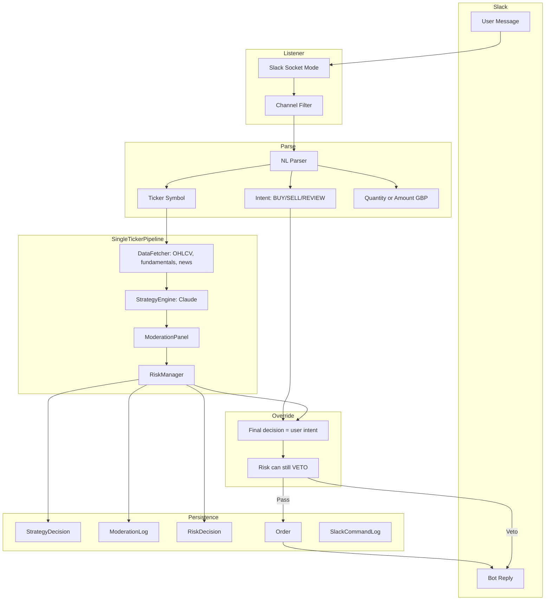

# Chat Interface and Trade Commands

> Outbound trade alerts (delivered) and inbound natural-language Slack commands (planned).

## Purpose

Provide a reliable, auditable chat and command layer for the Investment Agent that:

- Gives operators immediate visibility into trade decisions and outcomes (Phase 1: delivered).
- Never interferes with execution safety or core trading flow.
- Enables secure, explicit manual trade control via Slack natural language commands (Phase 2: planned).
- Maintains consistent audit trails for all trades—autonomous or manual.
- Provides a foundation for future web chat UI (Phase 3: future).

---

## Phase 1: Outbound Alerts (Delivered)

### Scope

**In scope:**
- Slack webhook alerts.
- Email alerts (SMTP).
- Event triggers from orchestrator/state machine:
  - `trade_instruction_approved` (post moderation+risk, pre execution)
  - `trade_execution_result` (filled/dry_run/failed/skipped)
  - `cycle_run_summary` (end-of-run report with all ticker decisions)
  - `state_transition` (ACTIVE/CAUTIOUS/HALTED)
  - `critical_cycle_failure` (cycle-aborting exceptions)
- `notification_logs` database table.
- Config flags, channel routing, retries/timeouts, dedup/idempotency.
- Unit tests + integration-style dry-run checks.

**Out of scope (Phase 1):**
- Inbound commands.
- Human approval workflows.
- Telegram and WhatsApp transport implementations.
- Rich interactive UI blocks/buttons.

### Architecture

```text
Orchestrator + StateMachine + CLI actions
   └─ emit typed notification events
        └─ NotificationService (fail-open, non-blocking)
             ├─ Router (event -> channels)
             ├─ Formatter (event -> channel payload)
             ├─ Sender (retry + timeout + dedup)
             ├─ SlackProvider
             └─ EmailProvider
                  └─ NotificationLogRepository (persistent audit trail)
```

**Non-blocking contract:**
- Notification send failures must be isolated from trade execution.
- `NotificationService` must catch/log all provider exceptions and return control immediately.
- Delivery is **at-least-once** (with idempotency key dedup on provider side where possible).

### Integration Points in Current Codebase

- `src/orchestrator/main.py`
  - Decision loop after moderation+risk approval emits `trade_instruction_approved`.
  - `Orchestrator._execute_trade()` emits `trade_execution_result`.
  - Top-level cycle exception handling emits `critical_cycle_failure`.
- `src/orchestrator/state_machine.py`
  - `StateMachine.transition()` emits `state_transition`.
- Existing command surface for Phase 2 mapping:
  - `--status`, `--pause`, `--resume`, `--force-sell`.

### Event Contract (Canonical)

Each outbound event must include:

| Field | Type | Purpose |
|-------|------|---------|
| `event_id` | uuid4 | Unique identifier |
| `event_type` | string | One of: `trade_instruction_approved`, `trade_execution_result`, `cycle_run_summary`, `state_transition`, `critical_cycle_failure` |
| `occurred_at` | ISO8601 UTC | Event timestamp |
| `cycle_id` | string \| null | Associated cycle (nullable for non-cycle events) |
| `severity` | enum | `info` \| `warning` \| `critical` |
| `source` | enum | `orchestrator` \| `state_machine` \| `command_gateway` |
| `dedup_key` | string | Stable hashable key per event intent |
| `payload` | object | Typed event-specific data |

**`trade_instruction_approved` payload:**
- `ticker` (string)
- `action` (string)
- `target_allocation_pct` (float)
- `conviction` (float)
- `moderation_consensus` (string; "not invoked" for HOLD/QUEUED — moderation not run)
- `risk_verdict` (string; "not invoked" for HOLD/QUEUED — risk not run)
- `reasoning_summary` (string)

**`trade_execution_result` payload:**
- `ticker` (string)
- `action` (string)
- `target_allocation_pct` (float)
- `execution_status` (string)
- `quantity` (float)
- `price` (float)
- `value_gbp` (float)
- `order_id` (string | null)
- `stop_loss_status` (string | null)
- `error_message` (string | null)

**`cycle_run_summary` payload:**
- `cycle_id` (string)
- `decisions` (list of decision summaries)
- `total_instructions` (int)
- `executed_count` (int)
- `rejected_count` (int)

**`state_transition` payload:**
- `old_state` (string)
- `new_state` (string)
- `reason` (string)
- `drawdown_pct` (float | null)

**`critical_cycle_failure` payload:**
- `stage` (string)
- `error_type` (string)
- `error_message` (string)
- `trace_id` (string | null)

### Message Rendering

- **Slack:** Concise, single-message summary with severity prefix. Environment, cycle ID, and UTC timestamp always included.
- **Email:** Subject line includes `[Investment-Agent][SEVERITY]`; body contains full event details with timestamps and cycle context.

### Delivery and Reliability

- **Per-channel timeout:** Configurable (default 5 seconds).
- **Retry policy:** Configurable bounded retries with exponential backoff (default 2 retries at 0.5s then 1.5s).
- **Dedup:**
  - Compute `dedup_key` from event intent fields.
  - Do not send duplicate event to same channel within configurable window (default 300 seconds).
- **Fail-open:**
  - Notification failures never raise to trading path.
  - All failures recorded in logs + `notification_logs` table.

### Data Model (notification_logs)

| Column | Type | Purpose |
|--------|------|---------|
| `id` | PK | Primary key |
| `timestamp` | UTC, indexed | Send attempt time |
| `event_id` | indexed | Reference to source event |
| `cycle_id` | nullable, indexed | Associated cycle (if any) |
| `event_type` | indexed | Event type string |
| `severity` | string | `info` \| `warning` \| `critical` |
| `channel` | string | `slack` \| `email` \| `telegram` \| `whatsapp` |
| `recipient` | nullable | Email address or user ID |
| `status` | string | `sent` \| `failed` \| `skipped` \| `deduped` |
| `attempt_number` | int | Retry counter |
| `dedup_key` | indexed | Dedup identifier |
| `payload_hash` | string | Hash of event payload |
| `error_message` | nullable | Provider error (if any) |
| `latency_ms` | nullable | Send latency in milliseconds |

**Indexes:**
- `(event_type, timestamp)`
- `(channel, timestamp)`
- Unique constraint on `(channel, dedup_key, attempt_number)` for replay auditing.

### Configuration

**`config/settings.yaml`:**

```yaml
notifications:
  enabled: true
  channels: ["slack", "email"]
  routes:
    trade_instruction_approved: ["slack"]
    trade_execution_result: ["slack", "email"]
    cycle_run_summary: ["slack"]
    state_transition: ["slack", "email"]
    critical_cycle_failure: ["slack", "email"]
    order_adjustment: ["slack"]
  timeout_seconds: 5
  max_retries: 2
  dedup_window_seconds: 300
  include_dry_run_alerts: false
  command_gateway:
    enabled: false
```

**.env additions:**

```
SLACK_WEBHOOK_URL
ALERT_EMAIL_FROM
ALERT_EMAIL_TO
SMTP_HOST
SMTP_PORT
SMTP_USER
SMTP_PASS
SMTP_USE_TLS
```

Phase 2 additions (future):
```
COMMAND_GATEWAY_SHARED_SECRET
SLACK_APP_TOKEN (xapp-…)
SLACK_BOT_TOKEN (xoxb-…)
```

### Implementation Record (2026-03-05)

US-1.5 Phase 1 was implemented and deployed to VPS with the following execution steps.

**Build + integration steps completed:**

1. Added `src/agents/notifications/` service, provider interfaces, Slack provider, email provider, formatters, and disabled command gateway scaffold.
2. Added `NotificationLog` ORM model and Alembic migration (`notification_logs` table).
3. Wired event emission into:
   - `Orchestrator.run_cycle()` and `_execute_trade()`
   - `StateMachine.transition()`
   - Scheduler exception path for critical failures.
4. Added notification tests (`service`, `providers`, `formatters`, `integration`) and validated full suite (146 tests passing).
5. Updated docs (README, CLAUDE, ARCHITECTURE, DEPLOYMENT, LOCAL_LIVE_RUN, SOPHISTICATION_ROADMAP).

**Slack hookup steps used:**

1. Created Slack Incoming Webhook.
2. Set `SLACK_WEBHOOK_URL` in VPS `.env`.
3. Restarted container with `docker compose up -d --build`.
4. Verified receipt of `trade_instruction_approved` and `cycle_run_summary` Slack messages.

**Email hookup steps used:**

1. First tested local SMTP sink (Mailpit), with `SMTP_USE_TLS=false` on local port 1025.
2. Moved VPS to transactional SMTP (SendGrid):
   - `SMTP_HOST=smtp.sendgrid.net`
   - `SMTP_PORT=587`
   - `SMTP_USER=apikey`
   - `SMTP_PASS=<SendGrid API key>`
   - `SMTP_USE_TLS=true`
3. Verified sender identity in SendGrid and restarted container.
4. Queried `notification_logs` inside container to verify status transitions (`skipped` → `sent`).
5. Confirmed final delivery in SendGrid Email Logs (`Delivered 250 OK`) for production recipient.

**Operational incidents observed and resolved:**

- `STARTTLS extension not supported by server` when using local Mailpit with TLS enabled; resolved by `SMTP_USE_TLS=false` for local sink testing.
- Container lacked sqlite CLI binary; switched verification to Python/SQLAlchemy query inside container.
- Gmail recipient-specific deferral (`421 4.7.32`) seen for one address; resolved by using alternate recipient and checking provider logs.

**Current production defaults:**

- `include_dry_run_alerts: false`
- `cycle_run_summary` routed to Slack only.
- Email reserved for higher-signal events (`trade_execution_result`, `state_transition`, `critical_cycle_failure`).

---

## Phase 2: Inbound Trade Commands (Planned)

### Design Principle: Manual Instance of the Agent

**User message = manual trigger of the full pipeline for one ticker.** All data is gathered and all LLM decisions are logged (Strategy, Moderation, Risk); the **final action is overwritten by the user intent** (buy/sell/review).

**Audit consistency:** Every trade (autonomous or manual) has the same paper trail: StrategyDecision, ModerationLog, RiskDecision, Order. You can always see "User asked to buy AAPL; strategy said HOLD; moderation said X; risk said Y; user override: BUY."

**REVIEW:** Run full pipeline, no execution; post strategy + moderation + risk + fundamentals/news summary to Slack.

**Risk:** RiskManager still runs and can VETO (e.g. sector cap, single-stock cap). User intent is applied only after risk checks pass.

**Trade-off:** Latency (~15–30 seconds) and LLM cost per Slack command; acceptable for explicit manual triggers.

### Architecture Overview



### Implementation Plan

#### 1. Dependencies and Config

- **Add `slack-sdk`** to `pyproject.toml` (required for Socket Mode).
- **New env vars:** `SLACK_APP_TOKEN` (xapp-…), `SLACK_BOT_TOKEN` (xoxb-…).
- **Config in `settings.yaml`** under `notifications.slack_trade_commands`:

```yaml
slack_trade_commands:
  enabled: false
  channel_id: ""
  confirmation_threshold_gbp: 500
  confirmation_timeout_minutes: 10
```

- **Settings class:** Add `slack_app_token`, `slack_bot_token`, `slack_trade_channel_id`, `slack_trade_confirmation_threshold_gbp`, `slack_trade_confirmation_timeout_minutes`.

#### 2. Slack Events Listener (Socket Mode)

- **New module:** `src/agents/notifications/slack_listener.py`
  - Use `slack_sdk.socket_mode.SocketModeClient` with `SocketModeHandler`.
  - Subscribe to `message.channels` (or `message.groups` if private).
  - Filter: only process messages where `event.channel == settings.slack_trade_channel_id` and `event.subtype` is absent (user messages).
  - Acknowledge immediately; process async in background (full pipeline takes 15–30 seconds).
  - Use `WebClient` (bot token) to post replies in thread.

#### 3. Natural Language Parser

- **New module:** `src/agents/notifications/trade_command_parser.py`
  - Use Claude to extract `{action: BUY|SELL|REVIEW, ticker: str, quantity_shares: float | None, amount_gbp: float | None}`.
  - **REVIEW:** Run full pipeline, no execution; post strategy + moderation + risk + fundamentals/news summary to Slack.
  - Return `TradeCommandIntent` dataclass or `None` if unparseable.

#### 4. Single-Ticker Pipeline (Core Design)

- **New orchestrator path or module:** `src/orchestrator/single_ticker_run.py` — `run_single_ticker_cycle(ticker_t212: str, user_intent: TradeCommandIntent) -> SingleTickerResult`.
  - **Step 1 — Data:** Build `stocks_data` for that one ticker only: DataFetcher.get_stock_analysis (or get_stock_analysis_lite + optional Finnhub/AV). Same data shape as full cycle.
  - **Step 2 — Strategy:** Run StrategyEngine for that ticker; persist **StrategyDecision** with `cycle_id` = e.g. `slack-{ts}` so it's clearly slack-triggered.
  - **Step 3 — Moderation:** Run ModerationPanel on the strategy output; persist **ModerationLog**.
  - **Step 4 — Override:** Ignore strategy action/size; set **final action** and **size** from `user_intent` (BUY/SELL + quantity or amount_gbp). For REVIEW, stop here and return summary.
  - **Step 5 — Risk:** Run RiskManager with the **user-intent** trade (ticker, action, quantity/amount). Persist **RiskDecision**. If risk VETO, return rejected; do not execute.
  - **Step 6 — Execution:** If BUY/SELL and risk passed, call OrderManager.execute_market_order (or by quantity); persist **Order** with `strategy="slack_command"`.
  - Return: strategy view, moderation view, risk view, order result (or rejection), so Slack can format one summary message.
- **Ticker resolution:** Extract `resolve_ticker_to_t212(plain_symbol)` to `src/utils/ticker_utils.py` (Instrument table + T212 fallback). Run before pipeline; reject if not found.

#### 5. Portfolio and Cash Validation

- Before or inside single-ticker run: use OrderManager.get_portfolio_state().
- **BUY:** `available_cash >= estimated_value` (from user quantity or amount_gbp).
- **SELL:** Resolve "sell my position" to full position quantity; check `position.quantity >= requested_quantity`.
- Reject with clear Slack message if insufficient; optional: still run for REVIEW context.

#### 6. OrderManager Extension for Quantity-Based Orders

- **Refactor:** `execute_market_order(..., target_amount_gbp=None, quantity=None, current_price=...)` — require one of `target_amount_gbp` or `quantity`. When `quantity` is set, use it directly for T212; still log value_gbp for Order row.

#### 7. Large Order Confirmation Flow

- If `estimated_value_gbp >= confirmation_threshold_gbp`: post "Confirm: Buy 10 shares of AAPL (~£X)? Reply 'yes' in this thread within 10 min."
- Store pending (in-memory or `SlackCommandPending` table); on "yes" in thread within timeout, call single-ticker pipeline and execute.

#### 8. Persistence and Audit

- **Existing tables:** StrategyDecision, ModerationLog, RiskDecision, Order — all populated by single-ticker run; use `cycle_id` like `slack-{timestamp}` and `strategy="slack_command"` on Order.
- **New table:** `slack_command_log` with columns:
  - `id` (PK)
  - `timestamp` (UTC)
  - `channel_id`
  - `user_id`
  - `raw_message`
  - `parsed_intent_json`
  - `ticker`
  - `action`
  - `cycle_id` (FK)
  - `order_id` (FK, nullable)
  - `status`
  - `rejection_reason`
  - `response_message`

  This links Slack trigger to cycle and order.

#### 8a. Database: Scheduled vs Manual (No Mandatory Schema Change)

**Do the databases need to change to account for scheduled vs manual?** No mandatory change. Existing columns are enough:

- **Order:** Use existing `strategy` column: set `strategy="slack_command"` for manual Slack orders. Scheduled orders use `primary_strategy` (e.g. momentum, mean_reversion) or "liquidation". Query manual orders with `WHERE strategy = 'slack_command'`.
- **StrategyDecision / ModerationLog / RiskDecision:** Use existing `cycle_id`. Scheduled runs use cycle IDs like `"2026-03-06-08:00"`; Slack runs use `"slack-{iso_timestamp}"`. Query manual runs with `WHERE cycle_id LIKE 'slack-%'`.
- **SlackCommandLog:** New table only stores Slack-triggered runs and links to `order_id`; any row there implies manual.

**Optional improvement:** Add an explicit **`trigger`** column to **Order** (e.g. `trigger VARCHAR(20)` with values `'cycle'` | `'slack'`) for clearer semantics and future triggers (e.g. API, Telegram). Recommendation: implement without it first; add in a follow-up migration if desired.

#### 9. Slack Reply Format

- **REVIEW:** "Review AAPL — Strategy: HOLD (conviction 72). Moderation: cautious. Risk: pass. Fundamentals: [sector, P/E]. Recent: [headline]. No order placed."
- **BUY/SELL (executed):** "Executed: Bought 10 AAPL @ £X.XX = £XXX. (Strategy had suggested HOLD; you overrode to BUY.) Order ID: ..."
- **Rejected (risk/cash/ticker):** "Rejected: [reason]. Strategy said X; Moderation Y; Risk: veto (sector cap)."

#### 10. Entry Point and Deployment

- **New CLI:** `poetry run python -m src.agents.notifications.slack_trade_listener` — long-running process; connects via Socket Mode; processes each message by running single-ticker pipeline (or confirmation flow).
- **Docker:** Optional `slack-listener` service when `SLACK_APP_TOKEN` and `SLACK_BOT_TOKEN` set.
- **Systemd:** Optional unit file for VPS.

#### 11. Safety Checks Summary

| Check | Action |
|-------|--------|
| Unrecognised ticker | Reject before pipeline |
| Insufficient cash (BUY) | Reject with current cash |
| No position (SELL) | Reject |
| Order > threshold | Require "yes" confirmation |
| Risk VETO | Reject after pipeline; log reason |

#### 12. Documentation Updates (When Implementing)

- **CLAUDE.md:** Slack trade commands, env vars, config keys, `slack_trade_listener` CLI.
- **docs/CHAT_AND_COMMANDS.md (this file):** Extend Phase 2 with acceptance criteria.
- **docs/ARCHITECTURE.md:** Slack inbound listener diagram.
- **docs/GOVERNANCE.md:** Audit trail for `slack_command_log`.
- **README.md:** New CLI command, env vars.
- **docs/DEPLOYMENT.md:** Docker service, env vars.
- **docs/LOCAL_SETUP.md:** Optional Slack listener setup.

#### 13. Tests

- **Unit:** `trade_command_parser` — parse "Buy 10 shares of AAPL", "Sell TSLA", "Buy £500 MSFT" — mock LLM.
- **Unit:** `resolve_ticker_to_t212` — mock DB.
- **Unit:** `OrderManager.execute_market_order` with `quantity` param.
- **Integration:** Mock Socket Mode client; simulate message; assert reply and Order log.

#### 14. File Checklist

| File | Action |
|------|--------|
| `pyproject.toml` | Add slack-sdk |
| `config/settings.yaml` | Add slack_trade_commands |
| `src/utils/config.py` | New config keys |
| `src/utils/ticker_utils.py` | New — resolve_ticker_to_t212 |
| `src/orchestrator/single_ticker_run.py` | New — single-ticker pipeline + user override |
| `src/agents/notifications/trade_command_parser.py` | New — NL parsing (BUY/SELL/REVIEW) |
| `src/agents/notifications/slack_listener.py` | New — Socket Mode handler, invokes single_ticker_run |
| `src/agents/execution/order_manager.py` | Optional quantity param in execute_market_order |
| `src/data/models.py` | Add SlackCommandLog |
| `alembic/versions/xxx_slack_command_log.py` | Migration |
| `src/agents/notifications/slack_trade_listener.py` | New — CLI entry |
| `tests/test_trade_command_parser.py` | New |
| `tests/test_single_ticker_run.py` | New — single-ticker pipeline + override |
| `tests/test_slack_listener.py` | New (mocked) |
| `.env.example` | Add SLACK_APP_TOKEN, SLACK_BOT_TOKEN |

### Slack App Setup

1. Create Slack App at api.slack.com.
2. Enable Socket Mode; create App-Level Token with `connections:write`.
3. Add Bot Token Scopes: `channels:history`, `channels:read`, `chat:write`, `app_mentions:read` (if using mentions).
4. Subscribe to `message.channels` (and `message.groups` if private).
5. Install app to workspace.

### Safety Checks

**Risk remains final authority.** User intent is applied only after passing RiskManager checks. If risk VETO occurs, the order is not executed and the user receives a clear rejection message with the reason (e.g., "sector cap exceeded", "single-stock limit").

**Portfolio validation is mandatory** before any execution. BUY orders must have sufficient cash; SELL orders must have the position. Rejections are immediate and descriptive.

### Open Questions

- **Require @mention:** Default to channel-only filter (no mention) for simplicity; user can restrict to a private channel.
- **Thread vs channel reply:** Reply in thread for cleaner UX (keeps context with original message).

---

## Phase 3: Web Chat UI (Future)

Placeholder for browser-based chat interface, post-Phase 2 stabilisation. Will provide real-time trade control and portfolio review via web dashboard.

---

## Acceptance Criteria

### Phase 1 (Outbound Alerts — Delivered)

- [x] Notification service exists under `src/agents/notifications/` with provider abstraction.
- [x] Five event types emit from the defined integration points (`trade_instruction_approved`, `trade_execution_result`, `cycle_run_summary`, `state_transition`, `critical_cycle_failure`).
- [x] Slack and email channels work independently and can be enabled/disabled by config.
- [x] Notification failures never block or fail a trading cycle.
- [x] Retries/timeouts/dedup operate as configured.
- [x] Every send attempt persists to `notification_logs`.
- [x] Dry-run cycles produce alerts when `include_dry_run_alerts=true`.
- [x] Unit tests cover formatter correctness, routing, retry, dedup, and fail-open behavior.
- [x] End-to-end dry-run validation demonstrates event emission and persisted logs.

### Phase 2 (Inbound Trade Commands — Planned)

- [ ] Natural language parser (`trade_command_parser.py`) extracts intent (BUY/SELL/REVIEW), ticker, quantity, and amount_gbp.
- [ ] Single-ticker pipeline (`single_ticker_run.py`) runs full data → strategy → moderation → risk flow with user intent override.
- [ ] RiskManager veto prevents execution; rejection message posted to Slack with reason.
- [ ] `SlackCommandLog` table captures all Slack-triggered runs; linked to Order and cycle_id.
- [ ] Slack Socket Mode listener (`slack_listener.py`) processes messages from configured channel; replies in thread.
- [ ] Large order confirmation flow requires "yes" confirmation for orders > `confirmation_threshold_gbp`.
- [ ] Ticker resolution rejects unknown symbols before pipeline invocation.
- [ ] Cash/position validation prevents insufficient-fund and non-existent-position orders.
- [ ] All trades (autonomous and Slack-initiated) visible in portfolio and audit logs with consistent cycle_id format.
- [ ] Tests cover parser, single-ticker pipeline, order validation, and confirmation flow (mocked Socket Mode).

### Phase 3 (Web Chat UI — Future)

- [ ] Web interface integrated with dashboard backend; SSE stream for real-time alerts.
- [ ] User authentication and authorization.

---

## Risks and Mitigations

| Risk | Mitigation |
|------|-----------|
| Alert noise/spam | Severity routing and per-event channel selection. |
| Provider outage (Slack/Email) | Timeouts + bounded retries + fail-open; trades never blocked. |
| Duplicate sends | Dedup keys + dedup window + dedup status logging. |
| Security regression in Phase 2 | Signature validation + allow-list + full audit trail mandatory before release. |
| Latency in Slack commands | 15–30s acceptable for explicit manual triggers; async processing + background thread. |
| Unrecognised ticker | Reject before pipeline; clear error message to user. |
| Insufficient cash/position | Validation before execution; descriptive rejection. |
| Risk VETO overrides user intent | Design intent: Risk is final gate; all rejections logged and communicated. |

---

## Success Metrics

### Phase 1

- P95 alert send latency < 10 seconds.
- >99% successful sends excluding provider outages.
- 0 trading cycles blocked by notification subsystem failures.
- 100% send attempts represented in `notification_logs`.

### Phase 2

- 100% command actions attributable in audit logs.
- >99% successful Slack command parses (excluding malformed input).
- <30 second latency end-to-end from user message to reply.
- 0 unlogged trades from Slack commands.
- 100% RiskManager vetoes recorded with reason.

---

## Related Notes

- [Architecture](ARCHITECTURE.md)
- [Governance](GOVERNANCE.md) (audit trail)
- [Sophistication Roadmap](SOPHISTICATION_ROADMAP.md) (US-1.5, US-1.6)
- [Conversational Trading Workflow](CONVERSATIONAL_TRADING_WORKFLOW.md) (US-1.9 unified multi-turn design)
