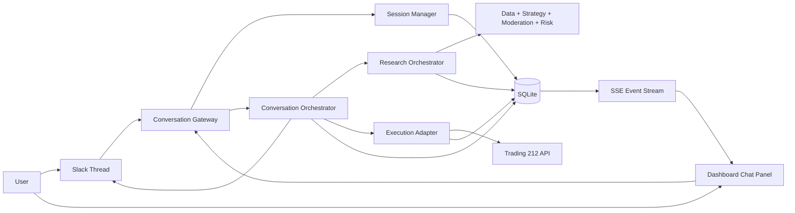
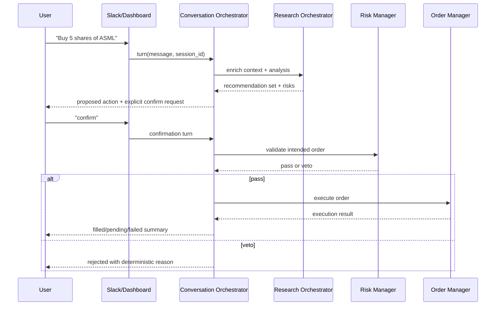

# Conversational Trading Workflow (Unified Spec)

> Multi-turn, session-based trading conversations across Slack and Dashboard, with explicit trade confirmation, deterministic risk veto, and full auditability.

## Purpose

Define a single implementation plan for a dialogue-driven trading workflow that unifies:

- Existing outbound notifications (US-1.5, delivered)
- Planned inbound Slack trade commands (US-1.6, planned)
- Planned dashboard interactivity (US-1.7 follow-on)
- Agentic research capabilities (US-4.4, in progress)

This document is the canonical design for cross-channel conversational trade operations.

---

## Scope

### In Scope

- Multi-turn session state (context, references, intent, pending confirmations)
- Shared session backend for Slack threads and dashboard chat
- Research orchestration per turn (committee + market data + optional agentic research tools)
- Explicit confirmation gate before execution
- Deterministic `RiskManager` veto remains final gate
- Real-time updates via Slack thread replies and dashboard SSE
- Full audit trail across turns, research, recommendations, confirmations, and executions

### Out of Scope (initial release)

- Autonomous execution from ambiguous language without explicit confirmation
- Multi-user collaborative sessions in the same thread/session (single operator ownership first)
- New external chat channels (Telegram/WhatsApp)
- Voice interfaces

---

## User Journey (Target UX)

1. User starts a conversation:
   - Slack: thread message ("Look into semiconductor stocks")
   - Dashboard: chat panel message ("What is happening with NVDA and peers?")
2. Agent creates or resumes a session and returns structured findings.
3. User asks follow-ups ("Dig deeper into ASML and TSM", "What about earnings outlook?").
4. Agent updates analysis while preserving prior context and references.
5. User requests action ("Buy 5 shares of ASML", "Set stop-loss on TSM at $X").
6. Agent returns executable action summary and asks explicit confirmation.
7. On confirmation, pipeline executes through Moderation and deterministic Risk.
8. Agent posts execution result and keeps session open until ended or timed out.

---

## Architecture

### High-Level Components

### New Modules (Proposed)

- `src/agents/conversation/session_manager.py`
  - session lifecycle, timeout, resume, context windowing
- `src/agents/conversation/conversation_orchestrator.py`
  - per-turn planner/executor, response synthesis, confirmation handling
- `src/agents/conversation/research_orchestrator.py`
  - tool routing policy: committee-only vs committee+agentic research
- `src/agents/conversation/context_resolver.py`
  - resolve references like "the first one", "that ticker"
- `src/agents/notifications/slack_conversation_listener.py`
  - Slack thread ingress/egress for conversational sessions
- `dashboard/backend/app/routers/chat.py`
  - session/turn/confirm endpoints + SSE topic hooks

### Existing Modules to Extend

- `src/agents/notifications/command_gateway.py`
  - evolve scaffold into provider-authenticated inbound gateway
- `src/orchestrator/main.py`
  - expose reusable single-ticker/multi-ticker analysis entrypoints
- `src/agents/execution/order_manager.py`
  - support conversation-initiated execution metadata (`trigger=chat`)
- `src/agents/risk/risk_manager.py`
  - unchanged decision authority; integrate explicit rejection metadata into chat responses
- `dashboard/backend/app/services/event_logger.py`
  - emit chat/session lifecycle events to SSE

---

## Execution and Safety Flow

Guardrails:

- No trade execution without explicit confirmation tied to a pending proposal.
- Confirmation expires after configurable timeout.
- Risk veto is absolute and always logged.
- Ambiguous references trigger clarification questions instead of execution.

---

## Database Schema (Proposed)

### New Tables

1. `chat_sessions`
   - `id` (PK)
   - `status` (`active`, `closed`, `timed_out`)
   - `channel_type` (`slack`, `dashboard`)
   - `channel_session_key` (Slack thread_ts or dashboard client session key)
   - `user_id`
   - `started_at`, `last_activity_at`, `ended_at`
   - `context_json` (resolved entities, watchlist, latest recommendations)
   - `linked_cycle_id` (nullable; when a turn triggers a pipeline run)

2. `chat_turns`
   - `id` (PK)
   - `session_id` (FK -> `chat_sessions.id`)
   - `turn_index`
   - `role` (`user`, `assistant`, `system`)
   - `message_text`
   - `intent_json` (parsed action/query intent)
   - `resolution_json` (pronoun/entity resolution)
   - `response_json` (structured cards/sections rendered to channel)
   - `created_at`

3. `chat_actions`
   - `id` (PK)
   - `session_id` (FK)
   - `turn_id` (FK -> `chat_turns.id`)
   - `action_type` (`research`, `recommendation`, `proposed_trade`, `executed_trade`, `stop_update`)
   - `ticker`
   - `payload_json`
   - `status` (`proposed`, `awaiting_confirmation`, `confirmed`, `rejected`, `executed`, `expired`)
   - `risk_verdict` (nullable)
   - `order_id` (nullable FK -> `orders.id`)
   - `cycle_id` (nullable)
   - `created_at`, `updated_at`

4. `chat_research_logs`
   - `id` (PK)
   - `session_id` (FK)
   - `turn_id` (FK)
   - `tool_name` (`committee`, `finnhub`, `alpha_vantage`, `web_search`, `sec_search`, etc.)
   - `provider`
   - `query`
   - `result_summary`
   - `cache_hit` (bool)
   - `latency_ms`
   - `created_at`

### Optional Backward-Compatible Additions

- `orders.trigger` (`cycle`, `slack_command`, `chat_conversation`) for cleaner attribution.
- `strategy_decisions.trigger_context` for direct linkage to conversational turns.

---

## Dashboard Chat API Design (Proposed)

Base prefix: `/api/chat`

1. `POST /api/chat/sessions`
   - create session or resume active one (optional channel key)
   - response: `session_id`, status, last context summary

2. `POST /api/chat/sessions/{session_id}/turns`
   - submit a user turn
   - request: message, optional client metadata
   - response: ack + `turn_id` (final response pushed via SSE)

3. `POST /api/chat/sessions/{session_id}/actions/{action_id}/confirm`
   - explicit confirmation for pending action
   - request: `confirm=true|false`
   - response: action status transition

4. `POST /api/chat/sessions/{session_id}/end`
   - explicit close

5. `GET /api/chat/sessions/{session_id}`
   - session summary and state

6. `GET /api/chat/sessions/{session_id}/turns`
   - paginated turn history

7. `GET /api/chat/sessions/{session_id}/actions`
   - pending/executed action ledger for UI action cards

SSE:

- Extend `/api/events/stream` with chat events:
  - `chat_session_started`
  - `chat_turn_completed`
  - `chat_action_proposed`
  - `chat_action_confirmed`
  - `chat_action_executed`
  - `chat_action_rejected`
  - `chat_session_timed_out`

---

## Phased Implementation Plan

### Phase A — Session Core and Logging (independent, build now)

- Add `chat_sessions`, `chat_turns`, `chat_actions`, `chat_research_logs`
- Implement `SessionManager` + inactivity timeout worker
- Add basic conversation orchestrator with deterministic parsing fallback
- Add audit-first persistence for every inbound/outbound turn

Exit criteria:

- Sessions persist across multiple turns
- Explicit start/end and timeout work
- Full turn/action logs queryable from DB

### Phase B — Slack Conversational Interface (depends on US-1.6 foundations)

- Build Slack thread listener/responder on Socket Mode
- Map thread_ts to `chat_sessions.channel_session_key`
- Add confirmation/rejection prompts and TTL handling
- Preserve existing single-command path as compatibility mode

Exit criteria:

- Multi-turn Slack thread conversation works end-to-end
- Confirmed trades execute, rejected/expired actions never execute

### Phase C — Dashboard Chat Panel and APIs (depends on US-1.7 backend/frontend)

- Add `/api/chat/*` endpoints and response schemas
- Add dashboard chat panel + action cards + confirmation UX
- Wire SSE chat events to live UI updates

Exit criteria:

- Dashboard users can run full conversational flow without Slack
- Session started in dashboard can be resumed by shared backend context key

### Phase D — Shared Cross-Channel Continuity

- Add session identity reconciliation rules (`user_id`, channel keys)
- Allow Slack->Dashboard and Dashboard->Slack continuation
- Add conflict handling for concurrent turns on same session

Exit criteria:

- Same logical session can move between Slack and dashboard safely
- Turn order and action state remain consistent

### Phase E — Research Depth and Routing (depends on US-4.4 maturity)

- Integrate agentic research routers as optional per-turn tools
- Add policy: lightweight answers by default, deep research on demand
- Persist research trace in `chat_research_logs`

Exit criteria:

- "Dig deeper" requests trigger richer tool-use traces
- Budget/cap controls remain enforced

---

## Dependency Map

### Direct Dependencies

- **US-1.6 (Slack NL Commands):** provides inbound Slack auth/listening baseline
- **US-1.7 (Dashboard):** provides UI shell and backend API patterns/SSE
- **US-4.4 (Agentic Research):** enriches research depth but is not required for v1 conversation loop

### Can Be Built Independently Now

- Session models and persistence
- Conversation orchestrator scaffold
- Confirmation state machine and audit logging
- Dashboard chat API contracts (even before full UI)

### Deferred Until Dependencies Complete

- Full Slack production listener hardening (if US-1.6 listener not yet shipped)
- Deep tool-use routing parity across all committee members (US-4.4 risk loop pending)
- Cross-channel identity trust model for production multi-user environments

---

## Implementation Ticket Breakdown (Execution-Ready)

Use this sequence as the default delivery plan. Estimates assume one developer working with review support.

| Ticket | Title | Scope | Depends On | Estimate |
|--------|-------|-------|------------|----------|
| US-1.9-T1 | Chat schema + migration | Add `chat_sessions`, `chat_turns`, `chat_actions`, `chat_research_logs` models + Alembic migration + indexes | None | 0.5-1 day |
| US-1.9-T2 | Session manager core | Implement start/resume/end/timeout lifecycle and DB persistence helpers | T1 | 1 day |
| US-1.9-T3 | Conversation orchestrator v1 | Turn intake, structured response generation, pending action state machine, confirmation TTL | T1, T2 | 1.5-2 days |
| US-1.9-T4 | Context resolver | Pronoun/reference resolution ("first one", "that ticker"), deterministic fallback to clarifying question | T2, T3 | 1 day |
| US-1.9-T5 | Execution confirmation gate | Wire confirm/reject flow into Risk->OrderManager path, block execution without explicit confirm | T3 | 1 day |
| US-1.9-T6 | Dashboard chat APIs | Implement `/api/chat/*` endpoints + schemas + integration with session/orchestrator | T2, T3, T5 | 1-1.5 days |
| US-1.9-T7 | Dashboard SSE chat events | Emit and stream `chat_*` events through existing events pipeline | T6 | 0.5 day |
| US-1.9-T8 | Slack conversational listener | Socket Mode thread listener + session key mapping + threaded response formatting | US-1.6 baseline + T2, T3, T5 | 1.5-2 days |
| US-1.9-T9 | Cross-channel continuity | Slack<->Dashboard session continuation rules and conflict handling | T6, T8 | 1 day |
| US-1.9-T10 | Research orchestration depth | Optional tool routing (committee-only vs deep), research log writes, budget-aware policy | US-4.4 maturity + T3 | 1-1.5 days |
| US-1.9-T11 | Test suite + fixtures | Unit/integration tests for session lifecycle, confirm gate, APIs, Slack threading, concurrency | T1-T10 | 1.5-2 days |
| US-1.9-T12 | Docs + runbooks | Update README, CLAUDE, ARCHITECTURE, DASHBOARD, GOVERNANCE, CHAT_AND_COMMANDS, DEPLOYMENT, LOCAL_SETUP | T1-T11 | 0.5-1 day |

### Definition of Done per Ticket

- **Schema tickets:** migration up/down works; indexes present; no breakage to existing tables.
- **Orchestration tickets:** every state transition persisted (`proposed -> awaiting_confirmation -> confirmed/rejected/expired -> executed`).
- **Execution tickets:** impossible to execute without explicit confirmation; all risk veto paths logged and user-visible.
- **API tickets:** stable request/response schemas, validation errors are deterministic and documented.
- **Slack tickets:** thread-only continuity, idempotent event handling, duplicate message protection.
- **Testing tickets:** all new tests pass with in-memory DB fixtures; no regression in existing test suite.
- **Docs tickets:** all required docs updated in same PR, including roadmap references and command examples.

### Suggested Sprint Cuts

- **Sprint 1 (MVP Core):** T1-T5
- **Sprint 2 (Dashboard usable):** T6-T7 + T11 (API/UI slice)
- **Sprint 3 (Slack + continuity):** T8-T9 + T11
- **Sprint 4 (Research depth + hardening):** T10-T12 + final regression pass

---

## Risks and Mitigations

| Risk | Mitigation |
|------|------------|
| Context drift across long sessions | Context compaction + explicit recap turns |
| Ambiguous user references ("buy first one") | Require deterministic entity resolution or ask clarification |
| Unintended execution | Mandatory confirmation + TTL + deterministic risk gate |
| Audit gaps across channels | Single session/action tables shared by both channels |
| Tool-cost spikes from deep research | Tiered routing policy + per-turn budget limits |
| Race conditions from concurrent messages | Session-level lock + idempotent action transitions |

---

## Acceptance Criteria (Unified Story)

- [ ] Multi-turn sessions persist context and resolve references within session scope
- [ ] Slack and dashboard use shared session backend and action ledger
- [ ] Every proposed trade requires explicit user confirmation before execution
- [ ] RiskManager veto is enforced and surfaced clearly in responses
- [ ] All turns, research operations, recommendations, confirmations, and executions are logged
- [ ] Session timeout and explicit close are supported
- [ ] SSE emits real-time chat/action events for dashboard UI

---

## Related Documents

- [Chat and Commands](CHAT_AND_COMMANDS.md) (US-1.5/US-1.6 tactical plan)
- [Dashboard](DASHBOARD.md) (US-1.7 architecture and APIs)
- [Agentic Research](AGENTIC_RESEARCH.md) (US-4.4 tool routing capabilities)
- [Architecture](ARCHITECTURE.md) (system-wide data flow)
- [Sophistication Roadmap](SOPHISTICATION_ROADMAP.md) (priority and delivery status)
