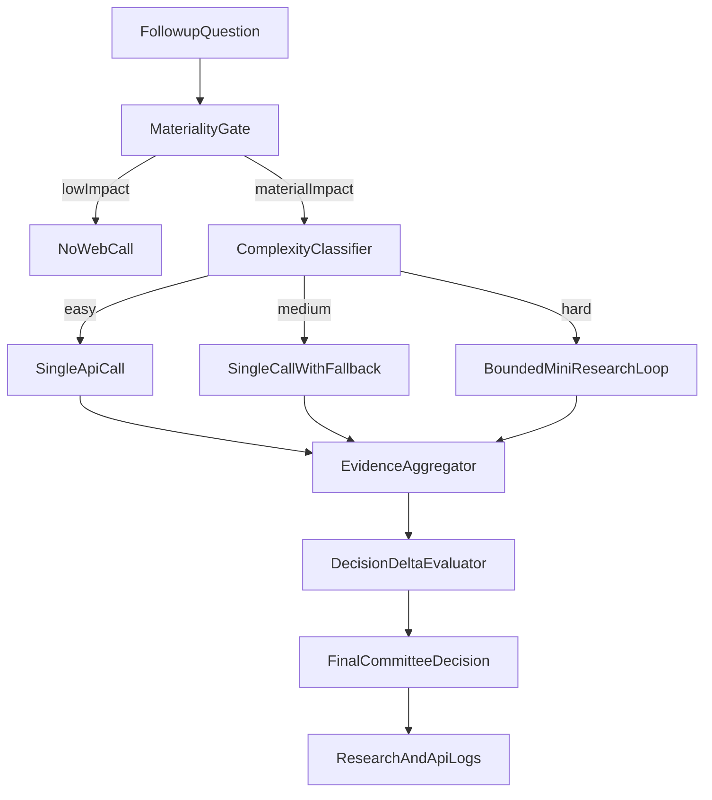

# Follow-up Research Routing Plan

This document is the **routing-policy source of truth** for follow-up research decisions.

- Architecture/tool schema source: [AGENTIC_RESEARCH.md](AGENTIC_RESEARCH.md)
- Execution checklist source: [AGENTIC_RESEARCH_IMPLEMENTATION_PLAN.md](AGENTIC_RESEARCH_IMPLEMENTATION_PLAN.md)

## Implemented So Far

Completed artifacts:
- Baseline notebook retained: [notebooks/research_api_investigation.ipynb](notebooks/research_api_investigation.ipynb)
- New routing notebook: [notebooks/research_api_decision_framework.ipynb](notebooks/research_api_decision_framework.ipynb)
- Benchmark dataset: [data/research_eval_questions_12.json](data/research_eval_questions_12.json)
- Benchmark outputs:
  - [data/research_eval_results_12.json](data/research_eval_results_12.json)
  - [data/research_eval_scores_12.json](data/research_eval_scores_12.json)
  - [data/research_policy_recommendation.json](data/research_policy_recommendation.json)

Implemented capabilities:
- 12-question benchmark with 4 easy / 4 medium / 4 hard follow-up questions.
- Provider benchmarking across Brave Search, Brave Answers, Tavily.
- Static-first gating logic for deciding whether web follow-up is needed.
- Action mode selection (skip / single-call / mini-research).
- Initial architecture and policy recommendation output.
- CB ticker end-to-end walkthrough (static vs web-enriched decision flow).

## Current Production Draft Policy

- **Default posture:** static-first, call web only when materiality gate triggers.
- **Materiality trigger:** disagreement, low confidence, or elevated risk context.
- **Routing by complexity:**
  - easy: no-call or single API call
  - medium: single call (+ fallback provider)
  - hard: bounded mini-research loop
- **Provider policy (default):** Brave Search primary + Tavily fallback.
- **Provider policy (experiment):** difficulty-based provider routing can be evaluated in shadow mode and promoted only after stable weekly benchmark runs.

Committee constraints from current implementation:
- Strategy (Claude): tool loop exists (max iteration guard), can use research tools.
- Skeptic (GPT-4o): tool loop exists; prompt guidance is sparse use (typically 1-2 searches).
- Risk (Gemini): currently single-turn in code path (no active tool-use loop).

## What Still Needs Implementation

### 1) Config and Integration

Add explicit routing config under `research` in [config/settings.yaml](config/settings.yaml):
- `research.followup_routing_enabled`
- materiality thresholds
- easy/medium/hard classifier thresholds/mode
- mini-research max calls and timeout
- optional provider preferences by difficulty (shadow mode first)

### 2) Observability and Logging

Improve research logging path:
- Persist real latency and cost estimates per call in `ResearchLog`.
- Persist routing metadata (`gate_result`, `difficulty`, `mode_selected`, `provider_selected`).

### 3) Tests

Add focused tests for routing behavior:
- skip vs single-call vs mini-research
- fallback provider behavior under failures
- budget and cap enforcement
- expected decision-delta behavior

### 4) Rollout

Use staged rollout:
- shadow mode comparison first
- active mode after threshold tuning and stability checks

## Removed/De-scoped Items

Removed stale path/name assumptions not used in implementation:
- `notebooks/research_followup_routing_eval.ipynb`
- `notebooks/data/followup_questions_v1.json`

Deferred broad expansions until core routing integration and tests are complete.

## Target Architecture (Retained)

## Assumptions

- RiskManager remains deterministic; routing only affects LLM research inputs.
- Existing provider stack (Brave primary, Tavily fallback) is sufficient for first production rollout.
- Notebook-first validation continues until config integration + tests land in code.
