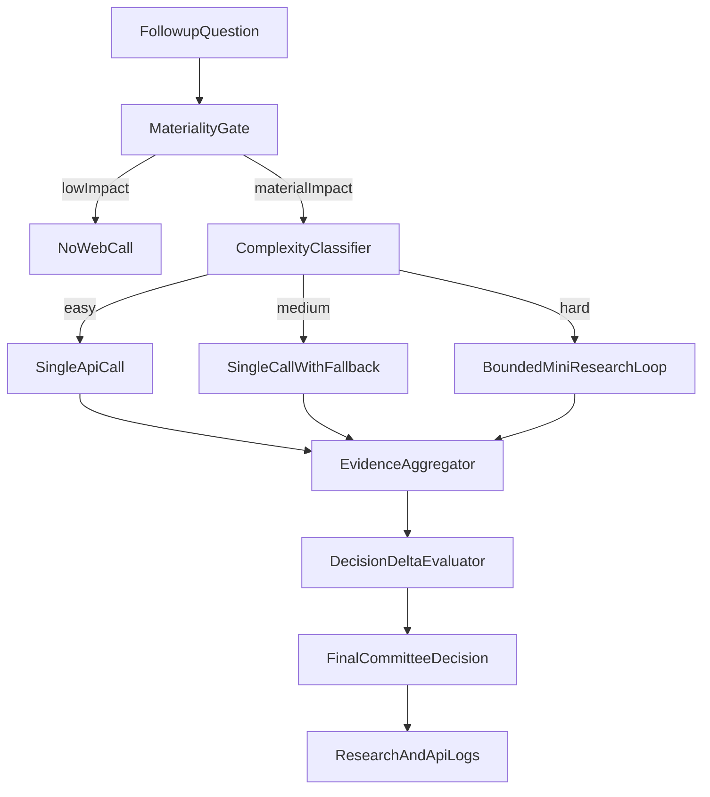

# Follow-up Research Routing Plan

## Scope and Deliverable Choice

- Create a **new notebook** instead of rewriting the old one to preserve historical Phase-0 results and reduce regression risk.
- Keep existing investigation notebook as baseline: [notebooks/research_api_investigation.ipynb](notebooks/research_api_investigation.ipynb).
- Add a new evaluation notebook focused on moderation/strategy follow-up routing: [notebooks/research_followup_routing_eval.ipynb](notebooks/research_followup_routing_eval.ipynb).

## Workstream 1: 12-Question Benchmark Dataset

- Build a structured dataset with 12 follow-up questions + ground truth, split evenly:
  - 4 easy (single factual verification)
  - 4 medium (requires synthesis across 2+ snippets)
  - 4 hard (ambiguity/contradiction or multi-hop evidence)
- Store dataset in versioned file for repeatability: [notebooks/data/followup_questions_v1.json](notebooks/data/followup_questions_v1.json).
- Include context fields tied to real pipeline usage: `ticker`, `stage` (`strategy|skeptic|risk`), `candidate_decision_before_web`, `materiality_target`, `ground_truth_evidence`.

## Workstream 2: Decision-to-Research Gating Logic

- Define a two-gate policy before any web call:
  - **Gate A (Materiality):** estimate whether web evidence could materially change decision (position size, approve/block, confidence bucket).
  - **Gate B (Complexity):** classify question as easy/medium/hard.
- Implement notebook experiment comparing three classifiers:
  - heuristic-only baseline
  - LLM-only classifier
  - hybrid (LLM + deterministic checks) — expected production default
- Output confusion matrix vs labeled difficulty and materiality labels.

## Workstream 3: Route Policy (One Call vs Mini-Research)

- Evaluate and codify route policy:
  - **Easy + low materiality:** skip web call
  - **Easy + material:** one-shot `web_search`/`news_search`
  - **Medium + material:** one-shot + optional fallback provider
  - **Hard + material:** mini-research loop (bounded multi-call, citation merge, contradiction check)
- Compare provider routing alternatives for each level using current stack:
  - Brave Search
  - Brave Answers
  - Tavily
- Record policy outputs per query: selected mode, provider, calls used, latency, estimated cost, and decision delta.

## Workstream 4: Performance, Cost, and Latency Evaluation

- Extend benchmark scoring from existing scripts (quality + truth alignment + latency):
  - [notebooks/enrichment_benchmark.py](notebooks/enrichment_benchmark.py)
  - [notebooks/brave_tavily_comparison.py](notebooks/brave_tavily_comparison.py)
- Add routing-centric metrics:
  - `decision_change_rate`
  - `material_change_precision/recall`
  - `cost_per_material_change`
  - `p95_latency_by_mode`
- Produce a final per-difficulty recommendation matrix: best default provider/mode and fallback behavior.

## Workstream 5: Target Architecture + Settings Blueprint

- Produce an implementation blueprint aligned with current research modules:
  - [src/agents/research/executor.py](src/agents/research/executor.py)
  - [src/agents/research/providers/router.py](src/agents/research/providers/router.py)
  - [src/agents/research/budget.py](src/agents/research/budget.py)
  - [src/agents/research/tools.py](src/agents/research/tools.py)
  - [config/settings.yaml](config/settings.yaml)
- Proposed additions:
  - `research.followup_routing_enabled`
  - difficulty thresholds / classifier mode
  - materiality thresholds
  - mini-research max calls/time budget
  - provider preference by difficulty
- Ensure logging captures real latency/cost at research-log level (currently zeros in `ResearchLog` path) and includes routing decision metadata.

## Workstream 6: End-to-End Ticker Validation

- Add a deterministic E2E-style integration test for one ticker with mocked external APIs and real internal routing logic.
- Suggested tests:
  - [tests/test_research_followup_routing.py](tests/test_research_followup_routing.py)
  - [tests/test_research_ticker_e2e.py](tests/test_research_ticker_e2e.py)
- Assertions:
  - gate behavior (skip vs one-call vs mini-research)
  - provider selection under success/fallback
  - budget/cap enforcement
  - decision materially changes only when expected

## Workstream 7: Final Recommendation Package

- Produce final recommendation artifact with:
  - default route policy per difficulty/materiality
  - provider ranking by difficulty
  - latency/cost envelope and monthly call impact
  - rollout plan (`shadow` → `active`) and guardrails
- Update docs impacted by this feature:
  - [docs/AGENTIC_RESEARCH.md](docs/AGENTIC_RESEARCH.md)
  - [docs/ARCHITECTURE.md](docs/ARCHITECTURE.md)
  - [docs/DATA_RATIONALE.md](docs/DATA_RATIONALE.md)
  - [docs/GOVERNANCE.md](docs/GOVERNANCE.md)
  - [README.md](README.md)

## Target Architecture Sketch

## Assumptions

- Use current provider stack (Brave Search / Brave Answers / Tavily) with no new external vendor.
- Keep RiskManager deterministic; routing only influences LLM research inputs.
- Start with notebook-first validation, then productionize selected policy in code.

