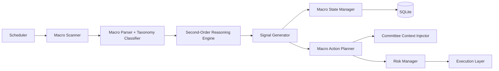

# Proactive Macro News Intelligence (Unified Spec)

> A macro layer above ticker analysis that proactively scans macro/geopolitical developments, reasons about second-order effects, and drives portfolio positioning proposals under deterministic risk controls.

## Purpose

Define a phased implementation plan for a proactive macro system that:

- Scans macro/geopolitical news on a schedule
- Produces structured macro signals with confidence/conviction
- Maintains persistent macro regime state across cycles
- Recommends (and optionally auto-triggers) portfolio posture changes
- Feeds macro context into Strategy/Moderation while preserving `RiskManager` absolute veto
- Keeps full signal-to-action audit trails

---

## Current Baseline (Already in Repo)

Existing capability provides a useful foundation but is not yet a full proactive macro layer:

- `src/agents/market_data/macro_intelligence.py` gathers sector performance + economic headlines
- `DataFetcher.get_macro_data()` fetches/caches `macro_intelligence`
- Orchestrator and moderation context include sector/economic summaries and sector headwind hints
- Config has `macro_intelligence_enabled` and macro cache TTL

What is missing vs this story:

- Independent macro scan jobs separate from normal cycle cadence
- Persistent macro state machine/regime memory
- Macro signal taxonomy + confidence policy
- Dedicated macro signal/action tables
- Controlled macro-to-execution pathways (review-only vs auto posture actions)

---

## Architecture Design

### High-Level Flow



### Proposed Modules

- `src/agents/macro/scanner.py`
  - source adapters and scheduled scan entrypoint
- `src/agents/macro/taxonomy.py`
  - macro event classes and expected first/second-order effects
- `src/agents/macro/reasoner.py`
  - maps events -> hypotheses -> confidence/conviction
- `src/agents/macro/state_manager.py`
  - regime transitions (`normal`, `risk_off`, `tariff_uncertainty`, etc.)
- `src/agents/macro/action_planner.py`
  - posture proposals: de-risk, tighten stops, opportunistic buy windows, rotation tilt
- `src/agents/macro/integration.py`
  - injects macro outputs into committee context and optional trade recommendations

### Existing Modules to Extend

- `src/scheduler/scheduler.py` (add macro scan jobs)
- `src/orchestrator/main.py` (consume macro state/signals in cycle context)
- `src/agents/risk/risk_manager.py` (macro-specific guardrails + veto messaging)
- `src/utils/config.py` / `config/settings.yaml` (macro config block)
- `src/data/models.py` (new macro tables)

---

## Database Schema (Proposed)

### New Tables

1. `macro_scan_runs`
   - `id` (PK), `scan_type`, `started_at`, `completed_at`, `status`
   - `sources_json`, `cost_gbp`, `error_message`

2. `macro_events`
   - `id` (PK), `scan_run_id` (FK)
   - `event_type`, `title`, `source`, `url`, `occurred_at`
   - `regions_json`, `sectors_json`, `commodities_json`
   - `raw_text`, `dedup_key`, `novelty_score`

3. `macro_signals`
   - `id` (PK), `scan_run_id` (FK), `event_id` (nullable FK)
   - `signal_type`, `direction` (`bullish`, `bearish`, `mixed`)
   - `confidence_score` (0-1), `conviction_score` (0-1), `horizon` (`intraday`, `swing`, `multiweek`)
   - `affected_universe_json`, `reasoning_json`
   - `suggested_actions_json`, `auto_action_eligible` (bool)
   - `created_at`

4. `macro_state`
   - singleton-like current state row history
   - `state_key`, `state_value`, `as_of`, `expires_at`, `confidence_score`
   - `source_signal_id` (FK), `metadata_json`

5. `macro_action_audit`
   - `id` (PK), `signal_id` (FK), `cycle_id` (nullable), `order_id` (nullable)
   - `action_type`, `proposed_at`, `decision` (`approved`, `rejected`, `vetoed`, `deferred`)
   - `decision_reason`, `executed_at`

### Optional Additions

- `risk_decisions.macro_context_json` for explicit macro rationale traceability
- `orders.trigger = macro_signal` for direct attribution

---

## Signal Taxonomy (Knowledge Base)

Primary `event_type` classes:

- `geopolitical_conflict`
- `central_bank_policy`
- `trade_policy_tariff`
- `commodity_supply_disruption`
- `regulatory_shock`
- `systemic_financial_stress`
- `earnings_season_breadth`
- `fiscal_policy_shift`
- `labor_inflation_shock`

Per event class, taxonomy stores:

- first-order impacts (e.g., `energy_up`, `rates_up`, `risk_assets_down`)
- second-order paths (e.g., margin compression in import-heavy sectors)
- expected lag window (`same_day`, `1-5d`, `1-4w`)
- confidence priors and invalidation triggers

This powers consistent reasoning and reduces prompt drift.

---

## Configuration Design (Proposed)

```yaml
macro_news:
  enabled: true
  scan_times_utc: ["06:30", "11:30", "15:30", "20:30"]
  lookback_hours: 8
  max_events_per_scan: 40
  confidence_threshold_review: 0.55
  confidence_threshold_auto_action: 0.80
  max_auto_actions_per_day: 2
  max_portfolio_adjustment_pct_per_day: 15
  allow_auto_de_risk: true
  allow_auto_risk_on: false
  source_priority: ["finnhub", "alpha_vantage", "brave_search", "tavily", "sec_edgar"]
  monthly_budget_gbp: 20
  degrade_policy:
    level_1_disable_deep_research: true
    level_2_reduce_scan_frequency: true
    level_3_review_only_mode: true
```

Also add settings accessors in `src/utils/config.py`.

---

## Macro-Specific Risk Controls

1. **Action-rate limiter**
   - cap macro-driven adjustments per day and per cycle
2. **Portfolio swing cap**
   - max total allocation shift/day (e.g., 10-15%)
3. **Directionality guard**
   - allow automatic de-risking before allowing automatic risk-on scaling
4. **Signal persistence requirement**
   - auto-action only after repeated confirmation across scans
5. **Contradiction breaker**
   - if new scans materially contradict active macro state, freeze auto-actions
6. **Risk veto supremacy**
   - `RiskManager` final deterministic gate for any macro-initiated order

---

## Phased Implementation Plan

### Phase A — Foundation (build now)

- Add macro tables and migration
- Add scanner job shell + run logging
- Persist normalized events and dedup keys
- Add read-only dashboard/API visibility for macro scans/signals

### Phase B — Signal Engine + Taxonomy

- Implement taxonomy map and second-order reasoning templates
- Generate macro signals with confidence/conviction
- Add macro state manager and regime persistence

### Phase C — Committee Integration

- Inject active macro state/signals into strategy + moderation context
- Add "macro thesis" section to decision payloads/journals
- Track signal influence in audit trail

### Phase D — Action Planner (review-first)

- Generate posture recommendations:
  - reduce gross exposure / raise cash
  - tighten stops
  - identify crash-watchlist buys
  - recovery profit-taking candidates
- Route recommendations to notifications/dashboard for human review

### Phase E — Controlled Auto-Actions

- Enable only high-confidence, capped macro actions
- Enforce macro-specific guardrails and daily shift caps
- Keep auto risk-on disabled by default until calibration evidence exists

### Phase F — Agentic Research Upgrade Path

- Switch scanner enrichment from basic feeds to Brave/Tavily/Browser tools where available
- Maintain same module interfaces; upgrade internals only
- Preserve cost-aware degradation and source fallback chain

---

## Deliverables Mapping

1. **Detailed phased plan**: see Phases A-F above.
2. **Architecture design**: module map + flow diagram in this doc.
3. **DB schema**: `macro_scan_runs`, `macro_events`, `macro_signals`, `macro_state`, `macro_action_audit`.
4. **Signal taxonomy**: event classes + expected effects + lag/invalidation metadata.
5. **Configuration**: `macro_news` block with scan cadence, thresholds, budgets, source priorities.
6. **Macro risk controls**: action-rate limits, swing caps, persistence requirements, veto-first execution.

---

## Acceptance Criteria

- [ ] Macro scans run on independent schedule and are persisted
- [ ] Signals include confidence/conviction and second-order impact fields
- [ ] Macro state persists across scans and is queryable
- [ ] Strategy/moderation receive active macro context in cycle decisions
- [ ] Macro recommendations and macro-driven actions are fully auditable end-to-end
- [ ] Auto-actions require explicit threshold gates and always pass deterministic risk rules
- [ ] Degradation policy reduces macro spend safely under budget pressure

---

## Related Documents

- [Data Rationale](DATA_RATIONALE.md)
- [Governance](GOVERNANCE.md)
- [Agentic Research](AGENTIC_RESEARCH.md)
- [Architecture](ARCHITECTURE.md)
- [Sophistication Roadmap](SOPHISTICATION_ROADMAP.md)
