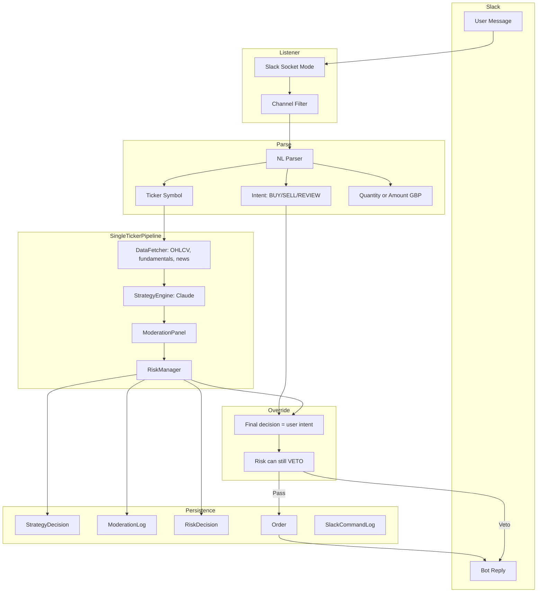

# Slack Natural Language Trade Commands — Project Plan

**Status:** Planned (implementation deferred).  
**Reference:** Sophistication Roadmap US-1.6; extends Chat Interface (US-1.5) Phase 2.

---

## Design Principle: Manual Instance of the Agent

**User message = manual trigger of the full pipeline for one ticker.** All data is gathered and all LLM decisions are logged (Strategy, Moderation, Risk); the **final action is overwritten by the user intent** (buy/sell/review).

- **Audit consistency:** Every trade (autonomous or manual) has the same paper trail: StrategyDecision, ModerationLog, RiskDecision, Order. You can always see "User asked to buy AAPL; strategy said HOLD; moderation said X; risk said Y; user override: BUY."
- **Review:** "Review MSFT" runs the full pipeline and posts a summary (strategy view, moderation, risk, fundamentals, news) with no execution.
- **Risk:** RiskManager still runs and can VETO (e.g. sector cap, single-stock cap). User intent is applied only after risk checks pass.
- **Trade-off:** Latency (~15–30s) and LLM cost per Slack command; acceptable for explicit manual triggers.

**Is this a good design?** Yes. It keeps one mental model: every trade (manual or not) has the same audit trail (data → strategy → moderation → risk → order). The user's message is an explicit override of the "decision" step while still running and logging the full pipeline; Risk remains the final gate. REVIEW fits naturally as "run pipeline, no execution, show summary."

---

## Current State

- **Slack today:** Outbound only via `SLACK_WEBHOOK_URL` — no inbound capability.
- **Execution:** `OrderManager.execute_market_order(ticker, action, target_amount_gbp, current_price)`.
- **Ticker format:** T212 `AAPL_US_EQ`; yfinance `AAPL`. Orchestrator normalizes via `_normalize_decision_ticker`.

---

## Architecture Overview

---

## Implementation Plan

### 1. Dependencies and Config

- **Add `slack-sdk`** to `pyproject.toml` (required for Socket Mode).
- **New env vars:** `SLACK_APP_TOKEN` (xapp-…), `SLACK_BOT_TOKEN` (xoxb-…).
- **Config in `settings.yaml`** under `notifications.slack_trade_commands`:
  - `enabled: false` (opt-in)
  - `channel_id: ""` — only process messages from this channel
  - `confirmation_threshold_gbp: 500` — orders above this require "yes" confirmation
  - `confirmation_timeout_minutes: 10`
- **Settings class:** Add `slack_app_token`, `slack_bot_token`, `slack_trade_channel_id`, `slack_trade_confirmation_threshold_gbp`, `slack_trade_confirmation_timeout_minutes`.

### 2. Slack Events Listener (Socket Mode)

- **New module:** `src/agents/notifications/slack_listener.py`
  - Use `slack_sdk.socket_mode.SocketModeClient` with `SocketModeHandler`.
  - Subscribe to `message.channels` (or `message.groups` if private).
  - Filter: only process messages where `event.channel == settings.slack_trade_channel_id` and `event.subtype` is absent (user messages).
  - Acknowledge immediately; process async in background (full pipeline takes 15–30s).
  - Use `WebClient` (bot token) to post replies in thread.

### 3. Natural Language Parser

- **New module:** `src/agents/notifications/trade_command_parser.py`
  - Use Claude (or small LLM) to extract `{action: BUY|SELL|REVIEW, ticker: str, quantity_shares: float | None, amount_gbp: float | None}`.
  - **REVIEW:** Run full pipeline, no execution; post strategy + moderation + risk + fundamentals/news summary to Slack.
  - Return `TradeCommandIntent` dataclass or `None` if unparseable.

### 4. Single-Ticker Pipeline (core design)

- **New orchestrator path or module:** `src/orchestrator/single_ticker_run.py` (or method on Orchestrator) — `run_single_ticker_cycle(ticker_t212: str, user_intent: TradeCommandIntent) -> SingleTickerResult`.
  - **Step 1 — Data:** Build `stocks_data` for that one ticker only: DataFetcher.get_stock_analysis (or get_stock_analysis_lite + optional Finnhub/AV). Same data shape as full cycle.
  - **Step 2 — Strategy:** Run StrategyEngine for that ticker; persist **StrategyDecision** with `cycle_id` = e.g. `slack-{ts}` so it's clearly slack-triggered.
  - **Step 3 — Moderation:** Run ModerationPanel on the strategy output; persist **ModerationLog**.
  - **Step 4 — Override:** Ignore strategy action/size; set **final action** and **size** from `user_intent` (BUY/SELL + quantity or amount_gbp). For REVIEW, stop here and return summary.
  - **Step 5 — Risk:** Run RiskManager with the **user-intent** trade (ticker, action, quantity/amount). Persist **RiskDecision**. If risk VETO, return rejected; do not execute.
  - **Step 6 — Execution:** If BUY/SELL and risk passed, call OrderManager.execute_market_order (or by quantity); persist **Order** with `strategy="slack_command"`.
  - Return: strategy view, moderation view, risk view, order result (or rejection), so Slack can format one summary message.
- **Ticker resolution:** Extract `resolve_ticker_to_t212(plain_symbol)` to `src/utils/ticker_utils.py` (Instrument table + T212 fallback). Run before pipeline; reject if not found.

### 5. Portfolio and Cash Validation

- Before or inside single-ticker run: use OrderManager.get_portfolio_state().
- **BUY:** `available_cash >= estimated_value` (from user quantity or amount_gbp).
- **SELL:** Resolve "sell my position" to full position quantity; check `position.quantity >= requested_quantity`.
- Reject with clear Slack message if insufficient; optional: still run for REVIEW context.

### 6. OrderManager Extension for Quantity-Based Orders

- **Refactor:** `execute_market_order(..., target_amount_gbp=None, quantity=None, current_price=...)` — require one of `target_amount_gbp` or `quantity`. When `quantity` is set, use it directly for T212; still log value_gbp for Order row.

### 7. Large Order Confirmation Flow

- If `estimated_value_gbp >= confirmation_threshold_gbp`: post "Confirm: Buy 10 shares of AAPL (~£X)? Reply 'yes' in this thread within 10 min." Store pending (in-memory or `SlackCommandPending` table); on "yes" in thread within timeout, call single-ticker pipeline and execute.

### 8. Persistence and Audit

- **Existing tables:** StrategyDecision, ModerationLog, RiskDecision, Order — all populated by single-ticker run; use `cycle_id` like `slack-{timestamp}` and `strategy="slack_command"` on Order.
- **New table:** `slack_command_log` — `id`, `timestamp`, `channel_id`, `user_id`, `raw_message`, `parsed_intent_json`, `ticker`, `action`, `cycle_id`, `order_id` (FK nullable), `status`, `rejection_reason`, `response_message` — links Slack trigger to cycle and order.

### 8a. Database: Scheduled vs Manual (no mandatory schema change)

**Do the databases need to change to account for scheduled vs manual?** No mandatory change. Existing columns are enough:

- **Order:** Use existing `strategy` column: set `strategy="slack_command"` for manual Slack orders. Scheduled orders use `primary_strategy` (e.g. momentum, mean_reversion) or "liquidation". Query manual orders with `WHERE strategy = 'slack_command'`.
- **StrategyDecision / ModerationLog / RiskDecision:** Use existing `cycle_id`. Scheduled runs use cycle IDs like `"2026-03-06-08:00"`; Slack runs use `"slack-{iso_timestamp}"`. Query manual runs with `WHERE cycle_id LIKE 'slack-%'`.
- **SlackCommandLog:** New table only stores Slack-triggered runs and links to `order_id`; any row there implies manual.

**Optional improvement:** Add an explicit **`trigger`** column to **Order** (e.g. `trigger VARCHAR(20)` with values `'cycle'` | `'slack'`) for clearer semantics and future triggers (e.g. API, Telegram). Recommendation: implement without it first; add in a follow-up migration if desired.

### 9. Slack Reply Format

- **REVIEW:** "Review AAPL — Strategy: HOLD (conviction 72). Moderation: cautious. Risk: pass. Fundamentals: [sector, P/E]. Recent: [headline]. No order placed."
- **BUY/SELL (executed):** "Executed: Bought 10 AAPL @ £X.XX = £XXX. (Strategy had suggested HOLD; you overrode to BUY.) Order ID: ..."
- **Rejected (risk/cash/ticker):** "Rejected: [reason]. Strategy said X; Moderation Y; Risk: veto (sector cap)."

### 10. Entry Point and Deployment

- **New CLI:** `poetry run python -m src.agents.notifications.slack_trade_listener` — long-running process; connects via Socket Mode; processes each message by running single-ticker pipeline (or confirmation flow).
- **Docker:** Optional `slack-listener` service when `SLACK_APP_TOKEN` and `SLACK_BOT_TOKEN` set.
- **Systemd:** Optional unit file for VPS.

### 11. Safety Checks Summary

| Check                 | Action                             |
|-----------------------|------------------------------------|
| Unrecognised ticker   | Reject before pipeline            |
| Insufficient cash (BUY)| Reject with current cash          |
| No position (SELL)    | Reject                             |
| Order > threshold     | Require "yes" confirmation         |
| Risk VETO             | Reject after pipeline; log reason  |

### 12. Documentation Updates (when implementing)

- **CLAUDE.md:** Slack trade commands, env vars, config keys, `slack_trade_listener` CLI.
- **docs/CHAT_INTERFACE_PROJECT.md:** Extend Phase 2 with natural language trade commands; acceptance criteria.
- **docs/ARCHITECTURE.md:** Slack inbound listener diagram.
- **docs/GOVERNANCE.md:** Audit trail for `slack_command_log`.
- **README.md:** New CLI command, env vars.
- **docs/DEPLOYMENT.md:** Docker service, env vars.
- **docs/LOCAL_LIVE_RUN.md:** Optional Slack listener setup.

### 13. Tests

- **Unit:** `trade_command_parser` — parse "Buy 10 shares of AAPL", "Sell TSLA", "Buy £500 MSFT" — mock LLM.
- **Unit:** `resolve_ticker_to_t212` — mock DB.
- **Unit:** `OrderManager.execute_market_order` with `quantity` param.
- **Integration:** Mock Socket Mode client; simulate message; assert reply and Order log.

### 14. File Checklist

| File                                               | Action                                                |
|----------------------------------------------------|-------------------------------------------------------|
| `pyproject.toml`                                   | Add slack-sdk                                         |
| `config/settings.yaml`                             | Add slack_trade_commands                              |
| `src/utils/config.py`                              | New config keys                                       |
| `src/utils/ticker_utils.py`                        | New — resolve_ticker_to_t212                          |
| `src/orchestrator/single_ticker_run.py`            | New — single-ticker pipeline + user override          |
| `src/agents/notifications/trade_command_parser.py` | New — NL parsing (BUY/SELL/REVIEW)                    |
| `src/agents/notifications/slack_listener.py`        | New — Socket Mode handler, invokes single_ticker_run  |
| `src/agents/execution/order_manager.py`            | Optional quantity param in execute_market_order        |
| `src/data/models.py`                               | Add SlackCommandLog                                   |
| `alembic/versions/xxx_slack_command_log.py`        | Migration                                             |
| `src/agents/notifications/slack_trade_listener.py`  | New — CLI entry                                       |
| `tests/test_trade_command_parser.py`               | New                                                   |
| `tests/test_single_ticker_run.py`                  | New — single-ticker pipeline + override               |
| `tests/test_slack_listener.py`                     | New (mocked)                                          |
| `.env.example`                                     | Add SLACK_APP_TOKEN, SLACK_BOT_TOKEN                 |

---

## Slack App Setup (User Manual)

1. Create Slack App at api.slack.com.
2. Enable Socket Mode; create App-Level Token with `connections:write`.
3. Add Bot Token Scopes: `channels:history`, `channels:read`, `chat:write`, `app_mentions:read` (if using mentions).
4. Subscribe to `message.channels` (and `message.groups` if private).
5. Install app to workspace.

---

## Open Questions

- **Require @mention:** Default to channel-only filter (no mention) for simplicity; user can restrict to a private channel.
- **Thread vs channel reply:** Reply in thread for cleaner UX (keeps context with original message).
