# Sophistication Roadmap

> Prioritised backlog of enhancements: user stories, acceptance criteria, and delivery status.

## Purpose

This document tracks every planned and delivered enhancement to the investment agent, ordered by priority and feasibility. It serves as the single backlog for sprint planning and as a record of what has been shipped. The dashboard **Roadmap** page (`/roadmap`) visualises this backlog with a short-cycle **Timeline** board, a detailed story-card view, and a staged architecture map that groups the production system into inputs, context, decisioning, and execution.

---

## Roadmap overview (Delivered vs pipeline)

**At a glance:** Delivered **24** · Pipeline **16** (order by priority and feasibility below)

### Timeline view

```mermaid
timeline
    title Roadmap
    section Delivered
        US-1.1 : Performance Tracking
        US-1.2 : Trade Outcome Tracker
        US-1.3 : CLI Dashboard
        US-1.5 : Chat Interface & Alerts
        US-3.4 : UOV Ranking & Queue
        US-3.5 : Intelligent Order Management
        US-5.1 : Backtesting Engine
        US-1.8 : Dashboard VPS Deployment
        US-1.7 : Dashboard & Visualisation
        US-1.4 : Deploy POC to VPS
        US-4.4 : Agentic Research
        US-4.5 : Proactive Macro News Intelligence
        US-4.1 : Volume Signals
        US-7.0 : Production Audit & Safety Fixes
        US-7.0a : Agent Logic Audit Fixes
        US-7.0b : Formal Verification Fixes
        US-7.1 : Dashboard Authentication
        US-7.4 : Integration Test Coverage
        US-1.7.3 : Dashboard Visual Design System
        US-1.7.4 : World News Dashboard Tab
        US-1.6 : Slack NL Trade Commands
        US-1.9 : Conversational Trading Workflow
        US-7.6 : VPS Runtime Stability & Service Isolation
    section Pipeline (priority order)
        US-2.1 : Conviction Calibration
        US-2.2 : Dynamic Strategy Weighting
        US-2.3 : Moderator Effectiveness
        US-2.4 : Nemotron Integration Investigation
        US-5.2 : Parameter Sensitivity
        US-3.2 : Regime Detection
        US-3.3 : Correlation Screening
        US-4.2 : Earnings Calendar
        US-4.3 : Sector Rotation
        US-7.2 : Partial Fill Resubmission
        US-7.3 : Execution Quality & Slippage
        US-7.5 : Remaining Audit Backlog
        US-6.1 : ML Trade Scoring (investigation)
        US-6.2 : Journal Embeddings
        US-6.3 : RL Investigation
        US-8.1 : Open-Source Launch Preparation
```

### Scannable roadmap (no diagram needed)

| Status | # | ID | Project |
|--------|---|-----|---------|
| **Delivered** | 1 | US-1.1 | Performance Tracking |
| | 2 | US-1.2 | Trade Outcome Tracker |
| | 3 | US-1.3 | CLI Dashboard |
| | 4 | US-1.5 | Chat Interface & Alerts |
| | 5 | US-3.4 | UOV Ranking & Queue |
| | 6 | US-3.5 | Intelligent Order Management |
| | 7 | US-5.1 | Backtesting Engine |
| | 8 | US-1.8 | Dashboard VPS Deployment |
| | 9 | US-1.7 | Dashboard & Visualisation (full API + 8 pages) |
| | 10 | US-1.4 | Deploy POC to VPS |
| | 11 | US-4.4 | Agentic Research (5 tools, all 3 members, shared budget, 37 tests) |
| | 12 | US-7.0 | Production Audit & Safety Fixes (34 findings; Phase 1+2: 12 fixed) |
| | 13 | US-7.0a | Agent Logic Audit Fixes (27 findings; 5C+7H all fixed, 36 tests) |
| | 14 | US-7.0b | Formal Verification Fixes (18 findings; Phase 1+2: scheduler safety, crash recovery, DB atomicity, 18 tests) |
| | 15 | US-7.1 | Dashboard Authentication (X-API-Key middleware, `hmac.compare_digest`, auth banner + API key modal, SSE 403 alignment; 36 tests in `test_dashboard_auth.py`) |
| | 16 | US-4.1 | Volume Signals (OBV + 20-day volume ratio, `volume_signals_enabled` flag, momentum/mean-reversion scoring, moderation context, 6 tests) |
| | 17 | US-3.1 | Risk-Parity Position Sizing (60-day inverse-vol BUY overlay, strategy/risk waterfall audit fields, delta-to-target BUY execution, 10 tests) |
| | 18 | US-1.7.3 | Dashboard Visual Design System (Syne font, full CSS token system, glass-dark panels, 72px violet grid, shadow/radius tokens, brand gradient, blurred nav, pill active state, 4 new shared primitives) |
| | 19 | US-4.5 | Proactive Macro News Intelligence (daily scheduled `macro_scan`, persisted `macro_state`, `macro_signal_logs`, structured `macro_action_plan`, strategy/moderation context injection) |
| | 20 | US-7.4 | Integration Test Coverage (audit findings I4, I5) |
| | 21 | US-1.7.4 | World News Dashboard Tab (persistent headline archive, keyword categorisation, 5 macro REST endpoints, regime + headline feed + action plan page, Dashboard Home macro card, 23 tests) |
| | 22 | US-1.6 | Slack NL Trade Commands (regex-first NL parser with company-name support, single-ticker pipeline, real confirmation gate, force override audit trail, dashboard Commands page, part of 113-test focused regression suite) |
| | 23 | US-1.9 | Conversational Trading Workflow skeleton (ChatSession/ChatTurn models, SessionManager CRUD, dashboard chat API stubs, 404/422 validation hardening, chat-turn integrity constraints) |
| | 24 | US-7.6 | VPS Runtime Stability & Service Isolation (runtime locks, single-process API entrypoint, bounded trigger/Slack execution, systemd split, separate migrations, 68 focused regression tests + broader verification) |
| **Pipeline** | 1 | US-2.1 | Conviction Calibration |
| | 2 | US-2.2 | Dynamic Strategy Weighting |
| | 3 | US-2.3 | Moderator Effectiveness |
| | 4 | US-2.4 | Nemotron Integration Investigation |
| | 5 | US-5.2 | Parameter Sensitivity |
| | 6 | US-3.2 | Regime Detection |
| | 7 | US-3.3 | Correlation Screening |
| | 8 | US-4.2 | Earnings Calendar |
| | 9 | US-4.3 | Sector Rotation |
| | 10 | US-7.2 | Partial Fill Resubmission (audit finding I1) |
| | 11 | US-7.3 | Execution Quality & Slippage (audit finding I2; pre-live prerequisite) |
| | 12 | US-7.5 | Remaining Audit Backlog (15 medium/low agent-logic, 22 medium/low trading-system, 7 formal-verification phase 3+4) |
| | 13 | US-6.1 | ML Trade Scoring (investigation) |
| | 14 | US-6.2 | Journal Embeddings |
| | 15 | US-6.3 | RL Investigation |
| | 16 | US-8.1 | Open-Source Launch Preparation |

---

## Summary: All projects

| ID | Project | Description | Benefit | Stage |
|----|---------|-------------|---------|--------|
| **US-1.1** | Performance Tracking | Daily Sharpe/Sortino/drawdown, win rate by strategy, alpha vs benchmark; `performance_metrics` table, CLI `--performance` | Enables all future improvements; can't improve what you can't measure | **Delivered** |
| **US-1.2** | Trade Outcome Tracker | Link each BUY to SELL/REDUCE; per-trade P&L, conviction linkage; `trade_outcomes` table | Core data for calibration and strategy tuning | **Delivered** |
| **US-1.3** | Performance Dashboard (CLI) | CLI `--dashboard`: portfolio value, Sharpe, win rate, costs, active positions | Immediate visibility into system behaviour | **Delivered** (export/summary open) |
| **US-1.4** | Deploy POC to VPS | Docker on VPS, health check, backup, first cycle logged | Begin gathering live market data and performance evidence | **Delivered** |
| **US-1.5** | Chat Interface & Trade Alerts | Outbound Slack + Email alerts for trades, cycle summary, state transitions, failures; `notification_logs` | Real-time operator visibility; foundation for human-in-the-loop | **Delivered** |
| **US-1.6** | Slack NL Trade Commands | Inbound Slack: BUY/SELL/REVIEW + ticker/company name; single-ticker pipeline, user intent overwrites decision; Risk can veto; dashboard Commands page | Manual override with full audit trail + dashboard visibility | **Delivered** |
| **US-1.7** | Dashboard & Visualisation | Web dashboard: 10 pages (Home with state badge, Universe, Run History, Portfolio, Opportunity, Order Mgmt, Commands, World News, Costs, Roadmap); full API (decisions, moderation, risk, opportunity, outcomes, stop-loss, performance, costs, api-usage, system). | Full operational visibility; personal quant experience | **Delivered** |
| **US-1.7.1** | Dashboard UX Phase 1 | AlertBanner (alert aggregation on all pages), Dashboard Home restructure (positions on home, always-visible activity + cycle summary, independent section loading, performance card, pause/resume toggle, PAUSED badge), accessibility (`aria-expanded`, `aria-live`), mobile nav fix. See `docs/UX_AUDIT.md`. | Reduces time-to-insight from 4 clicks to 0; surfaces anomalies proactively | **Delivered** |
| **US-1.7.2** | Dashboard UX Phase 2 | Force Sell from Portfolio, data freshness indicators, keyboard-accessible tables, focus trap on modals, colour accessibility (▲/▼ arrows + aria-labels), chart colour alignment. See `docs/UX_AUDIT.md`. | 19/28 audit findings resolved; full keyboard + screen reader accessibility | **Delivered** |
| **US-1.7.3** | Dashboard Visual Design System | Formalised ZENOUZ.ai visual language from `dashboard-style-guide.md`: Syne heading font, full CSS token system (`--color-*`, `--shadow-*`, `--radius-*`, `--transition-*`), violet soft-fill accents, glass-dark card treatment (radial-gradient + panel shadow + 1.5rem radius), brand gradient updated to violet→cyan→emerald, 72px violet atmospheric grid, blurred sticky nav bar, pill active state. Tailwind: `font-heading`, `borderRadius.panel/hero`, `boxShadow.panel/glow/glow-strong/card-hover`. Four new shared primitives: `Panel` (glass-dark surface), `MetricCard` (Syne KPI), `StatusPill` (brand pill/badge), `SectionHeader` (Syne heading + mono eyebrow). | Unified, polished visual identity across the entire dashboard; primitives unblock consistent page migration | **Delivered** |
| **US-1.8** | Dashboard VPS Deployment | Deploy dashboard to VPS via Docker; access via VPS IP (no domain required); see `docs/DASHBOARD_DEPLOYMENT.md` | Operational visibility on live VPS | **Delivered** |
| **US-1.9** | Conversational Trading Workflow | Multi-turn, session-based Slack + dashboard chat workflow with shared session backend, explicit confirmation gate, deterministic risk veto, and full conversation/research/action audit trail; see `docs/CONVERSATIONAL_TRADING_WORKFLOW.md` | Human-in-the-loop collaborative trading with traceable decisions and safer execution control | **Delivered (skeleton)** |
| **US-2.1** | Conviction Calibration | Calibration curve: conviction vs win rate; position sizing by calibrated confidence | Position sizing by calibrated conviction adds 2–5% annually | **Planned** |
| **US-2.2** | Dynamic Strategy Weighting | Rolling hit rate per sub-strategy; weights adjusted by performance, floor/cap | Stops allocating to strategies that aren't working | **Planned** |
| **US-2.3** | Moderator Effectiveness | Track correct blocks vs opportunity cost per moderator; monthly value-add vs cost | Informs cost optimisation; flag underperforming moderators | **Planned** |
| **US-2.4** | Nemotron Integration Investigation | Investigate NVIDIA Nemotron 3 Super as candidate risk scorer using shadow-mode evaluation, provider/cost comparison, and promotion gates | Potential cost/latency gains, provider diversification, and stronger long-context risk analysis if validated | **Planned (investigation)** |
| **US-3.1** | Risk-Parity Position Sizing | Size positions inversely to trailing volatility; equal risk contribution | Reduces volatility without reducing returns; strong academic evidence | **Delivered** |
| **US-3.2** | Enhanced Regime Detection | Continuous regime score (VIX, S&P, yields); regime-aware strategy weighting | Regime-aware strategy selection improves hit rate | **Planned** |
| **US-3.3** | Correlation-Aware Screening | Flag BUY candidates with high avg correlation to portfolio | Reduces duplicate risk exposure; soft signal to committee | **Planned** |
| **US-3.4** | UOV Ranking & Queueing | Hybrid score, z-score, EWMA; ranked BUY execution; queue + swap suggestions | Solves capital saturation; deterministic opportunity ranking | **Delivered** |
| **US-3.5** | Intelligent Order Management | Stop-loss (GTC) after BUY, ATR-based stop reassessment, software trailing stops, and limit dip-buy orders | More robust downside protection and smarter entries without manual intervention | **Delivered** |
| **US-4.1** | Volume-Weighted Signals | OBV, volume SMA ratio; feed into sub-strategy scoring | Volume confirms price moves; zero-cost signal enhancement | **Delivered** |
| **US-4.2** | Earnings Calendar | Next earnings date; flag "earnings imminent"; post-earnings drift signal | Avoid buying before earnings; position for post-earnings drift | **Planned** |
| **US-4.3** | Sector Rotation Signal | 11 GICS sectors via ETFs; 3-month momentum; overweight/underweight in screening | Sector momentum is real; long-term improvement | **Planned** |
| **US-4.4** | Agentic Research | 5 tools (web_search, news_search, sector_search, sec_search, macro_search) with caps 20/8/7 (total 35/cycle). All three members (Strategy, GPT-4o Skeptic, Gemini Risk) have full tool-use loops. Pipeline-wide shared budget enforcement. Brave primary, Tavily fallback. SEC EDGAR free. Latency/cost recorded. 37 unit tests. Phase 0/0.2 notebooks validated. | Stale context mitigation, follow-up ability, broader coverage | **Delivered** |
| **US-7.0a** | Agent Logic Audit Fixes | 27 findings (5C+7H+9M+6L). All Critical + High fixed: MODIFY verdicts as conditional AGREE (C-1), CAUTION 25% allocation reduction (C-2), conviction/allocation clamping (C-3), Gemini score bounds (C-4), orphaned "submitting" sync (C-5), risk-driven exit bypass (H-1), entry_type in schema (H-2), strategy timeout 120s (H-3), consensus on all moderator rows (H-4), repaired-decision validation (H-5), ticker dedup (H-6). 36 new tests. See `docs/AGENT_LOGIC_AUDIT.md`. | Eliminates 5 critical + 7 high LLM output parsing and consensus bugs | **Delivered** |
| **US-7.0b** | Formal Verification Fixes | 18 findings (3C+7W+8I). Phase 1: scheduler `max_instances=1` (concurrent cycle prevention), resume warns HALTED/CAUTIOUS. Phase 2: `trade_without_stop` alert (P2-5), OpportunityQueue `queue_status` lifecycle QUEUED→EXECUTING→EXECUTED + orphan reconciliation (P2-6), portfolio re-query before BUY after SELL/REDUCE (P2-4), decision chain integrity check (P2-3). 18 new tests. 12 invariants verified. See `docs/FORMAL_VERIFICATION_AUDIT.md`. | Crash safety, state machine correctness, DB atomicity | **Delivered** |
| **US-7.5** | Remaining Audit Backlog | Consolidated backlog from three audits: 15 medium/low findings (agent logic), 22 medium/low (trading system), 7 phase 3+4 items (formal verification). Includes: HALTED auto-recovery, market hours check, DB CHECK constraints, atomic cost budget, peak inflation detection, halted ticker denial list. | Hardening for eventual live-account transition | **Planned** |
| **US-7.6** | VPS Runtime Stability & Service Isolation | Single-instance runtime locks for API/scheduler/Slack/cycle execution; bounded manual trigger and Slack worker execution; separate migration service; current Docker Compose production posture plus optional lean systemd split for small VPS operation | Prevents duplicate/runaway processes and keeps idle CPU low on a resource-constrained host | **Delivered** |
| **US-7.7** | Dashboard HTTPS Domain & Canonical Access | Expose the dashboard at `https://zeninvest.zenouz.ai` via Cloudflare-proxied DNS and Nginx TLS termination; keep public overview anonymous, keep operator routes session-protected, remove public port 8000 exposure, enforce canonical host access, and update deployment/runbook documentation. See `docs/CLOUDFLARE_DASHBOARD_DOMAIN_PLAN.md`. | One safe, canonical public dashboard URL with working operator login over HTTPS | **Planned** |
| **US-4.5** | Proactive Macro News Intelligence | Scheduled macro/geopolitical scans, second-order effect reasoning, persistent macro state, confidence-scored signals, and macro action planning with full signal-to-action audit trail; integrates with committee context and risk veto. See `docs/PROACTIVE_MACRO_NEWS_INTELLIGENCE.md`. | Portfolio-level anticipation of macro shocks/tailwinds with controlled, auditable positioning adjustments | **Delivered** |
| **US-5.1** | Backtesting Engine | Replay history, paper broker, walk-forward, promotion report; yfinance + CSV cache | Release gate before strategy changes; historical confidence | **Delivered** |
| **US-5.2** | Parameter Sensitivity | Vary RSI, MA, weights, limits; heat maps; robust vs fragile ranges | Focus tuning effort on parameters that matter | **Planned** |
| **US-7.1** | Dashboard Authentication | API key or token-based auth on all dashboard endpoints; required before exposing beyond localhost | Critical security hardening; prevents unauthorized live cycle triggers | **Delivered** |
| **US-7.2** | Partial Fill Resubmission | Detect partial fills and resubmit unfilled remainder in next cycle | Ensures intended position sizes are achieved | **Planned** |
| **US-7.3** | Execution Quality & Slippage | VWAP/TWAP awareness, execution timing, slippage tracking; pre-live prerequisite | Required before transitioning from practice to live account | **Planned** |
| **US-7.0** | Production Audit & Safety Fixes | Full codebase audit (34 findings: 3C+6H+12M+13L). Phase 1: no-retry on POST, write-before-execute, liquidate_all status mapping, stop atomicity, moderator parse-failure safety, session leaks. Phase 2: committed cash tracking, correlation/daily-loss activation, cycle timeout, exception safety, HALTED data. 12 of 34 fixed. See `docs/TRADING_SYSTEM_AUDIT.md`. | Eliminates 3 critical + 6 high severity financial-risk bugs; activates 2 previously disabled risk rules | **Delivered** |
| **US-7.4** | Integration Test Coverage | End-to-end orchestrator run_cycle test, state machine transition tests | Catch pipeline regressions early; quality gate for new features | **Delivered** |
| **US-6.1** | Gradient-Boosted Trade Scoring | Investigation then (if justified) XGBoost on indicators + fundamentals → forward return | Potentially +3–7% annual; requires 500+ trades | **Planned** |
| **US-6.2** | Trade Journal Embeddings | Embeddings for journals; similarity search on new proposals | "Have we seen this pattern before?" context | **Planned** |
| **US-6.3** | RL Investigation | Literature + data assessment; decision gate before any implementation | Evidence-based decision on RL; document findings | **Planned** |
| **US-8.1** | Open-Source Launch Preparation | Remove nested repo, clean remotes, add MIT LICENSE, CONTRIBUTING, CODE_OF_CONDUCT, SECURITY, GitHub issue/PR templates, and GitHub Actions CI (pytest + mypy); see `docs/OPEN_SOURCE_LAUNCH.md` | Community-ready infrastructure; prerequisite for repo going public as ZenInvest by Zenouz.ai | **Planned** |

---

## Current state: POC (v1.0)

The POC is a fully functional autonomous trading agent running on Trading 212 Practice API with a multi-LLM pipeline. All tests pass. It is ready for VPS deployment to begin gathering live performance data.

**What the POC establishes:**
- End-to-end pipeline: Data → Screen → Strategy → Moderation → Risk → Execution → Journal → Notifications
- Multi-LLM adversarial architecture (Claude + GPT-4o + Gemini)
- Deterministic risk guardrails with VETO power
- Deterministic UOV opportunity layer (shadow/active modes, ranked BUY queue, swap suggestions)
- Cost-aware degradation; comprehensive logging and audit trail
- **Feedback loop:** performance_metrics, trade_outcomes, CLI `--performance` / `--dashboard`
- **Backtesting:** engine, paper broker, walk-forward validation, promotion report; yfinance fetch + CSV cache

**What the POC still lacks:**
- Calibration of strategy weights and conviction using live + backtest evidence
- Portfolio-level optimisation (e.g. risk-parity sizing)
- Learning/adaptation (static strategy parameters)

---

## Design principles

1. **Measure before you build** — collect live data first; only build what the data justifies  
2. **Incremental, not revolutionary** — each phase builds on the previous; no big rewrites  
3. **POC compatibility** — all enhancements integrate with the existing pipeline architecture  
4. **Evidence-based decisions** — no technique adopted without literature review and clear expected impact  
5. **Personal quant experience first** — prioritise insights, dashboards, and learning over institutional features  

---

## Priority matrix

Ordered by **priority** (P0 → P3) then **feasibility** (Easy → Medium → Hard).

| # | User Story | Value | Feasibility | Effort | Data Needed | Priority |
|---|------------|-------|-------------|--------|-------------|----------|
| 1.4 | Deploy POC to VPS | Critical | Easy | S | None | **P0** |
| 1.1 | Performance tracking | Critical | Easy | M | Existing DB | **P0** |
| 1.2 | Trade outcome tracker | Critical | Easy | M | Existing DB | **P0** |
| 1.3 | Performance dashboard (CLI) | High | Easy | S | US-1.1, 1.2 | **P1** |
| 1.5 | Chat interface + trade alerts | High | Easy–Med | M | Existing DB + events | **P1** |
| 3.1 | Risk-parity sizing | High | Easy | M | Historical prices | **P1** |
| 5.1 | Backtesting engine | High | Medium | L | yfinance history | **P1** |
| 3.5 | Intelligent order management | High | Easy–Med | M | Existing DB + T212 stops/limits | **P1** |
| 2.1 | Conviction calibration | High | Medium | M | ~50 trades | **P1** |
| 2.2 | Dynamic strategy weighting | High | Medium | M | ~50 trades | **P1** |
| 1.6 | Slack NL trade commands | High | Medium | M–L | Full pipeline | **P1** |
| 1.9 | Conversational trading workflow | High | Medium | L | US-1.6 + US-1.7 (+US-4.4 for deep research) | **P1** |
| 4.5 | Proactive macro news intelligence | High | Medium | L | Existing macro + scheduler (+US-4.4 for deeper research) | **P1** |
| 1.7 | Dashboard & Visualisation (Phase 1) | High | Medium | L | Existing DB + events_log | **P1** |
| 1.8 | Dashboard VPS Deployment | High | Easy | S | US-1.7 complete | **P1** |
| 2.3 | Moderator effectiveness | Medium | Easy | S | ~100 trades | **P2** |
| 3.3 | Correlation-aware screening | Medium | Easy | S | Historical prices | **P2** |
| 4.1 | Volume-weighted signals | Medium | Easy | S | Already fetched | **P2** |
| 4.2 | Earnings calendar | Medium | Easy | M | yfinance (free) | **P2** |
| 3.2 | Enhanced regime detection | Medium | Medium | M | Existing macro | **P2** |
| 5.2 | Parameter sensitivity | Medium | Medium | M | Backtest engine | **P2** |
| 6.1 | ML trade scoring | Medium | Hard | L | 500+ trades | **P2** |
| 7.1 | Dashboard authentication | Critical | Easy | S | None | **P1** |
| 7.2 | Partial fill resubmission | Medium | Easy | S | Existing orders | **P2** |
| 7.3 | Execution quality & slippage | High | Medium | M | Trade data | **P1** (pre-live) |
| 7.4 | Integration test coverage | High | Easy | M | None | **P1** |
| 7.5 | Remaining audit backlog | Medium | Easy–Med | L | None | **P2** |
| 7.7 | Dashboard HTTPS domain + canonical access | Critical | Easy–Med | M | US-1.8 + US-7.1 | **P0** |
| 4.3 | Sector rotation signal | Low–Med | Easy | M | ETF data (free) | **P3** |
| 6.2 | Journal embeddings | Low | Medium | M | Trade journals | **P3** |
| 6.3 | RL investigation | Low | Hard | M | Academic lit | **P3** |

---

## Project details (by priority)

*Phase labels (Foundation, Calibration, etc.) are thematic; execution order follows the priority matrix above.*

---

### P0 — Critical (Foundation)

**US-1.4: Deploy POC to VPS**
**Value:** Begin gathering live market data and performance evidence  
**Effort:** Small (1–2 days, following DEPLOYMENT.md)  
**Data Sources:** N/A  
**Stage:** Delivered  

**Note:** Deployment *implementation* (Docker, DEPLOYMENT.md, DASHBOARD_DEPLOYMENT.md) was delivered as code. US-1.4 is the operator checklist: run on VPS, first cycle logged, health/backup confirmed.

**Acceptance Criteria:**
- [x] Docker container running on VPS
- [x] Health check cron job active
- [x] Backup script scheduled
- [x] First successful cycle logged
- [x] Monitoring access confirmed from local machine

---

**US-1.1: Performance Tracking Module**
**Value:** Enables all future improvements — can't improve what you can't measure  
**Effort:** Medium (3–5 days)  
**Data Sources:** Existing database (portfolio_snapshots, orders, strategy_decisions)  
**Stage:** Delivered  

**Status (2026-03-05):** Delivered  

**Acceptance Criteria:**
- [x] Daily Sharpe ratio (rolling 30/60/90 day) computed from portfolio_snapshots
- [x] Sortino ratio, max drawdown, Calmar ratio tracked
- [x] Win rate by strategy (momentum, mean_reversion, factor) computed from filled orders
- [x] Alpha vs S&P 500 benchmark tracked per snapshot
- [x] Stored in `performance_metrics` table with Alembic migration
- [x] CLI command: `--performance` shows current metrics summary

**Integration:** Post-cycle step in orchestrator, after portfolio snapshot.

---

**US-1.2: Trade Outcome Tracker**
**Value:** Links strategy decisions to actual P&L — core data for calibration  
**Effort:** Medium (3–5 days)  
**Data Sources:** Existing orders + portfolio data  
**Stage:** Delivered  

**Status (2026-03-05):** Delivered  

**Acceptance Criteria:**
- [x] Each BUY tracked until corresponding SELL/REDUCE
- [x] Per-trade P&L (£ and %) with holding period
- [x] Claude conviction score linked to outcome
- [ ] Moderator verdict linked to trade outcome (optional follow-up)
- [ ] Risk decisions linked to outcomes (optional follow-up)
- [x] `trade_outcomes` table with Alembic migration

**Integration:** Updated on each SELL/REDUCE and after cycle snapshot.

---

### P1 — High (Foundation & Calibration)

**US-1.3: Performance Dashboard (CLI + Export)**
**Value:** Personal quant experience — immediate visibility  
**Effort:** Small (2–3 days)  
**Data Sources:** performance_metrics, trade_outcomes, cost_logs  
**Stage:** Delivered (CLI); export/summary open  

**Acceptance Criteria:**
- [x] `--dashboard` CLI: portfolio value, Sharpe, win rate, costs, active positions
- [ ] CSV/JSON export for Jupyter analysis
- [ ] Weekly email-style summary (journal markdown)

**Integration:** Extension of reporting module.

---

**US-1.5: Chat Interface & Real-Time Trade Alerts**
**Value:** Immediate operator visibility; foundation for human-in-the-loop  
**Effort:** Medium (4–6 days)  
**Data Sources:** Orchestrator decisions, orders, system_state, risk_decisions, moderation_logs  
**Stage:** Delivered (Phase 1 outbound)  

**Detailed plan:** `docs/CHAT_AND_COMMANDS.md`  

**Status (2026-03-05):** Delivered (Phase 1 outbound alerts)  

**Acceptance Criteria:**
- [x] Notification service under `src/agents/notifications/`
- [x] Alerts: trade_instruction_approved, trade_execution_result, cycle_run_summary, state_transition, critical_cycle_failure
- [x] Slack webhook + SMTP email; config in settings.yaml; secrets in .env.example
- [x] Retry + timeout + non-blocking; notification_logs table
- [x] VPS validation for Slack + SMTP

**Phase 2 (inbound):** Command gateway `/status`, `/pause`, `/resume`, `/force-sell`; auth; audit logging.

---

**US-3.1: Risk-Parity Position Sizing**
**Value:** High — reduces volatility without reducing returns; strong academic evidence  
**Effort:** Medium (4–5 days)  
**Data Sources:** Historical returns from market_data_cache  
**Stage:** Delivered  

**Acceptance Criteria:**
- [x] Position sized inversely to trailing 60-day volatility
- [x] Target: equal risk contribution per position
- [x] Replaces Claude ad-hoc allocation for BUY sizing; Claude still decides what; risk-parity how much
- [x] Existing risk limits (15% per stock, etc.) remain hard caps
- [x] A/B log: risk-parity size vs Claude proposed size

**Technical Approach:** `weight_i = (1/vol_i) / sum(1/vol_j)`.  
**Literature:** Maillard, Roncalli & Teiletche (2010) "The Properties of Equally Weighted Risk Contribution Portfolios"
**Status (2026-03):** Delivered — `risk.risk_parity_enabled` gate, 60-day configurable realized vol, vol floor + target-vol scaler, persisted `strategy_decisions` audit fields, dashboard/API waterfall exposure, and delta-to-target BUY execution semantics.

---

**US-5.1: Backtesting Engine**
**Value:** Critical for long-term confidence; release gate before strategy changes  
**Effort:** Large (5–8 days)  
**Data Sources:** yfinance historical (fetch + CSV cache when data/backtest/ empty)  
**Stage:** Delivered  

**Detailed plan:** `docs/BACKTESTING.md` (includes walk-forward validation and promotion report).  

**Status (2026-03):** Delivered  

**Acceptance Criteria:**
- [x] Replay historical data; deterministic policy (LLM-free proxy)
- [x] Paper broker; risk rules, position sizing, constraints
- [x] Output: equity curve, Sharpe, max drawdown, win rate, trades.csv, results.json
- [x] Walk-forward validation; promotion report (safe to deploy vs hold)
- [x] Compare vs buy-and-hold SPY; yfinance fetch + CSV cache

**Integration:** CLI `--config`, `--synthetic`, `--walk-forward`, `--scenario bull|bear|sideways`.

---

**US-3.5: Intelligent Order Management (Stop-Loss, Trailing, Limit Dip-Buy)**

**Value:** Automatic downside protection and smarter entries without manual intervention  
**Effort:** Medium (implemented)  
**Data Sources:** Existing orders, positions, indicators (ATR), T212 stop/limit APIs  
**Stage:** Delivered  

**Summary:**  
Implements an order-management layer that automatically:  
- Places a **GTC stop-loss after every BUY** using Claude's `stop_loss_pct`.  
- **Reassesses stops each cycle** using 14-day ATR × configurable multiplier, clamped to `[min_stop_distance_pct, max_stop_distance_pct]`, and (by default) only tightens stops (never widens).  
- Provides **software trailing stops** using a high-water mark per position and cancel+replace semantics, since T212 has no native trailing stop.  
- Supports **limit dip-buy entries** when strategy outputs `entry_type: "limit_dip"`, placing a limit BUY below current price with configurable offset and validity.  

All adjustments are persisted in `stop_loss_adjustments` and emitted as `order_adjustment` Slack notifications. Behaviour and config are documented in `docs/ORDER_MANAGEMENT_PROJECT.md` and referenced from `GOVERNANCE.md` (§3.3 Intelligent Order Management).

**Integration:**  
- `OrderManager.place_stop_loss()` called after successful BUY executions.  
- `StopLossManager.reassess_stops()` and `StopLossManager.apply_trailing_stops()` run after execution each cycle.  
- BUY path branches on `decision.entry_type` (`market` vs `limit_dip`) to choose market vs limit orders.  

---

**US-2.1: Conviction Calibration**
**Value:** Position sizing by calibrated conviction can add 2–5% annually  
**Effort:** Medium (3–4 days)  
**Data Sources:** trade_outcomes, strategy_decisions  
**Stage:** Delivered  

**Acceptance Criteria:**
- [ ] Calibration curve: conviction vs win rate (bins 50–60, 60–70, 70–80, 80+)
- [ ] Min 30 trades per bin before activating
- [ ] Position sizing: `size = base_size * calibration_factor`
- [ ] Logged for audit; fallback to current behaviour if insufficient data

**Technical Approach:** Empirical calibration curve or simple logistic regression; no ML.

---

**US-2.2: Dynamic Strategy Weighting**
**Value:** Stops allocating to strategies that aren't working in current regime  
**Effort:** Medium (3–4 days)  
**Data Sources:** trade_outcomes, strategy_decisions  
**Stage:** Planned  

**Acceptance Criteria:**
- [ ] Rolling 30-day hit rate per sub-strategy (momentum, mean_reversion, factor)
- [ ] Weights: `new_weight = base_weight * rolling_hit_rate / avg_hit_rate`; floor 15%, cap 50%
- [ ] Weight changes logged; configurable `dynamic_weighting: true/false`

**Technical Approach:** EWMA of success rate; transparent, no ML.

---

**US-1.6: Slack Natural Language Trade Commands**
**Value:** Manual override with full audit trail; single-ticker pipeline; user intent overwrites decision; Risk can veto
**Effort:** Medium–Large (5–8 days)
**Data Sources:** Full pipeline; new `slack_command_log`
**Stage:** Delivered

**Detailed plan:** `docs/CHAT_AND_COMMANDS.md`.

**Acceptance Criteria:**
- [x] Inbound Slack listener (Socket Mode) — `src/agents/notifications/slack_listener.py`
- [x] NL parser: BUY/SELL/REVIEW + ticker + quantity or amount (£) — regex-first with Claude fallback
- [x] Single-ticker pipeline (cycle_id = `slack-{ts}`); moderation reviews final user action/size, risk can veto or explicit force can override — `src/orchestrator/single_ticker_run.py`
- [x] REVIEW: run pipeline, post summary, no order
- [x] Execute via OrderManager; Order.strategy = `slack_command`; confirm in Slack
- [x] Safety: ticker validation, cash/position checks, real large-order confirmation, risk veto messaging, persisted response/audit status
- [x] `slack_command_log`; CLI `slack_trade_listener`
- [x] Focused US-1.6/US-1.9 regression suite: 117 passing tests

**Integration:** Long-running process; reuses Strategy/Moderation/Risk/Execution stack. CLI: `poetry run python -m src.agents.notifications.slack_trade_listener`.

---

**US-1.9: Conversational Trading Workflow**
**Value:** Multi-turn collaborative trading across Slack and dashboard with persistent context and explicit action confirmation
**Effort:** Large (8–12 days, phased delivery)
**Data Sources:** Existing pipeline + new chat session/turn/action tables + optional agentic research tools
**Stage:** Delivered (skeleton); full workflow pending

**Detailed plan:** `docs/CONVERSATIONAL_TRADING_WORKFLOW.md`.

**Skeleton (delivered):**
- [x] `ChatSession` and `ChatTurn` DB models + Alembic migration
- [x] `SessionManager` stub with real CRUD: `create_session()`, `add_turn()`, `get_session()`, `end_session()`
- [x] Dashboard chat API endpoints: `POST /api/chat/sessions`, `POST /sessions/{id}/turns`, `GET /sessions/{id}`, `POST /sessions/{id}/end`
- [x] Missing-session `404`s, `channel_type` / `role` validation, and FK + unique turn-order protections
- [x] Focused US-1.6/US-1.9 regression suite: 117 passing tests

**Full workflow (pending):**
- [ ] Session management supports start/resume/end/timeout with persistent multi-turn context
- [ ] Shared backend supports Slack thread and dashboard chat continuity
- [ ] Agent provides structured research summaries and follow-up refinements by turn
- [ ] Every trade action requires explicit confirmation; no execution on ambiguous intent
- [ ] RiskManager remains final deterministic veto with clear rejection reasons
- [ ] Full audit trail for turns, research calls, recommendations, confirmations, and executions
- [ ] Dashboard chat APIs and SSE events support real-time conversational updates

**Dependencies:**
- Requires US-1.6 for robust inbound Slack handling baseline (delivered)
- Requires US-1.7 backend/frontend extension for chat panel and APIs
- Uses US-4.4 research tooling when enabled; core session + confirmation flow can ship without deep tool-use

---

**US-4.5: Proactive Macro News Intelligence**
**Value:** Portfolio-level anticipation of macro shocks/tailwinds via proactive scanning and second-order reasoning  
**Effort:** Large (8–12 days, phased delivery)  
**Data Sources:** Existing macro module + Finnhub/AV/yfinance + scheduled scans + optional Brave/Tavily/Browser research  
**Stage:** Planned  

**Detailed plan:** `docs/PROACTIVE_MACRO_NEWS_INTELLIGENCE.md`.

**Acceptance Criteria:**
- [x] Independent macro scan schedule runs daily with persisted state snapshots
- [x] Deterministic regime classification and normalized macro signals are persisted
- [x] Persistent macro state is maintained across scans and queryable at cycle time
- [x] Strategy and moderation receive macro state/signals as explicit context in decision flow
- [x] Macro action planner outputs structured, review-first positioning implications
- [x] `proactive_scan_enabled: false` preserves prior runtime behavior
- [x] Full macro-state and signal audit trail exists in the database

**Dependencies:**
- Can start now using existing macro intelligence and scheduler primitives
- Benefits from US-4.4 tooling for deeper source coverage and richer reasoning traces
- Integrates with existing RiskManager veto path; no bypass allowed

---

**US-2.4: Nemotron Integration Investigation**
**Value:** Potential moderation/risk model cost reduction, faster inference, and provider diversification if quality is maintained
**Effort:** Investigation (2-4 days for smoke + shadow setup planning)
**Data Sources:** Existing committee inputs, moderation logs, risk decisions, cost logs
**Stage:** Planned (investigation)

**Detailed plan:** `docs/Nemotron_3_Super_Integration_Investigation.md`.

**Investigation Criteria:**
- [ ] API smoke test passes for at least one provider path (OpenRouter or NVIDIA NIM)
- [ ] Shadow comparison vs Gemini risk role across minimum 5 full cycles
- [ ] No material quality regression in risk assessments
- [ ] Cost and latency profile documented against current moderator stack
- [ ] Promotion decision documented: promote, hold as optional 4th voice, or archive

---

**US-1.7: Dashboard & Visualisation System (Phase 1 MVP + full API)**
**Value:** Full operational visibility — activity feed, universe, run history, portfolio, opportunity, order management, costs
**Effort:** Large (8–12 days for backend + instrumentation + frontend + deploy)
**Data Sources:** Existing DB; new `events_log` (optionally `runs`); backend reads agent tables read-only (no duplicate tables)
**Stage:** Complete (full API + 8 pages + UX audit 28/28 fixed)

**Detailed plan:** `docs/DASHBOARD.md`.

**Status (2026-03-19):** Backend (FastAPI + SSE + event logger) and frontend (React + Vite + Tailwind) are built. Agent instrumentation complete. Stabilisation complete. US-1.8 implemented: Docker service, multi-stage frontend build, SPA fallback. Phase 1.5 Analytics Lite: Decision Explorer (expandable universe rows), run diff, next-run countdown, P&L in top bar. **Full API and 8-page spec**: backend exposes decisions, moderation, risk, opportunity, outcomes, stop-loss, performance, costs, api-usage, system; status includes system state (ACTIVE/CAUTIOUS/HALTED) and paused; frontend has 8 pages (Dashboard Home, Universe, Run History, Portfolio, Opportunity Pipeline, Order Management, Costs, Roadmap & Architecture); Universe table shows `Investigated`, `Reviews`, `Decisions`, `Holding`, `Sold`, and `UOV (ewma)` per ticker, where `Sold` is computed from executed and dry-run SELL orders only; deep-linkable via `/universe/:ticker`. **UX Phases 1–3 (delivered 2026-03-18/19):** AlertBanner (multi-source alert aggregation), independent section loading (`useAsyncData`), Pause/Resume/Force Sell controls, FreshnessIndicator, PnlDisplay with directional arrows (▲/▼), focus-trapped modals, skeleton loading screens, position sparklines, decision pipeline waterfall, nav consolidation (“More” dropdown), mobile card layouts, responsive column hiding, URL state sync. 28/28 UX audit findings resolved (score 6.5→9.0/10). Design: ZENOUZ.ai brand — bg #06060a, positive #00ffa3, negative #ff4466, accent #00d4ff, violet #6332ff.

**Phase 1 Acceptance Criteria:**
- [x] FastAPI backend: REST runs/universe/portfolio/orders; SSE `/events/stream`
- [x] Read from existing tables; add only events_log + runs
- [x] Event logger: non-blocking, fail-open; instrument scheduler, screener, committee, execution, notifications
- [x] React + Vite + Tailwind: Home (activity feed, portfolio summary), Universe (table, committee reasoning), Run History (timeline), Portfolio (positions, P&L chart)
- [x] Dark terminal aesthetic; Recharts; config `dashboard_enabled`, `dashboard_events_enabled`
- [x] Alembic migration for `events_log` and `runs` tables
- [x] Fix 5 test failures (dashboard table init in test fixtures)
- [x] Fix frontend-backend type mismatches (PortfolioSnapshot, Position, Order fields)
- [x] Fix API client URL mismatches (portfolio endpoint, getByCycleId)
- [x] Implement `POST /api/runs/trigger` (dry-run) and `POST /api/runs/trigger-live` (live cycle); Dashboard Home has Dry Run and Live Run buttons
- [x] Deployment: US-1.8 implemented (Docker, port 8000); deploy to VPS per `docs/DASHBOARD_DEPLOYMENT.md`
- [x] Phase 1.5 Analytics Lite: Decision Explorer, run diff, next-run countdown, P&L
- [x] Full API: decisions (incl. pipeline waterfall), moderation, risk, opportunity, outcomes, stop-loss, performance, costs, api-usage, system (state, trigger, pause, resume); status returns state and paused
- [x] 8 pages: Dashboard Home, Universe, Run History, Portfolio, Opportunity Pipeline, Order Management, Costs, Roadmap & Architecture
- [x] Design: ZENOUZ.ai brand — bg #06060a, gain #00ffa3, loss #ff4466, accent #00d4ff, violet #6332ff
- [x] UX Phase 1: AlertBanner, independent section loading, always-visible positions + activity, merged top cards, PAUSED badge
- [x] UX Phase 2: Force Sell, FreshnessIndicator, PnlDisplay (▲/▼), focus-trapped modals, chart colour alignment, keyboard-accessible tables
- [x] UX Phase 3: Skeleton loading, position sparklines, pipeline waterfall, nav "More" dropdown, `/universe/:ticker` deep-linking, mobile card layouts, responsive column hiding, typography hierarchy

**Phases 2–4 (future):** Analytics & Insights; ML & Advanced (backtesting UI, anomaly detection, custom alerts); Interactive Control (manual run, strategy tuning UI, Slack mirror).

---

**US-1.8: Dashboard VPS Deployment**
**Value:** Operational visibility on live VPS; no domain required
**Effort:** Small (1–2 days)
**Data Sources:** Same DB as agent (shared volume)
**Stage:** Delivered

**Detailed plan:** `docs/DASHBOARD_DEPLOYMENT.md`

**Status (2026-03-10):** Delivered. Dashboard running on VPS: operator runs the deployment checklist in the plan (pull, `ufw allow 8000/tcp`, `docker compose up -d --build`); then dashboard is available at `http://YOUR_VPS_IP:8000`.

**Acceptance Criteria:**
- [x] Dashboard service added to docker-compose; shares `./data` volume with agent
- [x] Frontend built in Dockerfile (multi-stage); FastAPI serves static files
- [x] Access via `http://YOUR_VPS_IP:8000` (VPS IP — recommended; no domain)
- [x] Firewall: port 8000 documented and included in deployment commands (`ufw allow 8000/tcp`)
- [x] Activity feed (SSE), portfolio, runs, universe pages load correctly (relative API URLs work from VPS IP)
- [x] Deployment complete checklist in `DASHBOARD_DEPLOYMENT.md`; dashboard running on VPS once operator executes it

**Domain options:** VPS IP (recommended), purchase domain for HTTPS, or nginx reverse proxy. See deployment plan.

---

**US-7.7: Dashboard HTTPS Domain & Canonical Access**
**Value:** One safe, canonical public dashboard URL with working operator login over HTTPS  
**Effort:** Medium (1-2 days)  
**Data Sources:** Same DB as agent (shared volume)  
**Stage:** Planned  

**Detailed plan:** `docs/CLOUDFLARE_DASHBOARD_DOMAIN_PLAN.md`

**Target state:** The dashboard is available at `https://zeninvest.zenouz.ai`, fronted by Cloudflare-proxied DNS and Dockerized Nginx TLS termination. The public overview remains anonymous, operator routes remain session-protected, and raw public port `8000` access is removed.

**Acceptance Criteria:**
- [ ] Cloudflare proxied `A` record for `zeninvest.zenouz.ai` points at the VPS; SSL/TLS mode set to `Full (strict)`
- [ ] Docker Compose adds an `nginx` reverse proxy service publishing `80/443`
- [ ] Dashboard service is no longer publicly exposed on `0.0.0.0:8000`
- [ ] HTTP requests redirect to `https://zeninvest.zenouz.ai`
- [ ] Operator login succeeds over HTTPS on the domain; raw public HTTP login remains blocked
- [ ] Public overview and SSE-backed dashboard pages work through the canonical domain
- [ ] Deployment/runbook docs updated to make the domain path the recommended production posture

---

### P2 — Medium (Calibration, Portfolio, Signals, Validation)

**US-2.3: Moderator Effectiveness Analysis**
**Value:** Understand which moderator adds value; informs cost optimisation  
**Effort:** Small (2–3 days)  
**Data Sources:** moderation_logs, trade_outcomes  
**Stage:** Planned  

**Acceptance Criteria:**
- [ ] Track: trades GPT-4o blocked that would have lost (correct) vs made money (opportunity cost); same for Gemini
- [ ] Monthly report: moderator value-add vs API cost
- [ ] Flag if moderator blocks wrong >60% of the time

---

**US-3.2: Enhanced Regime Detection**
**Value:** Regime-aware strategy selection improves hit rate  
**Effort:** Medium (3–4 days)  
**Data Sources:** Existing macro (VIX, S&P, yields)  
**Stage:** Planned  

**Acceptance Criteria:**
- [ ] Continuous regime score (not binary BULL/BEAR/SIDEWAYS)
- [ ] Inputs: VIX level/trend, S&P vs 50/200 MA, yield curve slope
- [ ] Regime feeds dynamic strategy weighting (US-2.2); bull→momentum, bear→mean-reversion, transition→factor
- [ ] Logged for post-hoc analysis

**Technical Approach:** Weighted composite score; transparent, interpretable.

---

**US-3.3: Correlation-Aware Trade Screening**
**Value:** Prevents positions that duplicate existing risk exposure  
**Effort:** Small (2–3 days)  
**Data Sources:** Historical returns from market_data_cache  
**Stage:** Planned  

**Acceptance Criteria:**
- [ ] Before BUY: correlation of candidate with each existing position
- [ ] If avg correlation with portfolio > 0.6, flag "high correlation" to Claude and moderators
- [ ] Soft signal in risk manager (existing 0.7 portfolio veto remains)

---

**US-4.1: Volume-Weighted Signals**
**Value:** Volume confirms price moves; zero-cost enhancement  
**Effort:** Small (2–3 days)  
**Data Sources:** Existing yfinance OHLCV (volume already fetched)  
**Stage:** Delivered  

**Status (2026-03-22):** Delivered

**Acceptance Criteria:**
- [x] OBV; volume SMA ratio (current / 20-day avg)
- [x] Sub-strategy: high-volume breakouts +10; volume < 50% avg = -10
- [x] Logged in indicators output

---

**US-4.2: Earnings Calendar Integration**
**Value:** Avoid buying before earnings; position for post-earnings drift  
**Effort:** Medium (3–4 days)  
**Data Sources:** yfinance earnings calendar (free)  
**Stage:** Planned  

**Acceptance Criteria:**
- [ ] Fetch next earnings date per candidate
- [ ] Flag "earnings imminent" if within 5 trading days
- [ ] Post-earnings drift signal (beat estimates, within 10 days)
- [ ] Config: `avoid_pre_earnings: true/false`

---

**US-5.2: Parameter Sensitivity Analysis**
**Value:** Focus tuning on parameters that matter  
**Effort:** Medium (3–4 days)  
**Data Sources:** Backtesting engine output  
**Stage:** Planned  

**Acceptance Criteria:**
- [ ] Vary RSI, MA periods, strategy weights, allocation limits
- [ ] Heat maps: return/Sharpe sensitivity
- [ ] Document robust vs fragile parameter ranges

---

**US-6.1: Gradient-Boosted Trade Scoring**
**Value:** Potentially +3–7% annual; requires 500+ trade outcomes  
**Effort:** Large (investigation + implementation); investigate before committing  
**Data Sources:** trade_outcomes, strategy_decisions, indicators, fundamentals  
**Stage:** Planned  

**Investigation (before building):**
- [ ] Literature review; feature importance on trade data
- [ ] Cross-validation >5% improvement over current scoring
- [ ] If negative, skip and document

**Implementation (if passes):**
- [ ] XGBoost: indicators + fundamentals + sentiment → 10-day forward return
- [ ] Walk-forward retraining (monthly, trailing 6 months)
- [ ] Output as additional signal to Claude (not replacement); feature importance; fallback if degrades

---

### Operational Hardening (from March 2026 audit)

**US-7.1: Dashboard Authentication**
**Value:** Critical — all 20 API endpoints were unauthenticated, including `POST /api/runs/trigger-live` which can trigger a live trading cycle
**Effort:** Small (1 day)
**Data Sources:** None
**Stage:** Delivered (2026-03-21)
**Audit finding:** C1

**Acceptance Criteria:**
- [x] `X-API-Key` header authentication on all `/api/*` endpoints via `APIKeyMiddleware`
- [x] Auth middleware reads `DASHBOARD_API_KEY` from env; no-op when unset (backward-compatible dev mode)
- [x] Health check (`/health`), `/docs`, `/openapi.json`, `/redoc` remain unauthenticated
- [x] Frontend Axios client attaches `X-API-Key` via request interceptor (build-time `VITE_API_KEY` → `localStorage` fallback)
- [x] Existing CORS settings unchanged; `X-API-Key` added to `allow_headers`
- [x] 21 unit tests covering: no-key mode, correct key, wrong key, empty key, public paths, `get_api_key()`, startup warning
- [x] `DASHBOARD_API_KEY` documented in `config/.env.example` with generation command
- [x] Docker build arg `DASHBOARD_API_KEY` → Vite `VITE_API_KEY` in `Dockerfile` stage 1; runtime env in `docker-compose.yml`

**Implementation:** `dashboard/backend/app/middleware/auth.py` (`APIKeyMiddleware`, `get_api_key`, `warn_if_unauthenticated`); wired in `main.py`.
**Note:** When `DASHBOARD_API_KEY` is not set the dashboard runs in unauthenticated mode with a startup warning — safe for localhost-only dev. Set it in `.env` before VPS exposure.

---

**US-7.2: Partial Fill Resubmission**
**Value:** Medium — currently unfilled portions of partial fills are lost, meaning intended position sizes may not be achieved
**Effort:** Small (2–3 days)
**Data Sources:** Existing orders table, T212 order history
**Stage:** Planned
**Audit finding:** I1

**Acceptance Criteria:**
- [ ] `sync_order_status_from_t212()` detects partial fills and records unfilled remainder
- [ ] Next cycle resubmits unfilled remainder if strategy still holds the position
- [ ] Resubmission respects dedup (new dedup key with "resubmit" tag)
- [ ] Config: `resubmit_partial_fills: true/false` (default: true)
- [ ] Logged in orders table with `strategy = "partial_fill_resubmit"`

**Expands:** US-3.5 (Intelligent Order Management)

---

**US-7.3: Execution Quality & Slippage Monitoring**
**Value:** High — required before transitioning from practice to live account. Currently no VWAP/TWAP, no slippage tracking, no execution timing
**Effort:** Medium (3–5 days)
**Data Sources:** Orders (filled price vs decision-time price), T212 execution reports
**Stage:** Planned
**Audit finding:** I2

**Acceptance Criteria:**
- [ ] Record decision-time price alongside order price for slippage calculation
- [ ] `slippage_bps` column in orders table (filled_price - decision_price) / decision_price × 10000
- [ ] Dashboard: slippage distribution chart (mean, p50, p95 by order type)
- [ ] Alert when avg slippage exceeds configurable threshold
- [ ] Investigation: VWAP-aware execution timing for large orders (>£2000)

**Pre-requisite for:** Transition from `account_type: practice` to `account_type: live`
**Related:** US-3.1 (Risk-Parity Sizing) — both are sizing/execution quality improvements

---

**US-7.4: Integration Test Coverage**
**Value:** High — orchestrator run_cycle() has no end-to-end test; state machine transitions untested; opportunity optimizer was under-tested (fixed in audit)
**Effort:** Medium (3–5 days)
**Data Sources:** None
**Stage:** Delivered (2026-03-22)
**Audit findings:** I4, I5

**Status (2026-03-22):** Delivered. Added `tests/test_integration_orchestrator.py` and `tests/test_state_machine_transitions.py` on top of a shared in-memory harness in `tests/conftest.py`. Coverage now exercises the real `run_cycle()` control flow with mocked external services, asserts DB logging across strategy → moderation → risk → execution, checks orphaned-decision surfacing, verifies live ACTIVE → CAUTIOUS and HALTED liquidation transitions, and covers manual reset recovery. Existing pytest coverage already satisfied the dashboard endpoint and scheduler guard portions of this story (`tests/test_dashboard_auth.py`, `tests/test_scheduler_config.py`).

**Acceptance Criteria:**
- [x] End-to-end `run_cycle()` test with all APIs mocked (T212, LLMs, data providers)
- [x] Test covers: data fetch → strategy → moderation → risk → execution → journal
- [x] State machine transition test: ACTIVE → CAUTIOUS → HALTED → manual reset
- [x] Dashboard API endpoint tests (pytest-based, not standalone scripts)
- [x] Concurrent cycle safety test (verify dedup and scheduler guards)
- [x] Opportunity optimizer edge cases: TTL expiry, capacity gating, cash floor, dequeue (added in audit)
- [x] Holiday calendar tests: 7 tests covering observation rules, year range (added in audit)

---

**US-7.6: VPS Runtime Stability & Service Isolation**
**Value:** Critical on small VPS infrastructure — prevents duplicate or runaway Python processes from saturating CPU, raising load average, and destabilising the host
**Effort:** Medium (delivered in one hardening pass)
**Data Sources:** None (runtime/process architecture hardening)
**Stage:** Delivered (2026-03-24)

**Status (2026-03-24):** Delivered. The runtime model was hardened around three single-instance long-lived services (API, scheduler, Slack listener) plus a separate migration step. On the current VPS this runs under Docker Compose; the committed `systemd` units remain an optional alternative non-Docker layout. Cross-process advisory locks now prevent duplicate starts, dashboard/manual triggers refuse overlapping cycle execution, Slack command handling is bounded by a worker pool, and the dashboard SSE feed now uses a much lower idle poll rate suited to a 1 vCPU VPS.

**Delivered scope:**
- [x] Runtime lock helper (`src/runtime/locking.py`) for API, scheduler, Slack listener, and orchestrator cycle execution
- [x] Production-safe dashboard server entrypoint (`dashboard/backend/server.py`) with `uvicorn` single-process mode (`reload=False`, `workers=1`)
- [x] Global cycle lock in `Orchestrator.run_cycle()` so scheduled and manual runs cannot overlap
- [x] Bounded background dispatcher for dashboard-triggered cycles with HTTP `409` on overlap
- [x] Slack Socket Mode listener switched from unbounded per-message threads to a bounded worker pool
- [x] Dashboard SSE polling reduced from 1s to 5s with disconnect detection and shorter-lived DB sessions
- [x] Locked migration script plus dedicated `investment-agent-migrate.service`
- [x] Dedicated `systemd` units for API, scheduler, Slack listener, and migrations
- [x] Logger setup made fail-open when a log file path is not writable
- [x] Operations documentation added in `docs/VPS_RUNTIME_STABILITY_PLAN.md` and `docs/VPS_SYSTEMD_RUNBOOK.md`

**Acceptance Criteria:**
- [x] Exactly one API process can hold the runtime lock at a time
- [x] Exactly one scheduler process can hold the runtime lock at a time
- [x] Exactly one Slack listener process can hold the runtime lock at a time
- [x] Only one orchestrator cycle can run at a time across all entrypoints
- [x] Database migrations are no longer chained into long-lived service startup
- [x] systemd deployment instructions document logs, health checks, verification commands, and startup order
- [x] Focused runtime-lock and dispatch tests added
- [x] Broader backend and frontend verification completed after delivery

**Detailed plan and runbook:** `docs/VPS_RUNTIME_STABILITY_PLAN.md`, `docs/VPS_SYSTEMD_RUNBOOK.md`

---

**US-7.0a: Agent Logic Audit Fixes**
**Value:** Critical — 5 critical + 7 high LLM output parsing and consensus logic bugs; moderation verdicts silently ignored, allocation scores unbounded, orphaned orders
**Effort:** Medium (delivered in one session)
**Data Sources:** None (code audit)
**Stage:** Delivered (2026-03-20)
**Audit doc:** `docs/AGENT_LOGIC_AUDIT.md`

**Delivered Fixes (12/27):**
- [x] C-1: MODIFY verdicts now count as conditional AGREE; allocation cap applied
- [x] C-2: CAUTION consensus applies 25% allocation reduction for BUY
- [x] C-3: Conviction clamped [0,100], allocation clamped [0, max_single_stock_pct]
- [x] C-4: Gemini scores clamped [1,10]
- [x] C-5: Orphaned "submitting" orders synced by including in status query
- [x] H-1: Risk-driven exits bypass min_positions
- [x] H-2: `entry_type` added to strategy prompt JSON schema
- [x] H-3: Strategy tool-use timeout increased to 120s
- [x] H-4: Consensus logged on all moderator rows
- [x] H-5: Repaired JSON decisions validated for required fields
- [x] H-6: Strategy decisions deduplicated by ticker before moderation/risk
- [x] 36 new tests

**Remaining (backlog → US-7.5):** 9 Medium + 6 Low findings

---

**US-7.0b: Formal Verification Fixes**
**Value:** Critical — state machine completeness, race conditions, crash recovery, DB atomicity
**Effort:** Medium (delivered across two sessions)
**Data Sources:** None (formal verification audit)
**Stage:** Delivered (2026-03-21)
**Audit doc:** `docs/FORMAL_VERIFICATION_AUDIT.md`

**Phase 1 Delivered:**
- [x] P1-1: `max_instances=1` on all scheduler jobs (prevents concurrent cycles)
- [x] P1-2: Strategy decision dedup by ticker (cross-ref with H-6)
- [x] P1-3: Resume warns about HALTED/CAUTIOUS state

**Phase 2 Delivered (crash safety & DB atomicity):**
- [x] P2-3: Decision chain integrity check at cycle end (logs orphaned decisions)
- [x] P2-4: Portfolio re-query before BUY phase after SELL/REDUCE
- [x] P2-5: `trade_without_stop` notification (warning, Slack + email)
- [x] P2-6: OpportunityQueue `queue_status` lifecycle (QUEUED→EXECUTING→EXECUTED) with orphan reconciliation
- [x] 18 new tests; 12 invariants catalogued

**Remaining (backlog → US-7.5):** Phase 3 (HALTED auto-recovery, market hours check) + Phase 4 (5 items: atomic cost budget, DB thread safety, peak inflation detection, halted ticker denial list, DB CHECK constraints)

---

**US-7.5: Remaining Audit Backlog**
**Value:** Medium — hardening items required before live-account transition
**Effort:** Large (estimated 15–20 hours across multiple sprints)
**Data Sources:** None
**Stage:** Planned

**From Agent Logic Audit (15 findings):**
- [ ] 9 Medium findings (M-1 through M-9)
- [ ] 6 Low findings (L-1 through L-6)

**From Trading System Audit (22 findings):**
- [ ] ~8 Medium findings (M-1 through M-12 minus 4 fixed in Phase 2)
- [ ] 13 Low findings (L-1 through L-13)

**From Formal Verification Audit (7 items):**
- [ ] P3-1: HALTED auto-recovery after N cycles below threshold
- [ ] P3-2: Market hours check before order placement
- [ ] P4-1: SQL-level atomic cost budget
- [ ] P4-2: DB thread safety (threading.Lock if async added)
- [ ] P4-3: Peak inflation detection
- [ ] P4-4: Halted ticker denial list (cache T212 rejections)
- [ ] P4-5: DB-level CHECK constraints

---

### P3 — Lower priority

**US-4.3: Sector Rotation Signal**
**Value:** Sector momentum over long term  
**Effort:** Medium (3–5 days)  
**Data Sources:** Sector ETFs via yfinance (XLK, XLF, etc.)  
**Stage:** Planned  

**Acceptance Criteria:**
- [ ] Relative performance of 11 GICS sectors via ETF proxies
- [ ] 3-month sector momentum ranking; overweight top 3, underweight bottom 3 in screening
- [ ] Sector momentum score to Claude as context

---

**US-6.2: Trade Journal Embeddings & Similarity Search**
**Value:** "Have we seen this pattern before?" context  
**Effort:** Medium (3–5 days)  
**Data Sources:** Existing markdown trade journals  
**Stage:** Planned  

**Acceptance Criteria:**
- [ ] Embeddings per journal entry; similarity search for new proposals
- [ ] Show outcomes of similar trades to Claude and moderators
- [ ] Store embeddings (vector column or file)

---

**US-6.3: Reinforcement Learning Investigation**
**Value:** Uncertain; investigate only  
**Effort:** Investigation (3–5 days)  
**Data Sources:** Academic literature, backtesting results  
**Stage:** Planned  

**Investigation Criteria:**
- [ ] Review FinRL-DeepSeek, CVaR-PPO; assess data and interpretability
- [ ] Proceed only if expected Sharpe improvement > 0.3 with interpretable policy
- [ ] Document findings regardless

---

**US-3.4: Universal Opportunity Value (UOV) Ranking and Queueing**
**Value:** Solves capital saturation; deterministic opportunity ranking and queue  
**Effort:** Medium  
**Data Sources:** strategy_decisions, moderation_logs, risk_decisions, sub-strategy, sentiment, instruments  
**Stage:** Delivered  

**Status (2026-03-03):** Delivered  

**Delivered Scope:**
- [x] UOV hybrid score (uov_raw), z-score (uov_z), stage penalties (uov_final), EWMA (uov_ewma)
- [x] Shadow/active in settings.yaml; active mode ranked BUY execution; queue + TTL
- [x] Conservative swap suggestions (delta_z ≥ 1.0); no autonomous SELL
- [x] Tables: opportunity_score_snapshots, opportunity_queue; cycle output: opportunity_ranking, queued_candidates, swap_candidates

---

## Resource allocation

### Team & constraints

| Resource | Availability | Strengths | Constraints |
|----------|-------------|-----------|-------------|
| **Project Lead** | Part-time (evenings/weekends) | PhD Mathematics, data science in finance, strategy | Time-limited, final approver |
| **Claude Code Opus 4.6** | Cloud, primary | Architecture, complex logic, strategy, investigation | Pro tier limits |
| **Codex 5.3+** | Local VS Code, secondary | Implementation, tests | May need review |

### Task assignment

| Task Type | Primary | Reviewer |
|-----------|---------|----------|
| Architecture & complex logic | Claude Code | Project Lead |
| New DB models & migrations | Claude Code | Codex (tests) |
| Signal/indicator additions | Codex | Claude Code |
| Dashboard & reporting | Codex | Project Lead |
| ML investigation & maths | Claude Code + Project Lead | Project Lead |
| Tests for new features | Developer who builds | Other developer |
| VPS deployment & ops | Project Lead | — |

---

## Next sprint focus

**Completed:**
- **US-1.7** — Dashboard full spec merged to main
- **US-1.4** — POC deployed to VPS (Docker, first cycle logged, health/backup confirmed)
- **US-7.6** — VPS runtime stability hardening delivered (runtime locks, systemd split, bounded workers, separate migrations)

**Immediate (current focus):**
- **US-2.4** — Nemotron integration investigation (evaluation only; no production switch). See `docs/Nemotron_3_Super_Integration_Investigation.md`.
- **US-7.5** — Remaining audit backlog (carry remaining medium/low hardening before any live-account posture change)
- **US-7.3** — Execution quality & slippage (pre-live prerequisite)

**Audit hardening (delivered 2026-03-17):**
- US market holiday calendar — scheduler skips analysis cycles on NYSE holidays (`src/utils/market_holidays.py`)
- Opportunity scorer batch EWMA query — eliminated N+1 queries
- Opportunity optimizer test coverage — +7 tests (TTL expiry, capacity gating, cash floor, dequeue, rejection details)
- Holiday calendar tests — +7 tests

**Deferred (await data or later sprint):**
- **US-2.1 / US-2.2** — Conviction calibration and dynamic strategy weighting (requires ~50 trades)
- **US-5.2 prep** — Parameter sensitivity harness
- **US-7.2** — Partial fill resubmission (expand US-3.5)
- **US-8.1** — Open-source launch preparation

**Delivery references:**
- `docs/ORDER_MANAGEMENT_PROJECT.md`
- `docs/BACKTESTING.md` (includes walk-forward validation)
- `docs/DASHBOARD_DEPLOYMENT.md`
- `docs/archived/CHAT_INTERFACE_PROJECT.md`
- `docs/archived/SLACK_TRADE_COMMANDS_PROJECT.md`
- `docs/archived/BACKTESTING_PROJECT_PLAN.md`
- `docs/archived/DASHBOARD_VISUALISATION_PROJECT.md`
- `docs/archived/AGENTIC_RESEARCH_PROJECT.md`, `docs/archived/AGENTIC_RESEARCH_IMPLEMENTATION_PLAN.md`
- `docs/Nemotron_3_Super_Integration_Investigation.md`

---

## 8. Open-Source / Community

**US-8.1: Open-Source Launch Preparation**
**Value:** Community-ready infrastructure enabling the repo to go public as ZenInvest by Zenouz.ai with clear onboarding, legal clarity, and automated quality gates
**Effort:** Medium (2–3 days, 8 discrete deliverables across 3 phases)
**Data Sources:** N/A — repo hygiene and doc files only
**Stage:** Planned (P0 — prerequisite for Private → Public flip)

**Detailed plan:** `docs/OPEN_SOURCE_LAUNCH.md`.

**Phase A — Repo hygiene:** Remove nested `Investment-agent/` subdirectory; remove `old-origin` remote (KayvanNejabati); confirm `origin → https://github.com/zenouz-ai/zeninvest.git`. All tests must still pass.

**Phase B — Legal & community files:** `LICENSE` (MIT, copyright Zenouz.ai 2026), `CONTRIBUTING.md` (poetry install, alembic, pytest, mypy, black/isort, absolute imports, PR process), `CODE_OF_CONDUCT.md` (Contributor Covenant v2.1, contact zenouz.ai@gmail.com), `SECURITY.md` (responsible disclosure, email-only reporting, 48h SLA).

**Phase C — GitHub infrastructure:** `.github/ISSUE_TEMPLATE/bug_report.md`, `.github/ISSUE_TEMPLATE/feature_request.md`, `.github/PULL_REQUEST_TEMPLATE.md` (checklist: tests, docs, no secrets, disable switch, migration), `.github/workflows/ci.yml` (ubuntu-latest, python 3.11, poetry install → pytest -v → mypy src/, `INVESTMENT_AGENT_USE_INMEMORY_DB=1` so no API keys needed in CI).

**Acceptance Criteria:**
- [ ] No nested `Investment-agent/` directory at project root; all tests pass
- [ ] `git remote -v` shows only `origin → https://github.com/zenouz-ai/zeninvest.git`
- [ ] `LICENSE` (MIT, copyright Zenouz.ai) present at project root
- [ ] `CONTRIBUTING.md` covers dev setup, code style, in-memory SQLite test pattern, absolute import rule, PR process
- [ ] `CODE_OF_CONDUCT.md` is Contributor Covenant v2.1 with zenouz.ai@gmail.com contact
- [ ] `SECURITY.md` covers responsible disclosure (email-only, 48h acknowledge, 7-day assessment SLA)
- [ ] `.github/ISSUE_TEMPLATE/bug_report.md` and `feature_request.md` present and usable
- [ ] `.github/PULL_REQUEST_TEMPLATE.md` present with checklist (tests, docs, no secrets, disable switch, migration)
- [ ] `.github/workflows/ci.yml` runs pytest + mypy on push/PR to main; green on first run without external API keys

**Dependencies:**
- No code dependencies; pure repo hygiene + community infrastructure
- Must complete before repo is flipped Private → Public on GitHub
- VPS migration (fresh clone from zenouz-ai/zeninvest) should follow US-8.1 completion

---

## Integration guarantees

All roadmap items integrate with the existing POC:

1. **Database:** New tables via Alembic migrations; no breaking changes to existing schema.  
2. **Pipeline:** New steps as post-cycle or pre-strategy hooks; orchestrator flow unchanged.  
3. **Config:** New keys in settings.yaml with defaults; existing config unchanged.  
4. **Tests:** New features use in-memory SQLite fixture pattern.  
5. **Fallback:** Every feature has a disable switch and falls back to current behaviour.  
6. **Logging:** New computations logged to database for audit.

The POC runs continuously and accumulates data while we add features in priority order.

---

## Data Enrichment

**Instrument enrichment (delivered):** ~5,477 US equities have sector, market_cap, industry, and business_summary from bulk/backfill. The strategy prompt uses Instrument as fallback when yfinance returns sparse data. For future updates (new tickers, additional fields, UK expansion, stale-data refresh), see [SEED_ENRICHMENT_PLAN.md](SEED_ENRICHMENT_PLAN.md#future-enrichment-and-expansion).

---

## Related Notes

- [Architecture](ARCHITECTURE.md) — pipeline flow, state machine, database schema
- [Agentic Research](AGENTIC_RESEARCH.md) — US-4.4 tool access plan (Brave + Tavily)
- [Conversational Trading Workflow](CONVERSATIONAL_TRADING_WORKFLOW.md) — US-1.9 unified multi-turn Slack/dashboard chat plan
- [Proactive Macro News Intelligence](PROACTIVE_MACRO_NEWS_INTELLIGENCE.md) — US-4.5 proactive macro scanning/state/signal plan
- [Nemotron Investigation](Nemotron_3_Super_Integration_Investigation.md) — candidate model evaluation plan and promotion gates
- [Governance](GOVERNANCE.md) — risk rules, cost controls, audit trail
- [Competitive Analysis](COMPETITIVE_ANALYSIS.md) — positioning vs alternatives
- [Presentation](PRESENTATION.md) — stakeholder deck overview
