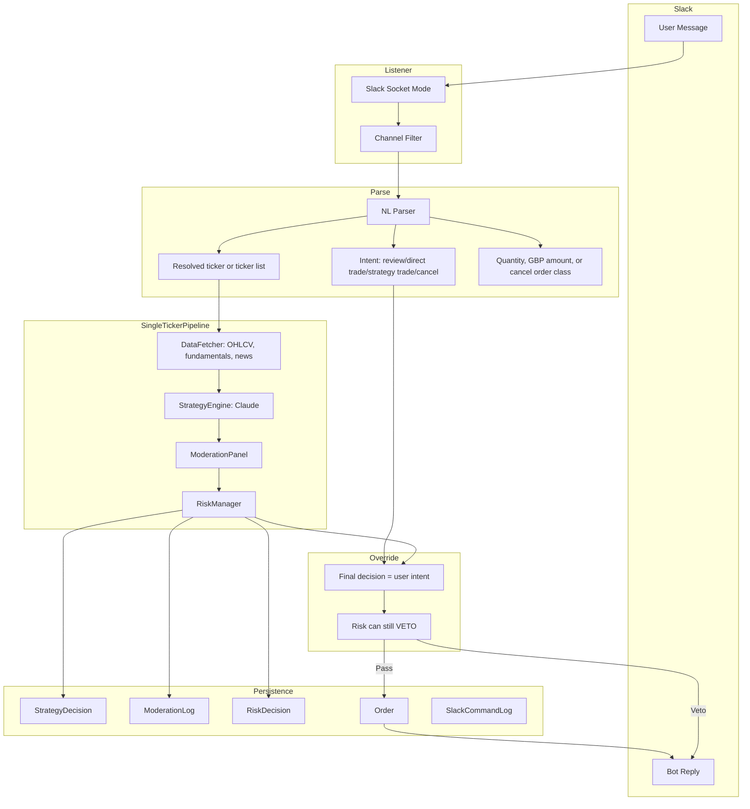

# Chat Interface and Trade Commands

> **Archived 2026-03-29:** Legacy pre-unification spec for US-1.5 (outbound alerts) and US-1.6 (inbound commands). The current canonical design is [CONVERSATIONAL_TRADING_WORKFLOW.md](CONVERSATIONAL_TRADING_WORKFLOW.md), which unifies both into a multi-turn session-based workflow (US-1.9).

## Purpose

Provide a reliable, auditable chat and command layer for the Investment Agent that:

- Gives operators immediate visibility into trade decisions and outcomes (Phase 1: delivered).
- Never interferes with execution safety or core trading flow.
- Enables secure, explicit manual trade control via Slack natural language commands (Phase 2: delivered).
- Maintains consistent audit trails for all trades—autonomous or manual.
- Provides a foundation for future web chat UI (Phase 3: future).

---

## Phase 1: Outbound Alerts (Delivered)

### Scope

**In scope:**
- Slack webhook alerts.
- Email alerts (SMTP).
- Event triggers from orchestrator/state machine:
  - `trade_instruction_approved` (operator-facing decision status on the instruction channel: queued, filtered, skipped, rejected, or otherwise not yet sent to broker)
  - `trade_execution_result` (actual execution outcome once a broker submission is attempted or an execution-time skip/failure is known)
  - `cycle_run_summary` (end-of-run report with account context, readable statuses, explicit counts, and reasons)
  - `state_transition` (ACTIVE/CAUTIOUS/HALTED)
  - `critical_cycle_failure` (cycle-aborting exceptions)
  - `order_adjustment` (stop-loss / trailing-stop adjustments)
  - `trade_without_stop` (execution completed but protective stop placement failed)
- `notification_logs` database table.
- Config flags, channel routing, retries/timeouts, dedup/idempotency.
- Unit tests + integration-style dry-run checks.

**Out of scope (Phase 1):**
- Inbound commands.
- Human approval workflows.
- Telegram and WhatsApp transport implementations.
- Rich interactive UI blocks/buttons.

### Architecture

```text
Orchestrator + StateMachine + CLI actions
   └─ emit typed notification events
        └─ NotificationService (fail-open, non-blocking)
             ├─ Router (event -> channels)
             ├─ Formatter (event -> channel payload)
             ├─ Sender (retry + timeout + dedup)
             ├─ SlackProvider
             └─ EmailProvider
                  └─ NotificationLogRepository (persistent audit trail)
```

**Non-blocking contract:**
- Notification send failures must be isolated from trade execution.
- `NotificationService` must catch/log all provider exceptions and return control immediately.
- Delivery is **at-least-once** (with idempotency key dedup on provider side where possible).

### Integration Points in Current Codebase

- `src/orchestrator/main.py`
  - Decision loop emits `trade_instruction_approved` only for operator-facing decision outcomes (for example `BUY-QUEUED`, `BUY-SKIPPED`, `RISK-REJECTED`) rather than as a pre-execution promise that a broker order has been sent.
  - `Orchestrator._execute_trade()` emits `trade_execution_result` only once the execution path knows the real submission outcome (`ORDER-SUBMITTED`, `ORDER-SKIPPED`, `ORDER-FAILED`, etc.).
  - Stop management emits `order_adjustment`, and missing-stop remediation emits `trade_without_stop`.
  - Top-level cycle exception handling emits `critical_cycle_failure`.
- `src/orchestrator/state_machine.py`
  - `StateMachine.transition()` emits `state_transition`.
- Existing command surface for Phase 2 mapping:
  - `--status`, `--pause`, `--resume`, `--force-sell`. Dashboard equivalents: Pause/Resume toggle and Force Sell button (Portfolio page) via REST API.

### Event Contract (Canonical)

Each outbound event must include:

| Field | Type | Purpose |
|-------|------|---------|
| `event_id` | uuid4 | Unique identifier |
| `event_type` | string | One of: `trade_instruction_approved`, `trade_execution_result`, `cycle_run_summary`, `state_transition`, `critical_cycle_failure`, `order_adjustment`, `trade_without_stop` |
| `occurred_at` | ISO8601 UTC | Event timestamp |
| `cycle_id` | string \| null | Associated cycle (nullable for non-cycle events) |
| `severity` | enum | `info` \| `warning` \| `critical` |
| `source` | enum | `orchestrator` \| `state_machine` \| `command_gateway` |
| `dedup_key` | string | Stable hashable key per event intent |
| `payload` | object | Typed event-specific data |

**`trade_instruction_approved` payload:** decision-status event on the instruction channel
- `ticker` (string)
- `action` (string)
- `target_allocation_pct` (float)
- `final_allocation_pct` (float)
- `conviction` (float)
- `moderation_consensus` (string; "not invoked" for HOLD/QUEUED — moderation not run)
- `risk_verdict` (string; "not invoked" for HOLD/QUEUED — risk not run)
- `notification_kind` (string; for example `BUY-QUEUED`, `BUY-SKIPPED`, `RISK-REJECTED`)
- `reason_code` (string | null)
- `reason_detail` (string | null)
- `account_label` (string | null; `practice/demo` or `live`)
- `reasoning_summary` (string)
- `occurred_at` (ISO8601 UTC)

**`trade_execution_result` payload:** execution-only result once submission/skip/failure is known
- `ticker` (string)
- `action` (string)
- `target_allocation_pct` (float)
- `execution_status` (string)
- `quantity` (float)
- `price` (float)
- `value_gbp` (float)
- `stop_loss_status` (string | null)
- `stop_loss_error` (string | null)
- `error_message` (string | null)
- `reason_code` (string | null)
- `reason_detail` (string | null)
- `notification_kind` (string | null; for example `ORDER-SUBMITTED`, `BUY-SKIPPED`, `ORDER-FAILED`)
- `account_label` (string | null; `practice/demo` or `live`)
- `order_type` (string | null)
- `execution_note` (string | null)

**`cycle_run_summary` payload:**
- `cycle_id` (string)
- `decisions` (list of decision summaries)
- `total_instructions` (int)
- `executed_count` (int)
- `rejected_count` (int)

**`state_transition` payload:**
- `old_state` (string)
- `new_state` (string)
- `reason` (string)
- `drawdown_pct` (float | null)

**`critical_cycle_failure` payload:**
- `stage` (string)
- `error_type` (string)
- `error_message` (string)
- `trace_id` (string | null)

### Message Rendering

- **Slack:** Outcome-first, concise operator message with severity prefix, account label, and a mandatory plain-English `Reason:` for non-submitted decisions.
- **Email:** Subject line includes `[Investment-Agent][SEVERITY]`; body contains the same account-aware decision/execution semantics plus richer cycle counts and execution notes.

### Delivery and Reliability

- **Per-channel timeout:** Configurable (default 5 seconds).
- **Retry policy:** Configurable bounded retries with exponential backoff (default 2 retries at 0.5s then 1.5s).
- **Dedup:**
  - Compute `dedup_key` from event intent fields.
  - Do not send duplicate event to same channel within configurable window (default 300 seconds).
- **Fail-open:**
  - Notification failures never raise to trading path.
  - All failures recorded in logs + `notification_logs` table.

### Data Model (notification_logs)

| Column | Type | Purpose |
|--------|------|---------|
| `id` | PK | Primary key |
| `timestamp` | UTC, indexed | Send attempt time |
| `event_id` | indexed | Reference to source event |
| `cycle_id` | nullable, indexed | Associated cycle (if any) |
| `event_type` | indexed | Event type string |
| `severity` | string | `info` \| `warning` \| `critical` |
| `channel` | string | `slack` \| `email` \| `telegram` \| `whatsapp` |
| `recipient` | nullable | Email address or user ID |
| `status` | string | `sent` \| `failed` \| `skipped` \| `deduped` |
| `attempt_number` | int | Retry counter |
| `dedup_key` | indexed | Dedup identifier |
| `payload_hash` | string | Hash of event payload |
| `error_message` | nullable | Provider error (if any) |
| `latency_ms` | nullable | Send latency in milliseconds |

**Indexes:**
- `(event_type, timestamp)`
- `(channel, timestamp)`
- Unique constraint on `(channel, dedup_key, attempt_number)` for replay auditing.

### Configuration

**`config/settings.yaml`:**

```yaml
notifications:
  enabled: true
  channels: ["slack", "email"]
  routes:
    trade_instruction_approved: ["slack"]
    trade_execution_result: ["slack", "email"]
    cycle_run_summary: ["slack"]
    state_transition: ["slack", "email"]
    critical_cycle_failure: ["slack", "email"]
    order_adjustment: ["slack"]
    trade_without_stop: ["slack", "email"]
  timeout_seconds: 5
  max_retries: 2
  dedup_window_seconds: 300
  include_dry_run_alerts: false
  command_gateway:
    enabled: false
```

**.env additions:**

```
SLACK_WEBHOOK_URL
ALERT_EMAIL_FROM
ALERT_EMAIL_TO
SMTP_HOST
SMTP_PORT
SMTP_USER
SMTP_PASS
SMTP_USE_TLS
```

Phase 2 additions (future):
```
COMMAND_GATEWAY_SHARED_SECRET
SLACK_APP_TOKEN (xapp-…)
SLACK_BOT_TOKEN (xoxb-…)
```

### Implementation Record (2026-03-05)

US-1.5 Phase 1 was implemented and deployed to VPS with the following execution steps.

**Build + integration steps completed:**

1. Added `src/agents/notifications/` service, provider interfaces, Slack provider, email provider, formatters, and disabled command gateway scaffold.
2. Added `NotificationLog` ORM model and Alembic migration (`notification_logs` table).
3. Wired event emission into:
   - `Orchestrator.run_cycle()` and `_execute_trade()`
   - `StateMachine.transition()`
   - Scheduler exception path for critical failures.
4. Added notification tests (`service`, `providers`, `formatters`, `integration`) and validated full suite (146 tests passing).
5. Updated docs (README, CLAUDE, ARCHITECTURE, DEPLOYMENT, LOCAL_LIVE_RUN, SOPHISTICATION_ROADMAP).

**Slack hookup steps used:**

1. Created Slack Incoming Webhook.
2. Set `SLACK_WEBHOOK_URL` in VPS `.env`.
3. Restarted container with `docker compose up -d --build`.
4. Verified receipt of decision-status (`trade_instruction_approved`) and `cycle_run_summary` Slack messages.

**Email hookup steps used:**

1. First tested local SMTP sink (Mailpit), with `SMTP_USE_TLS=false` on local port 1025.
2. Moved VPS to transactional SMTP (SendGrid):
   - `SMTP_HOST=smtp.sendgrid.net`
   - `SMTP_PORT=587`
   - `SMTP_USER=apikey`
   - `SMTP_PASS=<SendGrid API key>`
   - `SMTP_USE_TLS=true`
3. Verified sender identity in SendGrid and restarted container.
4. Queried `notification_logs` inside container to verify status transitions (`skipped` → `sent`).
5. Confirmed final delivery in SendGrid Email Logs (`Delivered 250 OK`) for production recipient.

**Operational incidents observed and resolved:**

- `STARTTLS extension not supported by server` when using local Mailpit with TLS enabled; resolved by `SMTP_USE_TLS=false` for local sink testing.
- Container lacked sqlite CLI binary; switched verification to Python/SQLAlchemy query inside container.
- Gmail recipient-specific deferral (`421 4.7.32`) seen for one address; resolved by using alternate recipient and checking provider logs.

**Current production defaults:**

- `include_dry_run_alerts: false`
- `cycle_run_summary` routed to Slack only.
- Email reserved for higher-signal events (`trade_execution_result`, `state_transition`, `critical_cycle_failure`).

---

## Phase 2: Inbound Trade Commands (Delivered)

### Design Principle: Manual Instance of the Agent

**User message = manual trigger of the full pipeline for one ticker.** All data is gathered and all LLM decisions are logged (Strategy, Moderation, Risk); the **final action is overwritten by the user intent** (buy/sell/review).

**Audit consistency:** Every trade (autonomous or manual) has the same paper trail: StrategyDecision, ModerationLog, RiskDecision, Order. You can always see "User asked to buy AAPL; strategy said HOLD; moderation said X; risk said Y; user override: BUY."

**REVIEW:** Run full pipeline, no execution; post strategy + moderation + risk + fundamentals/news summary to Slack.

**Risk:** RiskManager still runs and can VETO (e.g. sector cap, single-stock cap). User intent is applied only after risk checks pass. **Force override:** When the user explicitly prefixes a command with `force`, `override`, or `!` (e.g. `force buy MSFT`), explicit moderation/risk blocks are bypassed and execution proceeds. The original committee/risk objections are still preserved in the reply and audit trail, and overridden stages are labeled `OVERRIDDEN`.

**Trade-off:** Latency (~15–30 seconds) and LLM cost per Slack command; acceptable for explicit manual triggers.

### Architecture Overview



### Implementation Plan

#### 1. Dependencies and Config

- **Add `slack-sdk`** to `pyproject.toml` (required for Socket Mode).
- **New env vars:** `SLACK_APP_TOKEN` (xapp-…), `SLACK_BOT_TOKEN` (xoxb-…).
- **Config in `settings.yaml`** under `notifications.slack_trade_commands`:

```yaml
slack_trade_commands:
  enabled: false
  channel_id: ""
  confirmation_threshold_gbp: 500
  confirmation_timeout_minutes: 10
```

- **Settings class:** Add `slack_app_token`, `slack_bot_token`, `slack_trade_channel_id`, `slack_trade_confirmation_threshold_gbp`, `slack_trade_confirmation_timeout_minutes`.

#### 2. Slack Events Listener (Socket Mode)

- **New module:** `src/agents/notifications/slack_listener.py`
  - Use `slack_sdk.socket_mode.SocketModeClient` with `SocketModeHandler`.
  - Subscribe to `message.channels` (or `message.groups` if private).
  - Filter: only process messages where `event.channel == settings.slack_trade_channel_id` and `event.subtype` is absent (user messages).
  - Acknowledge immediately; process async in background (full pipeline takes 15–30 seconds).
  - Use `WebClient` (bot token) to post replies in thread.

#### 3. Natural Language Parser

- **New module:** `src/agents/notifications/trade_command_parser.py`
  - Regex-first parser plus Claude fallback now extracts a richer intent envelope:
    - `command_kind`: `review | trade | cancel`
    - `execution_mode`: `strategy | direct | cancel_only`
    - `trade_action`: `BUY | SELL | REVIEW | CANCEL`
    - `trigger_strategy`, `cancel_order_class`, `subject_phrases`, `quantity_shares`, `amount_gbp`, `force`
  - **REVIEW:** Run full strategy pipeline, no execution; post strategy + moderation + risk + fundamentals/news summary to Slack.
  - **Direct BUY/SELL:** Plain `buy` / `sell` default to `execution_mode="direct"`.
  - **Strategy-triggered trade:** `review Apple and buy` and `buy Apple and trigger strategy` use `execution_mode="strategy"`.
  - **Cancel:** `cancel buy|sell|stop sell ...` uses `execution_mode="cancel_only"`.
  - Return `TradeCommandIntent` dataclass or `None` if unparseable.

#### 4. Slack Command Execution Paths

- **Strategy path:** `src/orchestrator/single_ticker_run.py`
  - **Step 1 — Data:** Build `stocks_data` for that one ticker only: DataFetcher.get_stock_analysis (or get_stock_analysis_lite + optional Finnhub/AV). Same data shape as full cycle.
  - **Step 2 — Strategy:** Run StrategyEngine for that ticker; persist **StrategyDecision** with `cycle_id` = e.g. `slack-{ts}` so it's clearly slack-triggered.
  - **Step 3 — Moderation:** Run ModerationPanel on the strategy output; persist **ModerationLog**.
  - **Step 4 — Override:** Ignore strategy action/size; set **final action** and **size** from `user_intent` (BUY/SELL + quantity or amount_gbp). For REVIEW, stop here and return summary.
  - **Step 5 — Risk:** Run RiskManager with the **user-intent** trade (ticker, action, quantity/amount). Persist **RiskDecision**. If risk VETO, return rejected; do not execute.
  - **Step 6 — Execution:** If BUY/SELL and risk passed, call OrderManager.execute_market_order (or by quantity); persist **Order** with `strategy="slack_strategy"`.
  - Return: strategy view, moderation view, risk view, order result (or rejection), so Slack can format one summary message.
- **Direct trade path:** `src/orchestrator/direct_trade_run.py`
  - Ticker resolution, quote lookup, FX-aware GBP sizing, cash/position preflight, large-order confirmation, and `OrderManager.execute_market_order`.
  - No strategy, moderation, or risk call.
  - Orders persist with `strategy="slack_direct"`.
- **Cancel path:** `src/agents/notifications/cancel_command_runner.py`
  - Resolve all requested tickers up front.
  - Fetch pending T212 orders once.
  - Classify matches as `buy`, `sell`, or `stop_sell`, preferring local `orders` rows and falling back to the live T212 payload.
  - Cancel matching pending orders, update local rows to `cancelled`, and persist a structured per-message result in `SlackCommandLog.result_json`.
- **Ticker resolution:** Extract `resolve_ticker_to_t212(plain_symbol)` to `src/utils/ticker_utils.py` (Instrument table + T212 fallback). Run before pipeline; reject if not found.

#### 5. Portfolio and Cash Validation

- Before or inside single-ticker run: use OrderManager.get_portfolio_state().
- **BUY:** `available_cash >= estimated_value` (from user quantity or amount_gbp).
- **SELL:** Resolve "sell my position" to full position quantity; check `position.quantity >= requested_quantity`.
- Reject with clear Slack message if insufficient; optional: still run for REVIEW context.

#### 6. OrderManager Extension for Quantity-Based Orders

- **Refactor:** `execute_market_order(..., target_amount_gbp=None, quantity=None, current_price=...)` — require one of `target_amount_gbp` or `quantity`. When `quantity` is set, use it directly for T212; still log value_gbp for Order row.

#### 7. Large Order Confirmation Flow

- If `estimated_value_gbp >= confirmation_threshold_gbp`: prepare the trade through strategy → moderation → risk, then post a confirmation prompt before any execution.
- Persist the command as `awaiting_confirmation`; on `yes`, execute the prepared trade; on `no`, mark `cancelled`; on timeout, mark `expired`.

#### 8. Persistence and Audit

- **Existing tables:** StrategyDecision, ModerationLog, RiskDecision, Order — populated as needed by the strategy path or direct path; use `cycle_id` like `slack-{timestamp}`.
- **New table:** `slack_command_log` with columns:
  - `id` (PK)
  - `timestamp` (UTC)
  - `channel_id`
  - `user_id`
  - `raw_message`
  - `parsed_intent_json`
  - `command_kind`
  - `execution_mode`
  - `ticker`
  - `action`
  - `target_order_class`
  - `target_tickers_json`
  - `cycle_id` (FK)
  - `order_id` (FK, nullable)
  - `status`
  - `rejection_reason`
  - `response_message`
  - `result_json`

  This links Slack trigger to cycle and order.

#### 8a. Database: Scheduled vs Manual (No Mandatory Schema Change)

**Do the databases need to change to account for scheduled vs manual?** For the current command split, the existing trading tables still work, but `slack_command_log` now carries richer mode/result metadata:

- **Order:** Slack-triggered trades now use `strategy="slack_direct"` for plain BUY/SELL commands and `strategy="slack_strategy"` for strategy-triggered trade commands. Scheduled orders continue to use the actual strategy family (e.g. momentum, mean_reversion) or "liquidation".
- **StrategyDecision / ModerationLog / RiskDecision:** Use existing `cycle_id`. Scheduled runs use cycle IDs like `"2026-03-06-08:00"`; Slack runs use `"slack-{iso_timestamp}"`. Query manual runs with `WHERE cycle_id LIKE 'slack-%'`.
- **SlackCommandLog:** now stores `command_kind`, `execution_mode`, `target_order_class`, `target_tickers_json`, and `result_json` in addition to the original message/action/order linkage.

An explicit `trigger` column on `orders` is still optional for a future follow-up, but the current implementation is fully attributable without it.

#### 9. Slack Reply Format

- **REVIEW:** Full pipeline detail — price, strategy action/conviction/allocation/stop-loss/reasoning (not truncated), per-moderator GPT-4o/Gemini verdicts with scores and reasoning. Reply labels the mode as `strategy review`. No order is placed.
- **Direct BUY/SELL:** Reply labels the mode as `direct trade`. Strategy, moderation, and risk are intentionally absent; the reply focuses on quote, quantity/value, execution status, order ID, confirmation outcome, and any direct-trade tip. A `force` prefix is accepted for backward compatibility but recorded as unnecessary.
- **Strategy-triggered BUY/SELL:** Reply labels the mode as `strategy-triggered trade`. It includes the same execution details as before plus strategy, moderation, and risk context. If user overrode strategy: "(Strategy suggested HOLD; you overrode to BUY)". If force override bypassed moderation and/or risk, the overridden stage is shown as `OVERRIDDEN` while still displaying the underlying GPT-4o/Gemini/risk detail.
- **CANCEL:** Reply labels the mode as `cancel command` and shows the requested order class (`buy`, `sell`, `stop sell`), resolved target tickers, number of matching pending orders, cancelled order IDs, and any partial failures.
- **Rejected (risk/cash/ticker):** Full pipeline detail — price, strategy reasoning, per-moderator verdicts, risk triggered rules. Includes contextual next-step tips: risk VETO suggests action-specific `force buy <ticker>` / `force sell <ticker>`; moderation BLOCKED now suggests either `force buy <ticker>` / `force sell <ticker>` to proceed anyway or `REVIEW <ticker>` first; minimum-order rejects suggest a larger GBP order; no-position SELL rejects suggest reviewing current holdings first.
- **Error:** Error replies now include contextual tips when possible, e.g. retrying `REVIEW <ticker>` after market data refresh when price determination fails. Malformed moderator `modifications` payloads are treated as warning-only and do not abort the strategy-backed review/trade path.

#### 10. Entry Point and Deployment

- **New CLI:** `poetry run python -m src.agents.notifications.slack_trade_listener` — long-running process; connects via Socket Mode; processes each message by dispatching to the strategy, direct-trade, or cancel runner (plus confirmation flow for large BUY/SELL commands).
- **Docker:** Dedicated always-on `slack-listener` service when `SLACK_APP_TOKEN` and `SLACK_BOT_TOKEN` are configured. `docker compose up -d --build` starts the scheduler, dashboard, and Slack listener together.
- **Systemd:** Optional unit file for VPS.

#### 11. Safety Checks Summary

| Check | Action |
|-------|--------|
| Unrecognised ticker | Reject before pipeline |
| Insufficient cash (BUY) | Reject with current cash |
| No position (SELL) | Reject |
| Order > threshold | Require "yes" confirmation |
| Plain BUY/SELL | Execute as direct trade; skip strategy, moderation, and risk |
| `review X and buy/sell`, `buy/sell X and trigger strategy` | Run full strategy → moderation → risk path before execution |
| `cancel buy/sell/stop sell ...` | Resolve all requested tickers first, then cancel matching pending broker orders immediately |
| Risk VETO | Reject after pipeline; log reason. Hint suggests action-specific `force buy` / `force sell` override. |
| Moderation BLOCKED | Reject after moderation by default; explicit `force` prefix can override for Slack commands while preserving committee reasoning in reply/audit trail. |
| Below minimum order size | Reject before broker placement; hint suggests a larger GBP amount or `REVIEW <ticker>`. |
| Risk VETO + force prefix | **Override:** execute despite risk rejection; log as `OVERRIDDEN` with triggered rules |

#### 12. Documentation Updates (When Implementing)

- **CLAUDE.md:** Slack trade commands, env vars, config keys, `slack_trade_listener` CLI.
- **docs/CHAT_AND_COMMANDS.md (this file):** Extend Phase 2 with acceptance criteria.
- **docs/ARCHITECTURE.md:** Slack inbound listener diagram.
- **docs/GOVERNANCE.md:** Audit trail for `slack_command_log`.
- **README.md:** New CLI command, env vars.
- **docs/DEPLOYMENT.md:** Docker service, env vars.
- **docs/LOCAL_SETUP.md:** Optional Slack listener setup.

#### 13. Tests

- **Unit:** `trade_command_parser` — parse "Buy 10 shares of AAPL", "Sell TSLA", "Buy £500 MSFT" — mock LLM.
- **Unit:** `resolve_ticker_to_t212` — mock DB.
- **Unit:** `OrderManager.execute_market_order` with `quantity` param.
- **Integration:** Mock Socket Mode client; simulate message; assert reply and Order log.

#### 14. File Checklist

| File | Action |
|------|--------|
| `pyproject.toml` | Add slack-sdk |
| `config/settings.yaml` | Add slack_trade_commands |
| `src/utils/config.py` | New config keys |
| `src/utils/ticker_utils.py` | New — resolve_ticker_to_t212 |
| `src/orchestrator/single_ticker_run.py` | New — strategy review + strategy-triggered trade pipeline with user override |
| `src/orchestrator/direct_trade_run.py` | New — plain BUY/SELL path without strategy, moderation, or risk |
| `src/agents/notifications/cancel_command_runner.py` | New — multi-ticker pending-order cancellation path |
| `src/agents/notifications/trade_command_parser.py` | New — NL parsing for review, direct trade, strategy-triggered trade, and cancel |
| `src/agents/notifications/slack_listener.py` | New — Socket Mode handler, dispatches to strategy/direct/cancel runners |
| `src/agents/execution/order_manager.py` | Optional quantity param in execute_market_order; pending-order classification + cancellation helpers |
| `src/data/models.py` | Add SlackCommandLog; extend with mode/target/result fields |
| `src/data/migrations/versions/p1q2r3s4t5u6_extend_slack_command_log_for_command_split.py` | Migration for command split metadata |
| `src/agents/notifications/slack_trade_listener.py` | New — CLI entry |
| `tests/test_trade_command_parser.py` | New |
| `tests/test_single_ticker_run.py` | New — strategy path + override |
| `tests/test_direct_trade_run.py` | New — direct trade + cancel coverage |
| `tests/test_slack_listener.py` | New (mocked) |
| `.env.example` | Add SLACK_APP_TOKEN, SLACK_BOT_TOKEN |

### Slack App Setup

1. Create Slack App at api.slack.com.
2. Enable Socket Mode; create App-Level Token with `connections:write`.
3. Add Bot Token Scopes: `channels:history`, `channels:read`, `chat:write`, `app_mentions:read` (if using mentions).
4. Subscribe to `message.channels` (and `message.groups` if private).
5. Install app to workspace.

### Safety Checks

**Risk is the default final authority.** User intent is applied only after passing RiskManager checks. If risk VETO occurs, the order is rejected and the user receives a detailed message with the reason, triggered rules, and full pipeline context. **Force override:** The user can explicitly bypass moderation/risk blocks by prefixing the command with `force`, `override`, or `!` (e.g. `force buy MSFT`, `!buy AAPL`). The override is logged/shown as `OVERRIDDEN`, the triggered rules and committee reasoning are still preserved, and the Slack reply clearly indicates which stages were bypassed. This is intentional for situations where the human operator has conviction beyond what the committee/risk rules capture (e.g. cash floor with incoming deposit, known temporary conditions).

**Moderation reviews the final user-intended action and size.** If strategy suggests `HOLD` but the user explicitly asks to `BUY`, the moderation panel now reviews the `BUY` proposal while the reply/audit trail still preserves the original strategy recommendation for transparency.

**Portfolio validation is mandatory** before any execution. BUY orders must have sufficient cash; SELL orders must have the position. Rejections are immediate and descriptive.

### Open Questions

- **Require @mention:** Default to channel-only filter (no mention) for simplicity; user can restrict to a private channel.
- **Thread vs channel reply:** Reply in thread for cleaner UX (keeps context with original message).

---

## Phase 3: Web Chat UI (Future)

Placeholder for browser-based chat interface, post-Phase 2 stabilisation. Will provide real-time trade control and portfolio review via web dashboard.

---

## Acceptance Criteria

### Phase 1 (Outbound Alerts — Delivered)

- [x] Notification service exists under `src/agents/notifications/` with provider abstraction.
- [x] Notification events emit from the defined integration points, including decision-status, execution-result, cycle-summary, state-transition, critical-failure, stop-adjustment, and missing-stop alerts.
- [x] Slack and email channels work independently and can be enabled/disabled by config.
- [x] Notification failures never block or fail a trading cycle.
- [x] Retries/timeouts/dedup operate as configured.
- [x] Every send attempt persists to `notification_logs`.
- [x] Dry-run cycles produce alerts when `include_dry_run_alerts=true`.
- [x] Unit tests cover formatter correctness, routing, retry, dedup, and fail-open behavior.
- [x] End-to-end dry-run validation demonstrates event emission and persisted logs.

### Phase 2 (Inbound Trade Commands — Delivered)

- [x] Natural language parser (`trade_command_parser.py`) extracts command kind, execution mode, ticker subject phrases, quantity/amount, and cancel order class — regex-first (zero cost, supports ticker symbols, multi-word company names, strategy-trigger phrases, and multi-ticker cancel commands) with Claude fallback for ambiguous messages.
- [x] Strategy path (`single_ticker_run.py`) runs full data → strategy → moderation → risk flow with user intent override for REVIEW and strategy-triggered BUY/SELL commands.
- [x] Direct trade path (`direct_trade_run.py`) executes plain BUY/SELL commands without strategy, moderation, or risk while preserving quote lookup, preflight checks, confirmation, execution, and audit logging.
- [x] Cancel path (`cancel_command_runner.py`) resolves all requested tickers first, fetches pending broker orders once, cancels matching `buy` / `sell` / `stop sell` orders, updates local order status, and returns aggregated success or partial results.
- [x] RiskManager veto prevents execution by default; explicit `force` prefixes are logged as `OVERRIDDEN` and preserve triggered rules in the audit trail.
- [x] `SlackCommandLog` table captures all Slack-triggered runs; linked to Order and cycle_id, with mode, target-order, target-ticker, and result metadata.
- [x] Slack Socket Mode listener (`slack_listener.py`) processes messages from configured channel; replies in thread.
- [x] Large order confirmation flow requires "yes" confirmation for orders > `confirmation_threshold_gbp`.
- [x] Ticker resolution (`resolve_ticker_to_t212`) rejects unknown symbols before pipeline invocation.
- [x] Cash/position validation prevents insufficient-fund and non-existent-position orders.
- [x] REVIEW commands persist `review_only`; confirmation lifecycle persists `awaiting_confirmation`, `cancelled`, `expired`, and final `response_message`.
- [x] All trades (autonomous and Slack-initiated) visible in portfolio and audit logs with consistent cycle_id format (`slack-{timestamp}`).
- [x] Focused US-1.6/US-1.9 regression suite covers parser, ticker resolution, strategy/direct/cancel runners, listener/gateway, commands API, chat session manager/API, Slack reply formatting, FX-aware GBP sizing, and scheduler cadence cleanup.
- [x] **Dashboard Chat page** (`/chat`, legacy `/commands` alias): Stats cards (total, executed, rejected, review), action/status filters, and a `Legacy Slack Audit` table with expandable rows showing cycle_id, order linkage, rejection reasons, and response messages. Backend: `GET /api/commands/` (filtered + paginated), `GET /api/commands/stats`.
- [x] **US-1.9 Chat console upgrade**: `/chat` is now the canonical chat-first surface for authenticated operators, with `/commands` retained as a backward-compatible alias, shared Slack/dashboard conversation sessions, live thread + composer, planner-led mode chips, agent-activity workflow rail, citations/related-ticker/committee evidence panels, pending proposal controls, research trace, and a secondary `Legacy Slack Audit` tab so conversational workflow evidence stays separate from one-shot `SlackCommandLog` audit rows. Explicit confirm/reject API calls now require `expected_version` and return `409` with the latest action payload if the proposal changed. The audit tab now explicitly notes that it is not the full conversation archive and auto-refreshes while open.
- [x] **Slack thread routing hardening (2026-03-28):** inbound Slack text is normalized before routing so bullet/list-prefixed commands like `• • BUY £550 AAPL` and `• liquidate holdings below £100` stay on the intended path; explicit threaded commands now prefer deterministic previews over planner-led research; compare prompts support 2-3 explicit names; and `compare X and Y, then buy £20 of the stronger one` stages a confirm-gated preview instead of executing directly.
- [x] **Post-deployment fixes (2026-03-24):** Bot self-message loop prevention (`_resolve_bot_user_id` via `auth.test` + `bot_id`/user_id filtering); error message propagation from pipeline to Slack reply (gateway now surfaces `error_message`/`rejection_reason`); price extraction fix (`indicators.current_price` not `.close`); REVIEW reply shows full details — price, allocation %, stop-loss %, full reasoning (no truncation), per-moderator GPT-4o/Gemini verdicts with scores and reasoning; completion log lines for all terminal states (review_only, executed, rejected, error).
- [x] **Hardening pass (2026-03-24):** real confirmation gate before execution for large orders; moderation now reviews the final user action/size; force replies and rejection hints use action-specific wording; non-command chatter no longer leaves a stray processing reply; dashboard audit rows persist `response_message`; contextual Slack tips now cover risk vetoes, moderation blocks, unknown tickers, minimum-order rejects, price-data failures, no-position SELLs, duplicate orders, and pending broker acceptance.

### Phase 3 (Web Chat UI — Future)

- [ ] Web interface integrated with dashboard backend; SSE stream for real-time alerts.
- [ ] User authentication and authorization.

---

## Risks and Mitigations

| Risk | Mitigation |
|------|-----------|
| Alert noise/spam | Severity routing and per-event channel selection. |
| Provider outage (Slack/Email) | Timeouts + bounded retries + fail-open; trades never blocked. |
| Duplicate sends | Dedup keys + dedup window + dedup status logging. |
| Security regression in Phase 2 | Signature validation + allow-list + full audit trail mandatory before release. |
| Latency in Slack commands | 15–30s acceptable for explicit manual triggers; async processing + background thread. |
| Unrecognised ticker | Reject before pipeline; clear error message to user. |
| Insufficient cash/position | Validation before execution; descriptive rejection. |
| Risk VETO blocks user intent | Risk is default final gate; all rejections logged and communicated. `force` prefix available for explicit human override (logged as OVERRIDDEN). |

---

## Success Metrics

### Phase 1

- P95 alert send latency < 10 seconds.
- >99% successful sends excluding provider outages.
- 0 trading cycles blocked by notification subsystem failures.
- 100% send attempts represented in `notification_logs`.

### Phase 2

- 100% command actions attributable in audit logs.
- >99% successful Slack command parses (excluding malformed input).
- <30 second latency end-to-end from user message to reply.
- 0 unlogged trades from Slack commands.
- 100% RiskManager vetoes recorded with reason.

---

## Related Notes

- [Architecture](ARCHITECTURE.md)
- [Governance](GOVERNANCE.md) (audit trail)
- [Sophistication Roadmap](SOPHISTICATION_ROADMAP.md) (US-1.5, US-1.6)
- [Conversational Trading Workflow](CONVERSATIONAL_TRADING_WORKFLOW.md) (US-1.9 unified multi-turn design)
